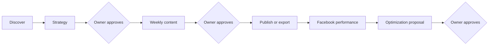

# MarketMind AI — Start Here

MarketMind AI is an Arabic-first, bilingual marketing workspace for Egyptian
small and medium businesses. It helps an owner understand the business, build
an evidence-grounded strategy, create weekly content, publish or export only
after approval, and use real Facebook performance evidence to improve future
content.

ببساطة: ماركت مايند بيساعد صاحب المشروع يفهم نشاطه، يبني خطة تسويق مبنية على
أدلة، يراجع المحتوى، ويوافق على أي خطوة قبل النشر أو التغيير.

## Product journey

The owner remains the decision-maker throughout the journey. Research may
suggest facts, AI may propose plans and content, and deterministic services may
execute approved actions; none of those layers can silently approve on the
owner's behalf.

## Current implementation

- Email/password and Google authentication, session rotation, RBAC, and admin
  controls.
- Bilingual Prepared Discovery with research evidence, progress updates, and
  owner-confirmed business profiles.
- Curated Strategy RAG over reviewed marketing knowledge, deterministic
  calculations, citations, versioning, and owner decisions.
- Content V2 weekly planning, generation, policy validation, revision, assets,
  and item-level approval.
- Deterministic export, simulation, scheduling, and Facebook static publishing
  behind exact candidate approval and provider-readiness gates.
- Automatic Facebook performance snapshots and bounded, owner-approved
  hook/CTA optimization proposals.
- Prepaid points-wallet billing with idempotent ledger handling and Paymob
  integration boundaries.
- Feature-flagged LangGraph orchestration with durable checkpoints and shadow
  evidence; the established product path remains authoritative.

Provider-dependent behavior still requires valid external accounts,
permissions, public media URLs, and server-side credentials. Local defaults and
CI use deterministic mock paths where documented; those results are not live
provider proof.

## Reading order

1. Read [`../../README.md`](../../README.md) for the public project overview and
   local setup.
2. Read [`../README.md`](../README.md) for the maintained documentation map.
3. Read [`02_MARKETMIND_AI_FLOW.md`](02_MARKETMIND_AI_FLOW.md) for the full data
   and approval journey.
4. Read [`03_AGENTS_OVERVIEW.md`](03_AGENTS_OVERVIEW.md) for responsibility
   boundaries.
5. Use the current technical documents under
   [`../technical-and-ai-docs/`](../technical-and-ai-docs/) for implementation
   and deployment details.
6. Use the feature architecture and runbook linked from [`../README.md`](../README.md)
   when changing a specific vertical slice.

## Truthfulness rules

- PostgreSQL owns durable product state; Redis/BullMQ carries recoverable work;
  Qdrant is a rebuildable index of reviewed knowledge.
- Publishing is deterministic and always separate from content approval.
- Fixtures, simulations, and mock providers must remain visibly labeled.
- Failed integrations and insufficient evidence must surface as blockers, not
  fabricated success.
- Code and shared contracts supersede historical planning language.
