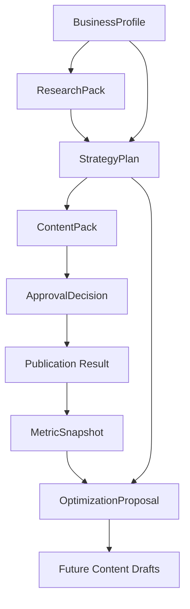

# MarketMind AI Flow

This file explains the full product journey from first owner interview to improvement proposal.

## Simple journey

```mermaid
flowchart LR
    A["1. Discover"] --> B["2. Research"]
    B --> C["3. Strategize"]
    C --> D["Owner approves strategy"]
    D --> E["4. Create content"]
    E --> F["Owner approves content"]
    F --> G["5. Publish or export"]
    G --> H["6. Monitor results"]
    H --> I["7. Improve future content"]
    I --> J["Owner approves pivot"]
```

## Phase 1 — Discover

Goal:

Understand the business (the SME).

The system asks the owner about:

- business name
- location
- food/drinks
- target customers
- goals
- budget
- brand style
- social media accounts
- competitors
- uploaded menu/logo/photos if available

Output:

`BusinessProfile`

Approval:

The owner must confirm the profile before strategy begins.

## Phase 2 — Research

Goal:

Collect useful evidence for strategy.

The system should use:

1. curated RAG over approved project/system marketing knowledge first
2. limited trusted web research only when needed

Output:

`ResearchPack`

It should include:

- useful facts
- source links or document references
- short notes explaining why each source matters

Important:

Research should support strategy. It should not become endless browsing.

## Phase 3 — Strategize

Goal:

Create a practical marketing strategy for the business.

The complete confirmed Business Profile is read directly from PostgreSQL. Its
relevant fields are also used to retrieve approved marketing playbooks from
Qdrant. The profile itself is not stored in the shared vector collection.

The strategy should include:

- primary goal
- target audience
- recommended platforms
- tone and language
- content themes
- four-week plan
- twelve-week overview
- budget direction
- KPIs
- citations
- visible assumptions, knowledge gaps, and blockers

Output:

`StrategyPlan`

Detailed architecture:

`sprint-4/STRATEGY_AGENT_AND_CURATED_RAG_ARCHITECTURE.md`

Approval:

The owner can approve, reject, or request edits.

## Phase 4 — Create

Goal:

Generate useful content based on the approved strategy.

For MVP, focus on Week 1:

- 3 to 5 posts
- Arabic and English captions where useful
- image ideas or generated assets
- short-video scripts
- posting notes

Output:

`ContentPack`

Approval:

The owner approves individual items or a group of items.

## Phase 5 — Publish or export

Goal:

Move approved content toward real use.

Important:

Publishing should not be an LLM agent. It should be a safe deterministic action.

Possible results:

- publish through approved n8n workflow
- export a content package
- run a clearly labeled demo simulation

Approval:

The owner must approve before any real publishing attempt.

## Phase 6 — Monitor

Goal:

Understand how content performed.

Metrics may come from:

- read-only Meta analytics if available
- manually entered data
- clearly labeled scenario/demo data

Output:

`MetricSnapshot`

Important:

Fake/demo analytics must be visibly labeled.

## Phase 7 — Improve

Goal:

Suggest changes for future content based on performance.

The Optimization Agent may suggest:

- change posting time
- change topic mix
- change caption style
- create more of a successful format
- reduce weak content types

Output:

`OptimizationProposal`

Approval:

Future drafts only change after owner approval.

## Full data movement

## Fictional example

MarketMind targets SMEs across industries (retail, services, hospitality,
education, healthcare, and more). The example below uses a café as one
illustrative SME to keep the narrative concrete; it is *not* a statement that
the product is hospitality-only.

Business:

Koshary & Coffee, a small café in Nasr City.

Discovery learns:

- sells coffee, desserts, and light Egyptian snacks
- wants more weekday foot traffic
- budget is limited
- prefers Egyptian Arabic
- brand should feel friendly and casual

Strategy decides:

- focus on Instagram and Facebook
- use local neighborhood tone
- promote weekday bundles
- show behind-the-scenes content

Content creates:

- one offer post
- one Reel script
- one customer-style caption
- one product spotlight

Monitoring shows:

- offer post had more saves
- Reel had more reach

Optimization suggests:

- create more short Reels
- repeat weekday bundle content with a different hook
