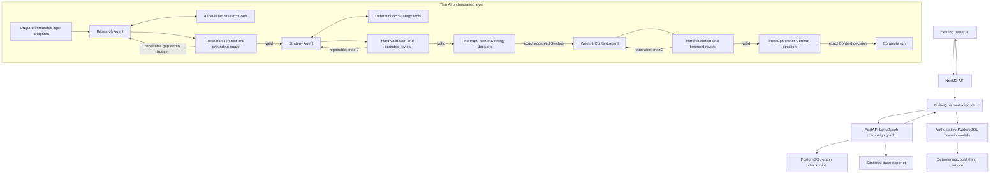

# Agentic Orchestration Implementation Plan

- Status: Phase 0 spike implemented; product graph remains gated
- Issue: [#161](https://github.com/ARabee3/marketmind-ai/issues/161)
- Owner: `@ARabee3`
- Required reviewers: `@mostafamerzk`, `@MostafaAhmed22`, and
  `@MOKHXXXXXX`
- Last updated: 2026-08-07

## 1. Decision summary

MarketMind will add a thin, durable orchestration layer in the FastAPI AI
service using LangGraph's Python Graph API.

The layer will coordinate the capabilities that already exist. It will not
replace the Discovery, Strategy, Content, RAG, provider, queue, approval, or
publishing implementations.

The first complete slice is deliberately narrow:

```text
confirmed Business Profile
  -> bounded Research Agent
  -> Strategy Agent
  -> exact owner Strategy approval
  -> Week-1 Content Agent
  -> exact owner Content decision
  -> stop
```

Publishing remains outside the graph and fully deterministic.

The top-level graph is deterministic. It knows the legal role order and owner
approval gates. Agentic behavior exists only where it adds value: a specialist
can choose from a small allow-list of tools, assess whether evidence is
sufficient, and perform a bounded targeted replan after a structured review.

### Non-regression contract

Protecting the working product is the first acceptance condition for this work.

- Discovery, Strategy, Content, owner approvals, billing, queues, and
  deterministic publishing keep their current public behavior and remain the
  authoritative path.
- The orchestration feature ships disabled. No existing owner is routed through
  it merely because the code has been deployed.
- Until shadow comparison passes, an orchestration run may not create a second
  Strategy version, Content pack, owner decision, publication candidate, or
  external action.
- The existing internal Strategy and Content paths remain the immediate
  rollback. Disabling one feature flag returns all users to those paths.
- A failed durability spike stops the LangGraph product implementation before
  it is connected to live domain writes. It does not justify changing the
  current workflow.

This plan does not promise that new code can never contain a defect. It makes
the new code unable to affect normal users or replace the current journey until
it proves safe in isolated tests and shadow mode.

## 2. What “thin orchestration layer” means

In simple terms, MarketMind already has several good specialists but no shared
project manager.

- The Research capability can plan queries and assess evidence.
- The Strategy capability can retrieve approved knowledge, calculate channel
  and budget decisions, and generate a validated plan.
- The Content capability can turn an approved plan into grounded weekly drafts.
- NestJS already controls queues, versions, approvals, billing, and database
  state.

The orchestration layer is the project manager or traffic controller between
them. It will:

1. remember where one run currently is;
2. give the active specialist only the inputs and tools it is allowed to use;
3. capture a typed output and verify the handoff;
4. retry only the failed step when a repair is safe;
5. pause when the owner must decide;
6. resume from the saved point after an exact approval;
7. record an understandable trace of actions, tools, evidence, cost, and
   failures.

It will not:

- create another giant prompt that does everything;
- let one model choose arbitrary system actions;
- own authentication, billing, database lifecycle, or approvals;
- publish, schedule, spend money, or connect an external account;
- replace deterministic validation with an LLM opinion;
- store or expose hidden chain-of-thought.

## 3. Why this is product work, not only checklist work

The change is valuable when it creates these observable behaviors:

- **Adaptive research:** the Research Agent can stop when evidence is adequate,
  use a second approved source when a real gap exists, or return a visible
  blocker instead of fabricating an answer.
- **Targeted recovery:** a malformed Strategy, missing citation, or weak Content
  item reruns the responsible node instead of restarting every completed step.
- **Safe long-running work:** the owner can review a Strategy later and the
  workflow resumes from a durable checkpoint rather than reconstructing state
  from prompts.
- **Explainability:** reviewers can follow profile -> evidence -> deterministic
  calculation -> generated recommendation -> owner decision.
- **Operational control:** every tool, retry, token budget, timeout, and terminal
  result is bounded and visible.
- **Easier extension:** a future reviewed tool is added behind one typed registry
  instead of being wired into several unrelated services.

A class named `AgentOrchestrator` that merely calls the current endpoints in a
fixed sequence would not produce these benefits and would not satisfy this
plan.

## 4. Existing baseline that must remain authoritative

### NestJS and BullMQ

NestJS remains the owner of:

- authentication, RBAC, business ownership, and internal authorization;
- billing entitlement checks and usage recording;
- idempotency and legal lifecycle transitions;
- BullMQ jobs and recovery;
- Strategy, Content, decision, and publication persistence;
- exact owner approvals and progress events;
- every external publishing action.

Current integration points include:

- `apps/api/src/modules/discovery/discovery-research.processor.ts`
- `apps/api/src/modules/strategy/strategy.processor.ts`
- `apps/api/src/modules/content/content.processor.ts`
- `apps/api/src/modules/content/content.client.ts`

### FastAPI

FastAPI remains the owner of:

- provider adapters and structured model calls;
- bilingual Discovery AI behavior;
- query planning and evidence triage;
- curated Strategy retrieval from Qdrant;
- deterministic channel, budget, and KPI decisions;
- Strategy prompt assembly, generation, validation, and repair;
- Content prompt assembly, generation, validation, and repair.

Current integration points include:

- `services/ai/app/api/internal_v1/search.py`
- `services/ai/app/api/internal_v1/strategy.py`
- `services/ai/app/api/internal_v1/content.py`
- `services/ai/app/rag/retrieval_service.py`
- `services/ai/app/decisions/service.py`

### Data systems

- PostgreSQL domain rows are the product source of truth.
- Qdrant is a rebuildable index of approved shared marketing knowledge.
- Redis/BullMQ is the outer job transport, not agent memory.
- LangGraph checkpoints store execution position and typed working state; they
  do not replace domain versions or decisions.

## 5. Target architecture



The return arrow from FastAPI to BullMQ is important. FastAPI returns a typed
artifact or pause result. NestJS persists the artifact with its existing
transactional rules. The model never writes authoritative Strategy, Content,
approval, or publication rows.

## 6. Why LangGraph Graph API

The Graph API is preferred over a free-form supervisor and over a purely
functional wrapper because this workflow needs:

- explicit typed state shared across specialist roles;
- visible legal edges and approval barriers;
- conditional tool loops with hard limits;
- durable interrupts and process-restart recovery;
- a graph the team can inspect and explain during the ITI discussion.

Existing service functions will be called from graph nodes. They should not be
rewritten to fit a framework abstraction.

Before implementation expands, Phase 0 must prove the selected releases work
on Python 3.12, the deployment runtime, and the current OpenAI, Gemini,
OpenRouter, and mock provider modes. A provider is eligible only after its
tool-calling capability test passes; an unsupported provider fails visibly and
does not receive a silent non-agentic substitute. The reviewed versions must
then be pinned in the service lockfile.

## 7. Run lifecycle

| State | Owner | Meaning | Legal next states |
| --- | --- | --- | --- |
| `queued` | NestJS | A run was accepted and one BullMQ job owns the attempt. | `running`, `cancelled`, `failed` |
| `running` | FastAPI + NestJS summary | A graph segment is executing. | either approval wait, `completed`, `failed`, `cancelled` |
| `awaiting_strategy_approval` | NestJS decision API | A valid immutable Strategy draft exists and the graph is interrupted. | `running`, `cancelled`, `failed` |
| `awaiting_content_approval` | NestJS decision API | A valid immutable Week-1 Content draft exists and the graph is interrupted. | `running`, `cancelled`, `failed` |
| `completed` | NestJS summary | The first orchestration slice ended after an exact Content decision. | terminal |
| `failed` | NestJS summary | A stable non-recoverable or exhausted error is visible. | owner-initiated new attempt only |
| `cancelled` | NestJS summary | An authorized cancellation stopped future work. | terminal |

The graph thread ID is the orchestration run UUID. Resume requests must reuse
the same thread ID. A new run always receives a new UUID and cannot inherit a
previous business's state.

## 8. Typed state

`CampaignOrchestrationStateV1` must be JSON serializable, versioned, and small
enough to inspect. Large provider payloads and domain artifacts remain in their
authoritative stores and are referenced by ID and checksum.

| Group | Required fields |
| --- | --- |
| Identity | `contract_version`, `run_id`, `correlation_id`, `owner_user_id`, `business_id` |
| Runtime | `graph_name`, `graph_version`, `status`, `current_role`, `current_stage`, `feature_cohort` |
| Immutable input | confirmed profile ID/version/checksum, Strategy ID/brief ID, requested week and exact week-context ID/checksum when present |
| Research | `ResearchPackV1` reference or compact value, citations, source quality, knowledge gaps, stop reason |
| Strategy | draft ID/version/checksum after Nest persistence, validation summary, exact pending/received decision binding |
| Content | cycle/pack/week/version/checksum references, validation summary, exact pending/received decision binding |
| Bounds | tool calls used/limit, replans used/limit, token/cost/time budgets |
| Audit | prompt/model/provider versions, sanitized action summaries, stable errors, timestamps |

### What state must not contain

- secrets, API keys, cookies, credentials, or authorization headers;
- arbitrary raw web pages when a bounded excerpt/reference is sufficient;
- hidden model reasoning or chain-of-thought;
- mutable copies that can be confused with approved domain records;
- private Business Profiles in Qdrant;
- owner decisions invented or inferred by a model.

## 9. Shared contracts

Freeze the following in `packages/contracts` before live integration:

- `ResearchPackV1`
- `CampaignOrchestrationStartV1`
- `CampaignOrchestrationResumeV1`
- `CampaignOrchestrationResultV1`
- `CampaignOrchestrationStateV1`
- `CampaignOrchestrationEventV1`
- lifecycle states and stable error codes

TypeScript and Pydantic fixtures must agree byte-for-byte on identifiers,
versions, checksums, enum values, timestamps, citations, decision bindings, and
error envelopes.

### ResearchPackV1 minimum

```text
contract_version
run_id
business_id
profile_version_id
facts[]
  statement
  source_ref
  source_kind
  fetched_at
  confidence
  relevance
assumptions[]
knowledge_gaps[]
source_quality_summary
stop_reason
```

Facts and assumptions must be separate. A missing citation cannot be repaired
by relabeling an assumption as a fact.

### Resume binding minimum

Strategy resume must bind:

```text
run_id
business_id
strategy_id
strategy_version_id
strategy_version
strategy_checksum
decision_id
decision
decided_by_user_id
decided_at
```

Content resume must bind the corresponding exact pack, item/version decision,
and checksum fields required by `content-v1`. NestJS verifies the current
authoritative rows before constructing the resume request. FastAPI then checks
that the supplied binding matches the paused graph state.

## 10. Tool registry

Every tool receives a typed context that is built server-side. The model can
choose tool-specific arguments, but it cannot choose the owner, business,
authorization scope, provider credentials, arbitrary host, or persistence
target.

| Tool | Existing capability reused | Agent decision it enables | Hard restrictions |
| --- | --- | --- | --- |
| `search_approved_marketing_knowledge` | curated Qdrant retrieval | Find approved playbooks relevant to a verified gap. | approved/current entries only; filters, result and token caps; citations required |
| `plan_trusted_research_queries` | bilingual query planner | Turn a real evidence gap into a small search plan. | maximum query count; no owner secrets in query; no execution by itself |
| `collect_trusted_business_evidence` | Nest-owned research integration | Request bounded evidence for an approved query plan. | **Deferred stretch tool:** useful later, but not a dependency of the first demo; narrow gateway and domain allow-list required before use |
| `triage_research_evidence` | evidence triage service | Keep relevant evidence and expose weak or conflicting sources. | cannot remove provenance or promote unsupported claims |
| `calculate_strategy_decisions` | deterministic decision service | Calculate channel scores, budgets, KPI modes, and gaps. | model cannot edit numeric outputs; validation rechecks them |
| `validate_strategy_plan` | Strategy contract/policy validator | Decide whether a draft can reach owner review. | hard result cannot be overridden by an LLM |
| `validate_content_pack` | Content contract/policy validator | Decide whether a pack can reach owner review. | hard result cannot be overridden by an LLM |

The first demo must prove at least three genuine, agent-selected tools without
depending on a new NestJS research gateway. Its safe initial set is:

1. `search_approved_marketing_knowledge`;
2. `plan_trusted_research_queries`;
3. `triage_research_evidence` over evidence already collected by Discovery;
4. `calculate_strategy_decisions`.

`validate_strategy_plan` and `validate_content_pack` are mandatory guards, not
optional agent tools and not part of the three-tool claim. Registering unused
functions or renaming a fixed function call as a tool is not sufficient.

### Tool execution policy

- Use an allow-list, never arbitrary names supplied by the model.
- Validate arguments before execution and results before state update.
- Apply owner/business scope outside model-controlled arguments.
- Use per-call timeouts, output-size limits, retry classification, and a global
  run budget.
- Redact secrets and unnecessary personal data before trace export.
- Return stable error codes and a safe summary; never hide a failed tool as an
  empty success.
- No tool may approve, publish, schedule, spend, send messages, execute shell or
  SQL, read arbitrary files, or access arbitrary URLs.

## 11. Specialist behavior

### Research Agent

Input:

- exact confirmed Business Profile snapshot;
- Strategy Brief and visible evidence gaps;
- trusted-source policy and tool budget.

Output:

- `ResearchPackV1` with cited facts, assumptions, gaps, source quality, and a
  stop reason.

It may select approved research tools conditionally. It must stop when evidence
is sufficient, a blocking gap needs the owner, or the configured budget is
exhausted. Endless browsing is forbidden.

### Strategy Agent

Input:

- exact confirmed profile and brief;
- `ResearchPackV1`;
- curated retrieval results;
- deterministic decision bundle.

Output:

- the existing `StrategyPlan` contract.

It writes the explanatory and planning fields but cannot change deterministic
scorecards, budget arithmetic, KPI modes, provenance, or owner limits.

### Content Agent

Input:

- exact owner-approved Strategy version and decision;
- matching confirmed profile version;
- exact Week-1 context and approved assets.

Output:

- the existing `content-v1` Week-1 draft response.

It cannot research new facts, invent offers, approve content, create a real
publication intent, or publish.

## 12. Review and targeted replanning

Hard validation runs first. An LLM quality review must never override a hard
contract, identity, approval, claim, channel, budget, citation, or publishing
guardrail.

A structured review result contains only:

```text
artifact_type
valid
issue_code
field
severity
repairable
short_explanation
recommended_node
```

It contains no hidden reasoning transcript.

Routing rules:

1. A hard non-repairable error fails visibly.
2. A missing owner fact pauses/fails with a visible blocker; the model may not
   invent it.
3. A repairable model/schema/quality issue returns only to the responsible
   specialist node.
4. A Strategy retry cannot rerun completed research unless the review identifies
   a concrete evidence gap and budget remains.
5. An artifact receives at most two replan attempts.
6. Exhaustion produces a stable terminal error and preserves the last valid
   immutable domain state.

## 13. Human-in-the-loop bridge

The graph interrupt is a technical pause. The owner still uses the existing
MarketMind approval interfaces and NestJS decision services.

### Strategy pause

1. FastAPI validates the Strategy draft and calls `interrupt()` with a compact,
   JSON-safe review payload.
2. The graph checkpoint is stored under the run UUID.
3. FastAPI returns `awaiting_strategy_approval` plus the draft and checkpoint
   metadata to the Nest worker.
4. NestJS persists the immutable Strategy version and progress event.
5. The owner approves, rejects, or requests a revision through the existing API.
6. Only an approved exact current version can enqueue the Content resume.

### Content pause

The same pattern applies after Content validation. The graph ends after NestJS
supplies the exact Content decision. Existing Content code remains responsible
for any immutable `PublicationCandidateV1` transaction. The graph does not
create, schedule, or dispatch it.

### Replay safety

LangGraph resumes an interrupted node from its beginning. Therefore every side
effect before an interrupt must already be idempotent or must be moved to NestJS
after the graph returns. Duplicate BullMQ delivery and duplicate resume calls
must resolve to the same run/artifact rather than create new versions.

## 14. Internal interfaces

Proposed FastAPI routes:

```text
POST /internal/v1/ai/orchestration/campaign-runs
POST /internal/v1/ai/orchestration/campaign-runs/{run_id}/resume
GET  /internal/v1/ai/orchestration/campaign-runs/{run_id}/state
```

The state route is internal and returns a sanitized view, not the raw
checkpointer payload.

NestJS should preserve the existing public Strategy and Content endpoints. The
feature flag changes which internal AI client path their workers use; it does
not force a new owner journey or a frontend rewrite.

Every call carries:

- internal service authentication;
- correlation and idempotency identifiers;
- exact owner/business scope from NestJS;
- contract, graph, prompt, and provider versions;
- configured tool/replan/token/cost/time limits;
- immutable input or decision bindings.

## 15. Persistence and reconciliation

### Domain persistence

Existing Strategy, StrategyVersion, StrategyDecision, ContentCycle,
ContentPack, ContentItemVersion, ContentDecision, and PublicationCandidate rows
remain authoritative.

### Orchestration summary

Add a generic NestJS-owned summary rather than silently stretching the current
Discovery-specific `AgentRun` model. The schema review may choose different
names, but it must represent:

- run identity and owner/business scope;
- graph name/version and current stage/status;
- checkpoint thread reference and last known checkpoint/version;
- immutable input and output references;
- configured/consumed bounds;
- correlation/idempotency data;
- timestamps and stable terminal error.

Add ordered sanitized events for node, tool, model, retrieval, validation,
interrupt, resume, and terminal transitions.

### Graph checkpoint

- Use an async PostgreSQL-backed LangGraph checkpointer in production.
- Use an in-memory saver only for unit tests.
- Provision/check checkpoint tables explicitly during deployment; normal app
  startup must not silently modify production schema.
- Enable strict serialization and make the encryption/retention decision part
  of the security review.
- Store only typed JSON-safe state and immutable references.
- Define deletion/retention behavior for completed, cancelled, and owner-deleted
  businesses.

### Reconciliation rule

If the graph says it is paused but NestJS did not persist the returned artifact,
the same idempotent job reads the saved checkpoint result and attempts the
domain transaction again. It does not rerun completed model/tool work.

If NestJS has persisted the artifact but its summary event write failed, a
reconciler rebuilds the sanitized summary from the authoritative domain row and
the checkpoint metadata. It never guesses an approval.

## 16. Observability

Each run needs one correlation path across BullMQ, NestJS, FastAPI, provider
calls, retrieval, and tools.

Minimum trace fields:

- environment, release, feature cohort, run and correlation IDs;
- graph, node, role, tool, prompt, provider, and model versions;
- start/end time, latency, retry/replan count, terminal status;
- token usage and provider-reported cost when available;
- retrieval source references and citation counts;
- validation issue codes and approval-wait reason;
- sanitized input/output summaries and stable errors.

Do not export credentials, raw authorization data, unnecessary owner data, raw
private documents, or chain-of-thought.

Langfuse is the recommended LLM trace UI because it can represent model,
retrieval, tool, latency, token, cost, and evaluation observations. Export must
be configuration-controlled and non-blocking. A Langfuse outage must not fail
the MarketMind run; the local sanitized event record remains the demo fallback.

## 17. Limits and failure behavior

Initial values are configuration and must be confirmed with evaluation rather
than hidden in prompts:

- maximum tool calls per specialist;
- maximum total tool calls per active graph segment;
- maximum two validation-driven replans per artifact;
- per-tool and per-provider timeouts;
- maximum evidence items, excerpt length, and prompt size;
- token/cost ceiling supplied after NestJS billing entitlement checks;
- one terminal deadline per active BullMQ segment.

Failure categories:

| Category | Example | Behavior |
| --- | --- | --- |
| input | stale profile or missing Strategy Brief | fail before a model call |
| authorization/scope | cross-business resume | reject and security-log |
| tool | timeout or invalid result | retry transient failure within budget, otherwise visible failure/gap |
| retrieval | Qdrant unavailable | classified retry or visible blocker; never fabricated evidence |
| provider | timeout, rate limit, invalid structured output | existing classified retry/repair policy within the graph budget |
| validation | hard policy failure | targeted repair when safe; never bypass |
| budget | tool/token/cost limit exhausted | stop with visible partial evidence/gap |
| checkpoint | save/load failure | do not advance domain state; retry safely |
| stale approval | decision does not bind paused artifact | reject resume without graph progress |
| tracing | exporter unavailable | continue with local sanitized events and a degraded trace flag |

## 18. Security and privacy minimum

- NestJS derives and verifies owner/business scope; the model never supplies it.
- Internal start, state, tool-gateway, and resume routes require service
  authentication and are not public owner endpoints.
- Tool arguments and returned data pass strict Pydantic validation.
- Research uses a domain allow-list and bounded excerpts; no generic browser is
  exposed.
- Retrieved/web text is treated as untrusted data and delimited from system
  instructions to reduce prompt-injection risk.
- Tool and graph state sizes are capped before persistence or prompt assembly.
- Secrets and unnecessary personal data are redacted before logs/traces.
- Checkpoint deserialization is restricted to reviewed types.
- No node or tool can approve, publish, schedule, spend, send, execute shell or
  SQL, or mutate an immutable artifact.
- Approval, Content candidate, and publishing invariants retain their existing
  deterministic tests.

## 19. Suggested repository map

```text
packages/contracts/src/orchestration/
  orchestration-types.ts
  orchestration-lifecycle.ts
  orchestration-policy.ts
packages/contracts/python/orchestration_contracts.py
packages/contracts/examples/orchestration-*.json

services/ai/app/orchestration/
  config.py
  state.py
  lifecycle.py
  graph.py
  routing.py
  nodes/
    research.py
    strategy.py
    content.py
    review.py
    approvals.py
  tools/
    registry.py
    knowledge.py
    research.py
    decisions.py
    validation.py
  checkpoint.py
  observability.py
services/ai/app/api/internal_v1/orchestration.py
services/ai/tests/orchestration/

apps/api/src/modules/orchestration/
  orchestration.module.ts
  orchestration.service.ts
  orchestration.processor.ts
  orchestration.repository.ts
  orchestration-ai.client.ts
  orchestration-reconciler.service.ts
```

This is a boundary proposal, not permission to create empty layers. Keep files
small and collapse boundaries that have no distinct responsibility.

## 20. Implementation sequence and gates

### Phase 0 — dependency and durability spike

Deliverables:

- Python 3.12, deployment-runtime, and OpenAI/Gemini/OpenRouter/mock
  compatibility note with a pinned dependency proposal;
- three-node fake graph using the mock provider and one idempotency-keyed fake
  side effect;
- PostgreSQL checkpoint, `interrupt()`, resume, and **fresh FastAPI
  process-restart** proof;
- serializer, encryption, migration, retention, and cleanup decision;
- provider tool-calling capability matrix.

Go/no-go gate:

The test starts one fake run, reaches `interrupt()`, records the stable
`thread_id`, terminates FastAPI, starts a fresh FastAPI process, and resumes the
same thread. It must complete with the expected result and exactly one
idempotency-keyed fake side effect. It must also reject a duplicate resume.

If any part fails, do not build the LangGraph product graph or connect it to a
live domain write. Keep the existing route unchanged. A later BullMQ/NestJS
state-machine fallback may preserve sequential-agent behavior, but it must not
be presented as passing the LangGraph/framework durability requirement.

#### Current implementation evidence

The isolated probe is implemented under
`services/ai/app/orchestration/phase0/`. It is not imported by `app.main` and
does not mount a product route. The probe uses a disposable PostgreSQL schema,
an async `AsyncPostgresSaver`, a three-node graph, `interrupt()`, and a
durable idempotency-keyed fake effect.

The restart gate currently passes on Python 3.12 (the CI/deployment runtime)
and Python 3.14 (the local development environment):

```text
2 passed: restart/resume and concurrent start/resume gate tests
7 concurrent duplicate resumes rejected with HTTP 409
7 concurrent duplicate starts rejected with HTTP 409
2 fake effect rows for the two independent successful runs
```

The probe holds a PostgreSQL advisory lock per thread while starting or
resuming, so the duplicate-start and duplicate-resume guarantees also hold
across separate FastAPI processes. The graph invokes a deterministic mock tool
provider and verifies the tool name and arguments before applying its fake
side effect. The gate is run in CI against an explicitly disposable
`marketmind_phase0_ci` database; the local command also refuses an unsafe
database name.

The live OpenAI, Gemini, and OpenRouter tool-calling matrix is intentionally
opt-in because it makes provider requests. The harness is present at
`services/ai/tests/orchestration/test_provider_capability_matrix.py`. The
current verification recorded Gemini and OpenRouter tool calls successfully;
OpenAI was skipped because `OPENAI_API_KEY` is not configured. The configured
OpenRouter free route returned an upstream 429, so the successful check used
the same key with the explicit `openai/gpt-4o-mini` model override. Serializer,
encryption, migration, retention, cleanup, and the missing OpenAI capability
check remain open.

Until those remaining checks are complete, this is a green durability spike,
not permission to connect LangGraph to live Strategy, Content, approval, or
publishing writes.

### Phase 1 — contracts, lifecycle, and persistence

Deliverables:

- shared contracts and valid/invalid fixtures;
- lifecycle transition tests and stable errors;
- orchestration run/event migration and repository;
- feature flag disabled by default.

Gate:

TypeScript and Pydantic agree, illegal transitions fail, and duplicate start
requests resolve to one run.

The current Phase 1 boundary carries caller-supplied execution budgets,
validates UUID/checksum and cross-object bindings in both contract runtimes,
checks that business/profile/strategy references belong to the caller before
creating a run, and validates resume bindings against the persisted run and
checkpoint thread. Idempotent start replay returns the same `{ run, event }`
shape as the first request, and lifecycle failures map to stable conflict
errors. Orchestration error codes are mirrored into the web localization map,
and the full request/state/resume/event/result fixture set is checked in CI.

### Phase 2 — tools and Research Agent

Deliverables:

- typed least-privilege tool registry;
- initial proof tools: approved Qdrant search, query planning, evidence triage
  over existing Discovery evidence, and deterministic Strategy calculations;
- optional Nest-owned bounded research gateway kept behind a later stretch
  scope, not on the first-demo critical path;
- Research Agent with sufficient-evidence and budget stop conditions;
- cited `ResearchPackV1` and evaluation fixtures.

Gate:

At least three tools are genuinely exercised across reviewed cases, every fact
retains provenance, and prompt-injection/tool-scope tests pass.

### Phase 3 — Strategy graph segment

Deliverables:

- immutable input preparation;
- Research -> Strategy typed handoff;
- reuse of existing deterministic decisions and Strategy generation;
- hard validation, quality review, and capped targeted replan;
- first durable Strategy approval interrupt;
- Nest persistence/progress integration.

Gate:

One mock and one credentialed run reach a valid immutable Strategy draft, pause,
survive restart, and reject stale/cross-owner resume attempts.

### Phase 4 — Content graph segment

Deliverables:

- exact approved Strategy resume binding;
- reuse of current Week-1 Content generation and validators;
- capped Content repair/replan;
- durable Content decision interrupt and terminal completion;
- proof that candidate creation/publishing remains outside the graph.

Gate:

One bilingual run reaches a valid Week-1 draft and completes after the exact
decision with zero duplicate artifacts and zero publication actions.

### Phase 5 — observability, evaluation, and rollout

Deliverables:

- sanitized local events and configurable Langfuse tracing;
- orchestration evaluation suite and CI smoke subset;
- fault-injection and crash/resume suite;
- shadow comparison report against the current path;
- operator rollback/reconciliation runbook and demo trace.

Gate:

All hard guardrails and idempotency scenarios pass, quality does not regress,
and the team can explain the complete trace before enabling the feature for the
demo business.

## 21. Practical short-time delivery order

For a focused team, use this sequence rather than implementing every concern in
parallel without a contract:

| Focus day | Primary outcome |
| --- | --- |
| 1 | Phase 0 durability spike plus frozen state/lifecycle decision |
| 2 | contracts, run/event persistence, and typed tool registry |
| 3 | Research -> Strategy graph with hard validation and first interrupt |
| 4 | exact resume -> Week-1 Content and second interrupt |
| 5 | tracing, orchestration evaluations, duplicate/crash tests |
| 6 | shadow/live verification, runbook, demo trace, and review fixes |

This is a planning estimate, not a promise. Provider/tool integration failures
or checkpoint migration/security findings are legitimate reasons to adjust it.
The minimum acceptable demo is not a fake fixed chain: it must still show real
tool selection, durable state, an exact owner pause/resume, a bounded replan,
and an inspectable trace.

The minimum acceptable demo also leaves the existing journey unchanged. It runs
behind the disabled-by-default flag until shadow-mode comparison and rollback
tests pass.

## 22. Evaluation plan

Reuse the existing Discovery, Strategy, and Content datasets. Add a reviewed
orchestration dataset covering at least:

- Arabic, English, and mixed-language profiles;
- retail, services, hospitality, education, and healthcare examples;
- enough evidence versus a real knowledge gap;
- weak/conflicting/untrusted sources;
- attempted prompt injection inside retrieved evidence;
- correct and incorrect tool selection;
- tool timeout and Qdrant/provider/tracing outages;
- invalid structured Strategy or Content output;
- repairable quality issue and exhausted replan budget;
- owner rejection, revision request, exact approval, and stale approval;
- cross-owner/cross-business resume attempt;
- crash before/after each interrupt;
- duplicate start, BullMQ delivery, and resume;
- token/tool/cost budget exhaustion;
- explicit proof that no publishing action occurs.

Initial acceptance thresholds:

| Measure | Threshold |
| --- | --- |
| hard safety and approval guardrails | 100% |
| crash/resume and idempotency cases | 100%; zero duplicate immutable artifacts |
| bounded termination/pause/failure | 100% |
| correct next role/tool on reviewed scenarios | at least 90% |
| typed handoff completeness and citation resolution | at least 90% |
| existing Strategy/Content validity | no regression from the current path |

Latency and cost are comparative gates rather than invented absolute targets.
Shadow runs establish the baseline before enabling the graph by default.

## 23. Test matrix

### Unit

- state construction and serialization;
- legal/illegal lifecycle edges;
- conditional routing and stop conditions;
- tool schemas, allow-list, scope injection, redaction, and limits;
- retry classification and replan caps;
- validation and approval bindings;
- trace field sanitization.

### Contract

- TypeScript/Pydantic parity for every orchestration envelope;
- valid start/pause/resume/complete transcripts;
- stale, cross-owner, checksum, version, and unknown-tool invalid fixtures;
- stable error codes.

### FastAPI integration

- mock tool-calling provider and every supported live-provider capability;
- Qdrant/research/decision/validator tool adapters;
- in-memory and PostgreSQL checkpointers;
- interrupt/resume and process restart;
- tracing unavailable without product failure.

### NestJS integration

- start/resume authorization and exact binding;
- run/event persistence and idempotency;
- BullMQ duplicate delivery and recovery;
- domain artifact transaction after a paused result;
- reconciliation after partial failure;
- billing allowance and usage recording;
- existing Strategy/Content progress compatibility.

### End to end

- confirmed profile -> Research -> Strategy draft;
- owner Strategy approval after restart -> Week-1 draft;
- owner Content decision -> complete;
- Arabic/English trace and source visibility;
- no external publication, scheduling, spending, or automatic approval.

## 24. Rollout and rollback

1. Ship with `AI_ORCHESTRATION_ENABLED=false`; retain the current Discovery,
   Strategy, Content, approval, and publishing paths unchanged.
2. Run mock and CI evaluation only. No owner or production domain row is
   affected.
3. Enable shadow mode for a reviewed fictional business. Shadow mode may record
   evaluation artifacts but must not persist duplicate Strategy/Content domain
   versions, decisions, publication candidates, or external actions.
4. Compare current and orchestrated paths for validity, grounding, citations,
   latency, cost, and failure rate.
5. Enable the orchestrated path only for the demo allow-list.
6. Retain the current Strategy/Content internal path as rollback until the
   evaluation and live demo evidence are accepted.
7. Roll back by disabling the feature flag. Paused graph runs remain visible and
   are cancelled or migrated deliberately; they are not silently abandoned.

### Non-regression release gate

Before Step 5, verify the existing path still passes its current contract,
service, and end-to-end tests; the shadow run is compared but has no authority
to change owner-visible data. The rollback exercise must prove that disabling
the flag routes the next job through the current implementation without a
schema migration, data repair, or owner intervention.

## 25. Risks and mitigations

| Risk | Mitigation |
| --- | --- |
| Framework added only for appearance | Acceptance requires real conditional tool use, checkpoint recovery, owner resume, bounded replan, and trace evidence. |
| Duplicate state owners | Nest owns domain truth; LangGraph owns only execution state and immutable references. Reconciliation rules are explicit. |
| Endless loops or cost growth | Hard tool/replan/time/token/cost budgets and terminal errors. |
| Approval bypass | Nest validates the current exact decision; graph checks the binding; hard tests cover stale/cross-owner attempts. |
| Prompt injection through research | Trusted-source policy, delimited untrusted text, typed tools, no arbitrary browser, and adversarial evaluation. |
| Checkpoint leaks sensitive data | Small typed state, redaction, strict serialization, reviewed encryption/retention/deletion. |
| Provider lacks reliable tool calling | Phase 0 capability matrix, explicit unsupported error, and no silent fake-agent fallback. |
| New graph changes current behavior | Disabled-by-default feature flag, no shadow-mode domain writes, existing path as rollback, and a release gate that reruns current-path tests. |
| Tracing service outage | Non-blocking export plus local sanitized events. |
| Publishing autonomy accidentally expands | No publishing tool exists; current deterministic publishing tests remain mandatory. |
| Schedule pressure produces an unexplainable system | Merge gates require human review, a recorded trace, and a team walkthrough. |

## 26. ITI checklist evidence

| Checklist area | Concrete evidence |
| --- | --- |
| Agentic framework | pinned LangGraph dependency, source graph, rendered graph, and architecture decision |
| Tools | typed allow-list, at least three exercised real tools, tool tests, and trace spans |
| State/memory (limited claim) | versioned short-term execution state, PostgreSQL checkpoints, and a sanitized per-run event trace; no long-term conversational/cross-business memory claim |
| Multi-agent | distinct Research -> Strategy -> Content prompts/contracts and handoff tests |
| Human in the loop | exact Strategy and Content interrupts with delayed resume evidence |
| Self-review/replan | structured issue output, targeted graph edge, attempt cap, and evaluation case |
| Visible reasoning evidence (not CoT) | selected tool, cited evidence, stated constraint, validation issue, stop reason, and next-route record; hidden chain-of-thought is never stored |
| Evaluation | reviewed dataset, thresholds, CI smoke/full reports, shadow comparison |
| Observability | local run events plus Langfuse trace with model/tool/retrieval/token/cost data |

## 27. Explicitly deferred

- Optimization Agent implementation;
- orchestration of all 12 Content weeks in the first slice;
- long-term conversational or cross-business memory;
- a free-form LLM supervisor or swarm;
- generic browser, shell, SQL, file, email, or social tools;
- fine-tuning;
- direct graph writes to immutable domain models;
- autonomous owner approvals;
- autonomous publishing, scheduling, paid execution, or spending.

## 28. Definition of Done

This work is complete only when:

- issue #161's acceptance criteria pass;
- the first bilingual vertical slice works with the feature flag;
- at least three real tools are exercised and visible;
- both owner gates pause durably and reject invalid resume payloads;
- process restart and duplicate-delivery tests create no duplicate artifacts;
- hard validators cannot be bypassed and replans are targeted/capped;
- trace, token/cost, source, validation, and terminal evidence is reviewable
  without exposing secrets or chain-of-thought;
- the existing Discovery, Strategy, Content, approval, and publishing paths
  still pass their current behavior tests and remain the immediate rollback;
- publishing remains deterministic and outside the graph;
- shadow comparison shows no validity regression;
- `npm run check` and all affected service/evaluation tests pass;
- the owner and reviewers can explain the architecture, tool permissions,
  state, failures, approvals, and rollback without relying on generated prose.

## 29. Current technical references

- [LangGraph overview](https://docs.langchain.com/oss/python/langgraph/overview)
- [LangGraph workflows and agents](https://docs.langchain.com/oss/python/langgraph/workflows-agents)
- [LangGraph persistence](https://docs.langchain.com/oss/python/langgraph/persistence)
- [LangGraph interrupts](https://docs.langchain.com/oss/python/langgraph/interrupts)
- [LangGraph checkpoint reference](https://reference.langchain.com/python/langgraph/checkpoints)
- [Langfuse observability](https://langfuse.com/docs/observability/overview)
- [Langfuse token and cost tracking](https://langfuse.com/docs/observability/features/token-and-cost-tracking)

These links establish framework capabilities. MarketMind's contracts, safety
boundaries, evaluations, and owner approvals remain the project's source of
truth.
