# RAG Checklist Closeout Implementation Plan

- Status: proposed for implementation
- Issue: [#163](https://github.com/ARabee3/marketmind-ai/issues/163)
- Linked human/live QA gate: [#128](https://github.com/ARabee3/marketmind-ai/issues/128)
- Branch: `codex/163-rag-checklist-closeout`
- Last updated: 2026-08-07

## 1. Decision summary

MarketMind already has a real curated RAG system. This plan closes the few
remaining ITI RAG checklist gaps without turning MarketMind into a generic
document-chat product and without changing the current Strategy journey by
default.

The implementation adds one low-risk second retrieval strategy: **MMR
(Maximal Marginal Relevance)**. Qdrant dense semantic search remains the first
stage. MMR only selects a more varied set from the already eligible semantic
candidates, so the retrieved Strategy context is less repetitive.

The closeout also makes the existing evaluation evidence easier to explain:

- context precision@5;
- context recall@5;
- MRR@5;
- citation-grounding/faithfulness pass rate;
- recorded answer-relevancy review.

No part of this plan permits fabricated reviewer approvals, live run IDs,
metrics, sources, or readiness claims. Issue #128 remains the authoritative
gate for genuine human review and replayed live proof.

## 2. What this plan does and does not claim

### We can truthfully demonstrate after completion

- automated ingestion of the reviewed MarketMind Markdown knowledge corpus;
- semantic Markdown chunking with headings, lists, tables, references, and
  300-500 token chunks with a 50-token overlap;
- Qdrant vector search with approved-only, effective/expiry, locale, market,
  industry, and paid-media filters;
- deterministic multi-query decomposition from the structured Strategy brief;
- two retrieval strategies: dense semantic search followed by MMR selection;
- persisted retrieval packs, versioned citations, and the existing Strategy
  evidence panel that resolves sources before approval;
- a reproducible retrieval and grounding evaluation report.

### Explicit non-claims

- MarketMind is not a user document-chat application. It does not currently
  offer PDF, DOCX, HTML, or OCR ingestion, and this plan does not add them.
- MarketMind should be presented under the Content Creation and Marketing
  project category, not as a generic Knowledge Management product.
- This plan does not add a knowledge graph, a Confluence/Notion/Drive
  connector, a research gateway, a new agent, or a model-based reranker.
- The final demo must document the real embedding provider, model, and vector
  dimension used by that run. It must not imply that a test default or a prior
  run configuration is the active production configuration.

## 3. Non-regression contract

The existing Strategy retrieval path is authoritative throughout this work.

- `semantic` selection mode remains available as an immediate rollback and
  preserves the current candidate-selection behavior.
- `semantic_mmr` is opt-in until it passes the compatibility and live-evidence
  gates. The demo may use it only after those gates pass.
- MMR never sees candidates that failed the existing Qdrant eligibility
  filters. It cannot admit draft, expired, future-effective, wrong-locale,
  wrong-market, wrong-industry, or paid-media-incompatible knowledge.
- MMR does not alter Business Profile inputs, Strategy contracts, owner
  approvals, generation, deterministic decisions, or publication behavior.
- Missing required knowledge remains a visible `KnowledgeGap`; MMR must never
  hide a missing framework by replacing it with unsupported model memory.
- Every selection continues through PostgreSQL hydration and the persisted
  `RetrievedKnowledgePack`, so every citation must resolve to an approved
  version before a Strategy can be approved.

## 4. Target retrieval flow

```mermaid
flowchart LR
    B["Confirmed Strategy Brief\nand privacy-minimized context"]
    Q["Existing deterministic\nsubquery builder"]
    D["Qdrant dense semantic search\nexisting hard metadata filters"]
    R["Existing regional preference"]
    M{"Selection mode"}
    S["Existing semantic\ndedup and cap"]
    X["MMR: retain relevance\nand diversify candidates"]
    H["Existing PostgreSQL hydration\nand gap detection"]
    P["Persisted retrieval pack\nwith citations"]
    G["Existing Strategy generation\nand hard validation"]

    B --> Q --> D --> R --> M
    M -->|"semantic"| S
    M -->|"semantic_mmr"| X --> S
    S --> H --> P --> G
```



In plain language:

1. The current Qdrant search finds the most semantically relevant candidates.
2. MMR keeps the strongest result, then prefers other relevant results that add
   different useful context instead of repeating the same advice.
3. Existing deduplication, source checks, hydration, gaps, citations, and
   approval rules remain in place.

## 5. Implementation plan

### Phase 0 — baseline and compatibility gate

1. Freeze the current retrieval fixtures and expected Arabic/English framework
   cases before modifying selection logic.
2. Record baseline outputs for each subquery: candidate chunk IDs, selected
   chunk IDs, gaps, citation resolution, latency, and existing top-5 hit rate.
3. Add an explicit selection-mode setting with `semantic` as the safe initial
   default. Do not silently change an existing environment to MMR.
4. Confirm the current focused RAG, Strategy grounding, and knowledge-schema
   tests pass before implementation starts.

**Go/no-go:** if the baseline cannot be reproduced, stop and repair the test
fixture or configuration before adding MMR.

### Phase 1 — deterministic MMR selection

1. Add a small, pure `app.rag.mmr` module. It accepts a query vector and the
   already filtered candidates with vectors, then returns selected candidate
   IDs in deterministic order.
2. When `semantic_mmr` is enabled, ask Qdrant for vectors only for the current
   first-stage candidates. Do not embed Business Profile data again or add an
   external reranking call.
3. Select independently within each `subquery_category`; never let a popular
   channel result crowd out required framework, objective, measurement, or
   content-strategy categories.
4. Always retain the highest raw semantic candidate when a category has one.
   Use MMR only for the remaining slots. Start with a documented relevance
   weight such as `lambda = 0.75`; tune it only through the frozen evaluation
   set.
5. Preserve raw semantic score and existing source-quality data. Add selection
   metadata additively only when the shared contract and API mapping can carry
   it without breaking older consumers.
6. Keep the existing regional preference, deduplication, cap, hydration, and
   `KnowledgeGap` behavior. Resolve ordering carefully in tests rather than
   assuming a more diverse result is always better.

### Phase 2 — focused non-regression tests

Add tests for all of the following:

- a near-duplicate pair plus a relevant complementary candidate selects a
  diverse pack in `semantic_mmr` mode;
- the top semantic candidate remains selected;
- MMR ordering is deterministic for the same input;
- `semantic` mode retains the current selection behavior;
- every existing hard filter still wins over semantic relevance or diversity;
- for every evaluation or demo case, no required `framework_diagnosis`,
  `objective_funnel`, or `measurement_kpi` category result returned by
  `semantic` is absent from `semantic_mmr`;
- Arabic and English `framework_diagnosis` cases still retrieve approved
  framework knowledge;
- expired, draft, missing-review, and private Business Profile data cannot
  appear in a retrieval pack;
- every selected citation still resolves through the persisted pack and blocks
  Strategy approval when it does not.

### Phase 3 — evaluation report

Use the existing frozen bilingual Strategy retrieval dataset. Add honest manual
relevance labels only where the current dataset cannot calculate a metric; do
not manufacture a large dataset or claim a size it does not have.

For every measured case, keep the labeling boundary explicit:

- label every candidate returned in the top five as `relevant` or
  `not_relevant` for precision@5 and MRR@5;
- define the complete known-relevant chunk set before calculating recall@5;
- mark a case `unmeasured` with its reason when its candidate labels or known
  relevant set are incomplete. Do not substitute a zero, a pass, or an inferred
  value.

Report the following for both `semantic` and `semantic_mmr`:

| Metric | Definition | Evidence needed |
| --- | --- | --- |
| Context precision@5 | Relevant retrieved chunks divided by the returned top-five chunks | Curated relevance labels and per-case output |
| Context recall@5 | Relevant retrieved chunks divided by all known relevant chunks | Curated relevance labels and per-case output |
| MRR@5 | Reciprocal rank of the first relevant chunk | Ranked per-case output |
| Faithfulness | Fraction of sourced claims whose citations resolve to approved items in the persisted pack | Existing grounding checker, aggregated honestly |
| Answer relevancy | Human review score against the actual Strategy brief and owner need | Small bilingual rubric with reviewer/date/result |

The report must state:

- dataset version, case count, languages, sectors, and label owner;
- measured and unmeasured case counts, with the reason for every unmeasured
  case;
- embedding provider, model, dimension, collection, selection mode, and date;
- thresholds and whether each metric passed;
- known limitations, including that deterministic fixture embeddings are not a
  substitute for a live provider run.

The preferred success rule is no regression in required retrieval recall or
grounding, plus an observable diversity improvement where duplicate candidates
exist. For every evaluation and live demo case, no required
`framework_diagnosis`, `objective_funnel`, or `measurement_kpi` category result
returned by `semantic` may be lost in `semantic_mmr`. Do not optimize a single
aggregate number while losing a required category.

### Phase 4 — honest readiness and demo evidence

1. After the implementation merge, use the configured live environment to run:
   - one Arabic `framework_diagnosis` retrieval;
   - one English `framework_diagnosis` retrieval;
   - one Strategy generation using the resulting persisted retrieval pack.
2. Record actual run IDs, date, collection, embedding model/dimension,
   selection mode, screenshots or retained logs, and citation-resolution
   evidence. Do not record secrets, prompts containing owner PII, or fake IDs.
3. Update `Docs/marketing-knowledge/LIVE_READINESS.md` only to reflect facts
   confirmed in the approval record and live run evidence.
4. Complete the remaining genuine human approvals through #128. This issue
   does not close or replace that gate.

## 6. Expected file boundaries

| Area | Likely files | Responsibility |
| --- | --- | --- |
| Selection configuration | `services/ai/app/core/config.py`, `services/ai/app/rag/config.py` | Explicit mode and safe defaults |
| MMR algorithm | new `services/ai/app/rag/mmr.py` | Pure, deterministic vector selection |
| Runtime integration | `services/ai/app/rag/retrieval_service.py` | Conditional vectors, selection, metadata |
| Contracts and persistence | RAG schemas, mappings, and tests only if metadata changes | Additive compatibility only |
| Evaluation | `services/ai/tests/evaluation/runner/`, dataset schemas/cases, report tests | Reproducible metrics and comparisons |
| Documentation | this plan, readiness record, evaluation report | Truthful evidence and limits |

The current Strategy evidence UI already shows citation excerpts, source
references, source quality, expiry, and unresolved-evidence blocking. No new
owner-facing UI is required unless the metadata change cannot be explained in
the existing evidence view.

## 7. Verification order

1. Run knowledge corpus validation:

   ```bash
   npm run check:marketing-knowledge
   ```

2. Run focused AI RAG, evaluation, and Strategy grounding tests using the
   service virtual environment.
3. Run the normal deterministic AI suite:

   ```bash
   npm run check:ai
   ```

4. Run the full repository check when the branch is ready:

   ```bash
   npm run check
   ```

5. Run the human/live readiness gate separately:

   ```bash
   npm run strategy:readiness
   ```

   A passing code suite does not override a failing readiness gate.

6. Replay the Arabic/English live evidence and the Strategy generation only
   with approved knowledge and retained proof.

## 8. Definition of done

- [ ] MMR is implemented, tested, selectable, and demonstrably active in the
      configured demo path.
- [ ] Semantic-only rollback retains the existing retrieval behavior.
- [ ] No required `framework_diagnosis`, `objective_funnel`, or
      `measurement_kpi` category result returned by `semantic` is lost in
      `semantic_mmr` for an evaluation or live demo case.
- [ ] No hard filter, Strategy blocker, citation, or owner-approval safeguard
      regresses.
- [ ] A versioned evaluation report contains the five stated metrics and does
      not hide failed or unmeasured cases.
- [ ] The final live configuration records one actual embedding dimension and
      does not imply an unsupported dimensionality claim.
- [ ] Arabic and English retrieval and Strategy live evidence are replayed and
      retained.
- [ ] `LIVE_READINESS.md`, `APPROVAL_RECORD.md`, and the issue describe the
      same truthful state.
- [ ] Issue #128 has the genuine remaining approvals and its final readiness
      gate passes before any claim of fully verified production readiness.

## 9. Demo explanation

> MarketMind first searches trusted marketing guidance by meaning. It then uses
> MMR to keep the best match while avoiding repeated advice, so the Strategy
> receives complementary evidence: a framework, channel guidance, measurement,
> and content guidance. Every item remains filtered, approved, versioned, and
> cited. If essential knowledge is missing, the system shows a blocker instead
> of pretending it knows the answer.
