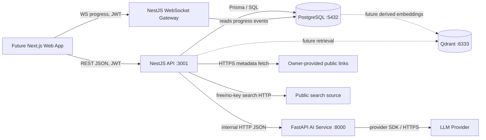

# System Architecture and Contracts

## System Architecture

### Runtime Components

| Component | Default port | Responsibility |
|---|---:|---|
| Next.js web app | `3000` | Future UI only; docs deferred. |
| NestJS API | `3001` | Public REST API, auth, RBAC, Discovery orchestration, WebSocket progress, PostgreSQL writes. |
| FastAPI AI service | `8000` | Discovery prompt execution, provider adapter, structured AI responses. |
| PostgreSQL | `5432` | Source-of-truth relational and JSONB storage. |
| Qdrant | `6333` | Future vector retrieval; optional and unused in Sprint 1. |

### Architecture Diagram



### Service Ownership

NestJS owns:

- Auth, users, roles, permissions, sessions.
- Public `/api/v1/*` routes.
- WebSocket `/ws/v1/*` routes.
- Discovery lifecycle state.
- `IntelligenceGatherer` orchestration for Sprint 1.
- Lightweight URL metadata extraction.
- Free/no-key search calls.
- All PostgreSQL writes and migrations.

FastAPI owns:

- AI provider adapter.
- Discovery prompt execution.
- Structured AI response validation before returning to NestJS.
- Provider error normalization.

FastAPI must not write to PostgreSQL in Sprint 1. Keeping one database writer avoids migration drift and transaction confusion.

### Prepared Discovery Flow

1. Owner authenticates through NestJS.
2. Owner starts Discovery with intake data and optional social links.
3. NestJS creates `discovery_sessions`, `prepared_discovery_intakes`, and `social_links`.
4. NestJS returns `202 Accepted` with `session_id` immediately.
5. NestJS runs background research in-process for Sprint 1.
6. NestJS emits WebSocket progress events and persists each event.
7. `IntelligenceGatherer` reads owner-provided link metadata first.
8. `IntelligenceGatherer` performs bounded free/no-key search for market and competitor context.
9. NestJS stores source refs, observations, hooks, and knowledge gaps in PostgreSQL.
10. NestJS calls FastAPI `/internal/v1/ai/discovery/start` with intake plus stored intelligence context.
11. FastAPI returns the first Discovery question or a safe failure.
12. NestJS stores the assistant message and marks session `ready_for_chat` or `partial_ready`.
13. Owner continues through `/api/v1/discovery/:session_id/respond`.
14. NestJS calls FastAPI `/internal/v1/ai/discovery/respond` for each AI turn.
15. When enough information exists, FastAPI returns a schema-valid `BusinessProfileDraft`.
16. NestJS stores the draft and waits for owner confirmation.
17. Owner confirms profile through `/api/v1/discovery/:session_id/confirm-profile`.
18. NestJS creates a confirmed `business_profile_versions` row and unlocks Strategy later.

### Public API Routes

Use URI versioning from the first public API version:

```text
POST /api/v1/auth/register
POST /api/v1/auth/login
POST /api/v1/auth/refresh
POST /api/v1/auth/logout
GET  /api/v1/auth/me

GET  /api/v1/health

POST /api/v1/discovery/start
GET  /api/v1/discovery/:session_id/status
POST /api/v1/discovery/:session_id/respond
POST /api/v1/discovery/:session_id/summarize
POST /api/v1/discovery/:session_id/confirm-profile

WS   /ws/v1/discovery
```

The Socket.IO client emits `discovery.join` with `session_id`; NestJS verifies
session ownership before joining the session-specific progress room.

Internal FastAPI routes:

```text
POST /internal/v1/ai/discovery/start
POST /internal/v1/ai/discovery/respond
POST /internal/v1/ai/discovery/summarize
```


## API Versioning

Use URL versioning from day one:

```text
/api/v1/...
/ws/v1/...
/internal/v1/...
```

Rules:

- Breaking changes create `/v2`.
- Additive fields are allowed in `/v1`.
- Removing fields, renaming fields, or changing meanings is breaking.
- Internal `/internal/v1` can move faster, but NestJS and FastAPI must update together in the same PR or coordinated pair.
