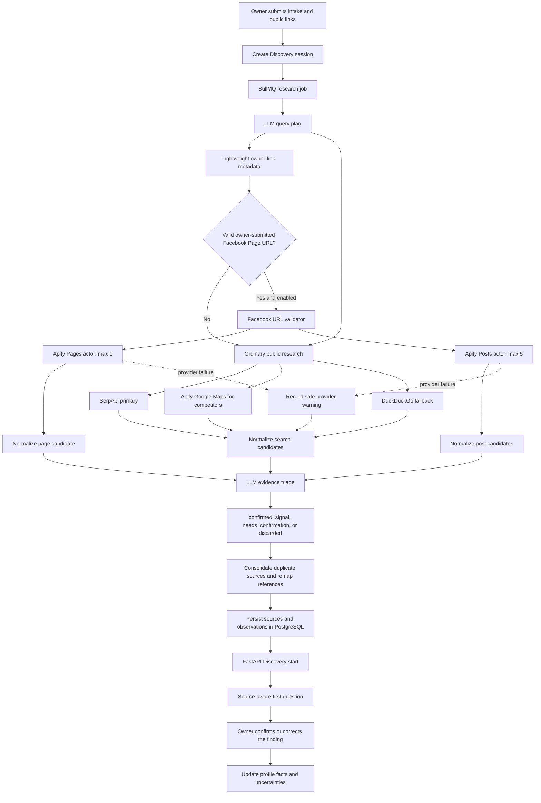
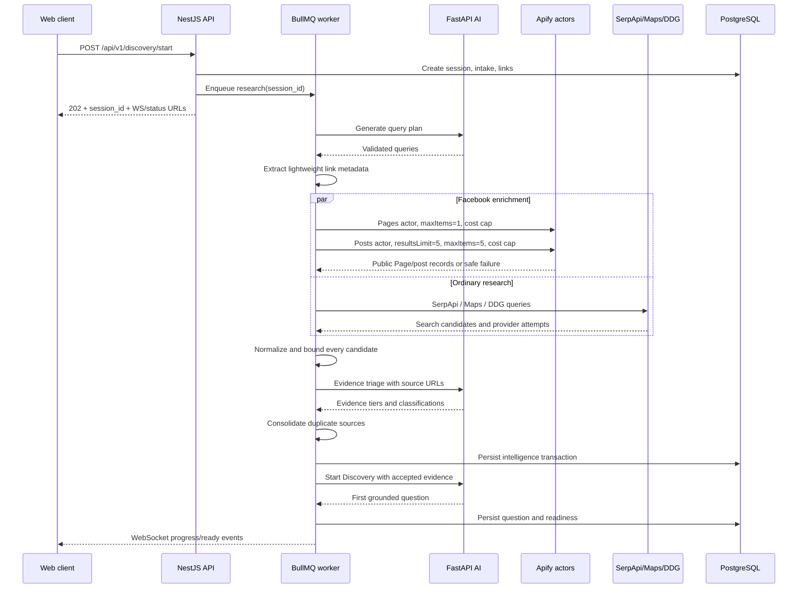

# Facebook Public Page Enrichment

**Research date:** 2026-07-14  
**Feature:** Prepared Discovery `IntelligenceGatherer`  
**Status:** implementation-ready architecture proposal

## Executive Decision

Add Facebook enrichment to Prepared Discovery, but keep its first release
strictly bounded:

1. Accept only owner-submitted public Facebook Page URLs.
2. Use the Apify-maintained `apify/facebook-pages-scraper` to retrieve one
   page profile.
3. Optionally use the Apify-maintained `apify/facebook-posts-scraper` for at
   most five recent public posts.
4. Do not collect comments, commenter identities, follower lists, personal
   profiles, private groups, messages, or raw Facebook exports.
5. Normalize actor output in NestJS, then let the existing LLM evidence-triage
   service assign the existing `confirmed_signal`, `needs_confirmation`, or
   `discarded` evidence tier.
6. Keep every accepted fact source-linked. Research can suggest or support a
   fact, but only the owner's chat confirmation promotes it to a confirmed
   business-profile fact.
7. Keep the feature fail-open. If Facebook or Apify fails, ordinary metadata,
   SerpApi, Google Maps, DuckDuckGo fallback, and Discovery chat continue.

This first release needs no Prisma migration and no public Discovery contract
change. Facebook-specific details fit the existing generic source and
observation metadata fields.

Long term, use Meta's official Pages API for Pages the owner connects through
OAuth. Keep Apify as a bounded public-data fallback and as a possible public
competitor research source after a separate privacy and product review.

## Why This Belongs In IntelligenceGatherer

The intake already accepts `platform: "facebook"`, but the current lightweight
metadata fetch usually sees Facebook's login/interstitial HTML rather than the
actual business Page. That means it commonly misses the information useful to
Discovery:

- Page identity, username, category, public address, and website.
- About/intro text that may describe products and positioning.
- Followers, likes, rating, and visible activity signals.
- Recent posts mentioning products, offers, occasions, opening changes, or
  current marketing activity.

These are research observations, not confirmed owner facts. Their value is to
make the interview more specific. Instead of asking only a generic question,
the agent can say, for example:

> لقيت على صفحة فيسبوك إنكم بتنشروا عروض مناسبات بشكل متكرر. هل المناسبات
> فعلًا من أهم أسباب الشراء عندكم، ولا الصفحة لا تعكس أغلب المبيعات؟

The question contains a traceable public finding and explicitly asks the owner
to confirm or correct it.

## Current Flow

The active flow is:

```text
POST /api/v1/discovery/start
  -> PostgreSQL session + intake + social links
  -> BullMQ research job
  -> DiscoveryResearchProcessor
  -> IntelligenceGathererService
       1. LLM query planning
       2. owner-link HTML metadata extraction
       3. SerpApi / Apify Maps / DuckDuckGo search
       4. HTML source enrichment
       5. LLM evidence triage
       6. contract mapping
  -> PostgreSQL intelligence persistence
  -> FastAPI Discovery start
  -> first source-aware question
  -> WebSocket progress + HTTP recovery status
```

Relevant implementation boundaries:

- `intelligence-gatherer.service.ts` owns the research sequence.
- `metadata-extractor.service.ts` checks owner-submitted links.
- `source-enrichment.service.ts` enriches search result pages.
- `apify-maps.provider.ts` is the existing Apify integration pattern.
- `evidence-triage.service.ts` sends normalized candidates to the LLM and maps
  accepted/discarded decisions.
- `discovery-intelligence.repository.ts` persists source metadata and
  observations transactionally.
- `discovery-research.processor.ts` starts AI Discovery after persistence.

## Actor Evaluation

### Selected Actors

| Use | Actor | Decision |
| --- | --- | --- |
| Page identity and public business details | `apify/facebook-pages-scraper` | Required for the first release |
| Recent public content and aggregate engagement | `apify/facebook-posts-scraper` | Optional, feature-flagged, max 5 posts |
| Find a Page by keyword/location | `apify/facebook-search-scraper` | Not needed initially; SerpApi already performs discovery |
| Public comments | `apify/facebook-comments-scraper` | Excluded due to personal-data, noise, and cost risk |
| Public reviews | `apify/facebook-reviews-scraper` | Deferred; collect only after a product and privacy review |
| Ads Library | `apify/facebook-ads-scraper` | Deferred to a later competitor/ads intelligence feature |

The selected actors are maintained by Apify rather than community publishers.
The [Pages actor](https://apify.com/apify/facebook-pages-scraper) returns public
Page identity, category, contact, follower/like, rating, creation, and ad-status
fields. Its [input schema](https://apify.com/apify/facebook-pages-scraper/input-schema)
requires `startUrls` and explicitly supports Pages rather than personal
profiles.

The [Posts actor](https://apify.com/apify/facebook-posts-scraper) returns public
post text, URL, timestamp, media links, and aggregate engagement. Its
[input schema](https://apify.com/apify/facebook-posts-scraper/input-schema)
supports `startUrls`, `resultsLimit`, optional date bounds, and optional video
transcripts.

### Why Not One Large Facebook Scrape

A broad scrape would increase latency, cost, irrelevant evidence, and privacy
risk. Discovery needs a small amount of strong context, not a social-media data
warehouse. One Page record and five recent posts are enough to test whether the
Page improves profile completion and interview quality.

Do not enable video transcripts in the first release. Do not use the Posts
date filter initially because it has an additional per-post charge. The five
post limit already bounds recency and volume.

## Free-Plan Cost Analysis

Apify's current [platform pricing](https://apify.com/pricing) gives the Free
plan $5 of monthly prepaid usage. When that credit is exhausted, free-plan
services are blocked until the next billing cycle; unused credit does not roll
over.

The actor pricing tabs are the billing source of truth:

| Actor event | Free-plan price | Proposed maximum per session |
| --- | ---: | ---: |
| Facebook Page | $12 / 1,000 pages | 1 page = $0.012 |
| Facebook post | $5 / 1,000 posts | 5 posts = $0.025 |
| Posts actor start | $0.001 / run | 1 run = $0.001 |
| Estimated Facebook layer | | about $0.038/session |

Sources: [Pages pricing](https://apify.com/apify/facebook-pages-scraper/pricing)
and [Posts pricing](https://apify.com/apify/facebook-posts-scraper/pricing).
Both list platform usage as included.

Theoretical test capacity:

- Page-only: about 416 Page results from $5.
- One Page plus five posts: about 131 sessions from $5 before allowing for
  failed/partial runs.
- A safer planning number is 100 full social-enrichment test sessions.

This is not the whole MarketMind Apify budget. Google Maps runs use the same
account credit, so actual available sessions will be lower. Record actual cost
per run in testing rather than relying only on theoretical arithmetic.

Some actor README copy mentions different free quantities. Pricing tabs are
more specific and should be rechecked before implementation or procurement.

## Target Flow



### Runtime Sequence



## Detailed Integration Design

### 1. Keep Ownership In NestJS

NestJS already owns external research providers, orchestration, progress, and
persistence. FastAPI owns LLM calls and structured AI decisions. Facebook
retrieval therefore belongs in `apps/api`, not `services/ai`.

The LLM must not call Apify directly. This keeps secrets, cost caps, retries,
timeouts, data minimization, and provider observability deterministic.

### 2. Add A Small Social Provider Boundary

Recommended folder structure:

```text
apps/api/src/modules/discovery/intelligence/
  social-enrichment.service.ts
  social-enrichment.types.ts

  apify/
    apify-actor.client.ts
    apify-actor.types.ts

  facebook/
    facebook-url.ts
    apify-facebook-pages.provider.ts
    apify-facebook-posts.provider.ts
    facebook-result.normalizer.ts
```

Responsibilities:

- `ApifyActorClient`: shared authenticated actor execution, timeout, spend cap,
  response-size cap, and normalized provider errors. Refactor the existing Maps
  provider to use it after Facebook behavior is locked with tests.
- `FacebookUrl`: normalize and reject non-Page URLs before spending money.
- `ApifyFacebookPagesProvider`: one public Page profile.
- `ApifyFacebookPostsProvider`: zero to five recent public posts.
- `FacebookResultNormalizer`: parse unknown actor JSON into strict internal
  candidates and drop everything outside the allowlist.
- `SocialEnrichmentService`: select the provider by platform, enforce session
  limits, and return normalized candidates plus provider attempts/warnings.

This structure allows later Instagram or TikTok adapters without pretending
that every platform has the same fields, policies, or actor behavior.

Use a small common boundary, not a universal social-media data model:

```text
SocialEnrichmentProvider
  supports(platform, url) -> boolean
  enrich(request, signal) -> candidates + attempts + warnings
```

Each provider owns its URL rules, actor/API input, output parser, field
allowlist, limits, and error mapping. The orchestrator only handles budgets,
parallel execution, progress, and aggregation.

### Multi-Platform Expansion

"Open all social platforms" should be treated as a provider roadmap, not one
generic scraper. Public access, useful fields, costs, and personal-data risks
differ by platform.

| Platform | Current/next behavior |
| --- | --- |
| Website | Keep current bounded HTML metadata/source enrichment |
| Google Maps | Keep current Apify Maps provider for local/competitor evidence |
| Facebook | Implement this Page and bounded-post design first |
| Instagram | Add a separate owner-profile provider only after Facebook metrics prove value |
| TikTok | Add a separate public-business-account provider and video/caption retention review |
| Delivery platforms | Keep bounded page/search enrichment until a provider-specific need is proven |
| Other | Preserve the submitted URL and use lightweight metadata only |

Every later adapter must satisfy the same contract: public business source,
bounded cost and volume, strict normalization, LLM triage, source citation,
fail-open behavior, and no owner-fact promotion without confirmation.

### 3. URL Validation Before Actor Execution

Accept only HTTPS Facebook Page URLs from owner intake. Normalize known mobile
hosts to the canonical host and remove fragments/tracking parameters.

Reject at least:

- Non-Facebook domains and look-alike domains.
- `profile.php`, `/people/`, and personal-profile forms.
- `/groups/`, `/events/`, `/marketplace/`, `/watch/`, and direct reel/post URLs
  when the expected input is a Page.
- Credentials in URLs, private/local addresses, and unsupported schemes.

The actor still performs the final Page-versus-profile check. URL validation is
an early safety and cost guard, not proof that the Page belongs to the business.

### 4. Execute Bounded Calls

For the initial version, use the same bounded synchronous Apify pattern as the
existing Google Maps provider. The Discovery job is already asynchronous from
the user's HTTP request.

Use both actor-input and API-level limits:

```json
// Pages actor input
{
  "startUrls": [{ "url": "https://www.facebook.com/example/" }]
}
```

```json
// Posts actor input
{
  "startUrls": [{ "url": "https://www.facebook.com/example/" }],
  "resultsLimit": 5,
  "captionText": false
}
```

API query controls:

```text
timeout=60
Pages: maxItems=1, maxTotalChargeUsd=0.02
Posts: maxItems=5, maxTotalChargeUsd=0.03
clean=true
```

Apify documents `maxItems` as a maximum number of charged dataset items, not a
guarantee that the actor returns only that many. Keep `resultsLimit` in actor
input and cap the parsed response as well. `maxTotalChargeUsd` is the hard cost
guard for one actor run. Allocating $0.02 to Pages and $0.03 to Posts keeps the
combined Facebook ceiling at $0.05. See the
[run-sync dataset endpoint](https://docs.apify.com/api/v2/act-run-sync-get-dataset-items-post).

The synchronous endpoint can hold a request for up to 300 seconds, but
MarketMind's current total research deadline is 180 seconds. Keep each
Facebook call at 60 seconds or less and overlap Facebook enrichment with
ordinary search. Do not add two serial actor waits to the current search loop.

Move to asynchronous actor runs plus idempotent webhooks only if measured test
latency regularly exceeds the bounded synchronous design. Apify notes that
webhook delivery can be duplicated and handlers must be idempotent; see
[webhook actions](https://docs.apify.com/integrations/webhooks/actions).

### 5. Normalize Before The LLM

Treat every actor response as `unknown`. Parse and cap it before creating an
internal candidate. Do not send raw actor output to FastAPI.

Allowed Page fields:

| Actor field family | Normalized use |
| --- | --- |
| Page ID/name/URL/title | identity and citation |
| categories | business-type candidate, normalized to a short string |
| intro/about | offerings or positioning candidate, truncated |
| public address/website | identity/digital-presence candidate |
| public business phone/email | identity check only after Page match |
| followers/likes/rating/count | aggregate social signal |
| creation/ad status | optional digital-presence signal |

Allowed post fields:

| Actor field family | Normalized use |
| --- | --- |
| post URL/ID | citation and deduplication |
| text/caption | current offer/activity candidate, truncated |
| timestamp | recency signal |
| reaction/comment/share counts | aggregate engagement only |
| external links | digital-presence evidence, max count bounded |

The current triage mapper forwards only scalar metadata to FastAPI. Arrays and
nested objects are removed. Convert useful actor arrays into bounded scalars,
for example `categories_text`, `external_links_count`, and
`engagement_total`, before triage.

Do not retain:

- Full raw actor JSON.
- Comment text or commenter identity.
- Profile pictures or follower/member lists.
- Admin data, private content, messages, cookies, or login state.
- Media binaries or video transcripts.

### 6. Separate Retrieval Providers From Query-Plan Hints

Add internal evidence-provider names:

```text
apify_facebook_pages
apify_facebook_posts
```

Do not add those actors to `SearchProviderHint`: the LLM query planner does not
route arbitrary search queries to a Facebook actor. The current code reuses
`SearchProviderHint` as the type of `EvidenceTriageCandidate.provider`, so
adding Facebook requires a small internal type correction:

```text
ResearchProviderName
  = serpapi
  | duckduckgo
  | apify_google_maps
  | metadata
  | apify_facebook_pages
  | apify_facebook_posts

SearchProviderHint
  = serpapi
  | duckduckgo
  | apify_google_maps
  | metadata
```

Use `ResearchProviderName` for normalized candidates and LLM evidence-triage
requests in both NestJS and `services/ai/app/search/schemas.py`. Keep
`SearchProviderHint` for query-plan routing. This is an internal NestJS/FastAPI
schema change, not a change to `packages/contracts` or the public API.

The actor names also belong in source metadata. They do not become new public
`SourceType` enum values. Public records remain:

- `owner_link` for the submitted Page URL.
- `search_result` for individual public posts or discovered Pages.
- `social_signal` or `digital_presence` for observations.

Example source metadata:

```json
{
  "provider": "apify_facebook_pages",
  "actor_id": "apify/facebook-pages-scraper",
  "platform": "facebook",
  "owner_submitted": true,
  "facebook_page_id": "123456",
  "followers_count": 8500,
  "categories_text": "Dessert Shop, Bakery",
  "enrichment_status": "complete"
}
```

Do not store the Apify token, request headers, cookies, or the complete actor
response in metadata.

### 7. Consolidate Duplicate Sources Before Persistence

This is a required correctness step.

`DiscoveryIntelligenceRepository.createSourceRefs()` currently deduplicates by
normalized URL and keeps the first saved source. Owner-link metadata is added
before search evidence, so a richer Facebook Page candidate with the same URL
can be skipped and its metadata lost.

Add an `IntelligenceSourceConsolidator` before contract mapping/persistence:

1. Group candidates by normalized canonical URL.
2. Prefer `owner_link` as the public source type when the owner supplied it.
3. Merge safe metadata, keeping provider provenance.
4. Keep the highest confidence and richest bounded title/snippet.
5. Remap every observation's `source_index` to the consolidated source.
6. Preserve separate post URLs as separate sources.

Do not solve this by inventing fake URLs or adding Facebook tables. The generic
source model is sufficient; it only needs correct consolidation.

### 8. Let The LLM Decide Evidence, Not Retrieval Mechanics

The provider deterministically retrieves and normalizes data. The existing LLM
evidence triage decides:

- Whether the Page likely represents the submitted business.
- Whether a post is relevant to the owner's business or market.
- Whether the evidence tier is `confirmed_signal`, `needs_confirmation`, or
  `discarded`.
- Classification: own business, social signal, competitor, market context, or
  irrelevant.
- Confidence, reason, candidate facts, and a suggested confirmation question.

The LLM must receive:

- Intake identity and location.
- Source URL and actor provider.
- Bounded Page/post text.
- Aggregate counts.
- Owner-submitted provenance.
- A strict instruction not to treat public claims as confirmed owner facts.

Both non-discarded evidence tiers currently map to an accepted research
observation, while `evidence_tier` remains in metadata. A `confirmed_signal`
means that the public source strongly supports the signal; it still does not
mean the owner confirmed a business-profile fact.

The Discovery prompt then receives only accepted source-linked observations.
It should reference a finding naturally and ask the owner to confirm or correct
it. A rejected or discarded actor result must never influence the chat.

### 9. Progress And Recovery

No progress-contract change is required initially. Reuse the existing
`metadata` stage with explicit payload phases:

```text
discovery.facebook_enrichment.started
discovery.facebook_page.completed
discovery.facebook_posts.completed
discovery.facebook_enrichment.partial
discovery.facebook_enrichment.completed
```

Recommended payload:

```json
{
  "phase": "facebook_enrichment",
  "provider": "apify_facebook_posts",
  "outcome": "succeeded",
  "result_count": 5,
  "duration_ms": 4200,
  "error_code": null
}
```

Do not include post text, personal data, token values, or raw actor output in
WebSocket payloads. HTTP status remains the recovery source of truth.

## Failure And Degradation Strategy

Facebook is useful enrichment, not a gate for Prepared Discovery.

| Failure | Behavior |
| --- | --- |
| `APIFY_TOKEN` missing | Skip Facebook actor calls, keep owner-link metadata, report `not_configured` |
| Invalid/non-Page URL | Do not call Apify, mark link unsupported for Page enrichment |
| Actor timeout/5xx | Retry once only if time budget permits, then continue partial |
| Free credit exhausted/charge cap reached | Stop Facebook enrichment and expose a safe cost-limit error |
| Empty/restricted Page | Preserve submitted URL, mark empty/restricted, continue search |
| Actor output schema drift | Reject invalid fields/result; never cast blindly |
| Posts fail but Page succeeds | Keep Page evidence and continue as partial social enrichment |
| LLM triage fails | Do not promote Facebook evidence; apply the current ProviderError/partial-result path |
| Total research deadline near | Abort social work first, preserve ordinary research and session recovery |

Suggested normalized provider error codes:

```text
APIFY_FACEBOOK_NOT_CONFIGURED
APIFY_FACEBOOK_INVALID_PAGE_URL
APIFY_FACEBOOK_TIMEOUT
APIFY_FACEBOOK_RATE_LIMITED
APIFY_FACEBOOK_BUDGET_EXHAUSTED
APIFY_FACEBOOK_RESTRICTED_OR_EMPTY
APIFY_FACEBOOK_INVALID_OUTPUT
APIFY_FACEBOOK_PROVIDER_ERROR
```

Errors shown to users must remain simple and non-technical. Provider codes and
attempt details belong in progress metadata and server logs.

## Configuration

Reuse the existing `APIFY_TOKEN`. Add explicit, bounded feature configuration:

```env
DISCOVERY_FACEBOOK_ENRICHMENT_ENABLED=false
DISCOVERY_FACEBOOK_POSTS_ENABLED=false
APIFY_FACEBOOK_PAGES_ACTOR_ID=apify~facebook-pages-scraper
APIFY_FACEBOOK_POSTS_ACTOR_ID=apify~facebook-posts-scraper
DISCOVERY_FACEBOOK_MAX_PAGES=1
DISCOVERY_FACEBOOK_MAX_POSTS=5
DISCOVERY_FACEBOOK_TIMEOUT_MS=60000
DISCOVERY_FACEBOOK_SESSION_MAX_CHARGE_USD=0.05
DISCOVERY_FACEBOOK_PAGES_MAX_CHARGE_USD=0.02
DISCOVERY_FACEBOOK_POSTS_MAX_CHARGE_USD=0.03
```

Defaults should be conservative. Enable Pages first in development, verify
cost/output, then enable Posts. Configuration validation must reject actor cap
allocations whose sum exceeds the session cap. Never commit the token.

## Privacy, Terms, And Product Boundaries

Public visibility does not mean unrestricted reuse. Meta describes public
content as visible beyond Facebook, but its
[Automated Data Collection Terms](https://www.facebook.com/legal/automated_data_collection_terms)
still define and govern publicly available personal data. Apify's
[General Terms](https://docs.apify.com/legal/general-terms-and-conditions),
[Acceptable Use Policy](https://docs.apify.com/legal/acceptable-use-policy), and
[Data Processing Addendum](https://docs.apify.com/legal/data-processing-addendum)
place responsibility on the customer to have an appropriate legal basis and
to comply with applicable law and third-party rights.

This is architecture guidance, not legal advice. Before production launch,
obtain an Egypt-focused legal review covering notice, lawful basis,
cross-border vendor processing, retention, and deletion.

Product rules for the first release:

- Tell the owner that MarketMind checks public links they submit.
- Process public business Pages only.
- Prefer aggregate engagement over identity-level data.
- Keep raw actor responses only in memory and discard them after normalization.
- Apply the documented short retention window to research metadata.
- Provide deletion that removes Page-derived sources, observations, and
  profile evidence associated with the business/session.
- Never present scraped content as owner-confirmed truth.

## Meta Official API: Long-Term Direction

Meta's official API is the better production source for a Page the business
owner controls. Page access tokens and Page permissions can support authorized
Page content and Insights. Arbitrary competitor Page access through
[Page Public Content Access](https://developers.facebook.com/docs/features-reference/page-public-content-access/)
requires app review and business verification, and remains limited to public
data. [Page Insights](https://developers.facebook.com/docs/graph-api/reference/page/insights/)
requires Page-level authorization and is not a reliable competitor-data path.

Recommended long-term source policy:

| Page relationship | Preferred source |
| --- | --- |
| Owner connects and authorizes the Page | Meta Pages API |
| Owner submits a public Page but has not connected it | Bounded Apify fallback |
| Candidate Page discovered for the owner's own business | SerpApi discovery, Apify only after strong match/owner confirmation |
| Competitor Page | Public Page profile only in a later feature; no internal Insights claim |

Do not delay the bounded testing integration while waiting for Meta app review,
but do not make scraping the permanent source for owner-authorized analytics.

## Testing Strategy

### Unit Tests

- Facebook URL normalization and rejection matrix.
- Pages actor request: actor ID, timeout, `maxItems=1`, and $0.02 run cap.
- Posts actor request: `resultsLimit=5`, `captionText=false`, `maxItems=5`,
  and $0.03 run cap.
- Strict parsing of current actor fixtures.
- Missing, extra, nested, malformed, and changed actor fields.
- Arabic Page names, Arabic posts, mixed Arabic/English, and emoji.
- Truncation and scalar metadata normalization.
- Page success/posts failure and Page failure/posts success behavior.
- Source consolidation and observation-reference remapping.
- No secret/raw-payload leakage into metadata or progress.

### Integration Tests

- Mock Apify HTTP responses through the shared external HTTP boundary.
- Confirm Facebook candidates reach LLM triage with source URLs and normalized
  scalar metadata.
- Confirm accepted and discarded decisions persist correctly.
- Confirm the owner-link source retains merged Facebook metadata rather than
  losing it during URL deduplication.
- Confirm the AI start payload receives accepted Facebook evidence.
- Confirm provider failure still reaches `partial_ready` or `ready_for_chat`
  according to the existing lifecycle.

### Controlled Real-Provider Test

Use one public test business Page supplied by the owner/team:

1. Record the Apify balance before the run.
2. Enable Pages only and run one Discovery session.
3. Inspect provider duration, result count, normalized output, actual charge,
   persisted source, and first AI question.
4. Enable Posts with a limit of five and repeat.
5. Verify no raw comments or personal-profile data were retained.
6. Repeat with an invalid Page, a restricted Page, Arabic content, and an
   intentionally exhausted/very small charge cap.

Do not automate live-provider tests in normal CI. Keep deterministic fixtures
for CI and run a small opt-in provider smoke test manually or on a protected
schedule.

## Observability And Acceptance Metrics

Record structured server-side metrics without content:

- `facebook_enrichment_attempts_total{actor,outcome}`
- `facebook_enrichment_duration_ms{actor}`
- `facebook_enrichment_results_total{actor}`
- `facebook_enrichment_cost_usd{actor}` when Apify exposes run usage
- `facebook_evidence_decisions_total{tier,classification}`
- `facebook_enrichment_deadline_aborts_total`
- `facebook_enrichment_schema_mismatch_total{actor}`

Initial acceptance targets:

- Facebook enrichment never makes Discovery start fail by itself.
- No actor call exceeds the configured per-call timeout.
- The two actor allocations never exceed the configured $0.05 session cap.
- At most one Page and five posts are retained as candidates.
- Every owner-visible Facebook observation has a source reference.
- No personal commenter/follower data or raw actor payload is persisted.
- The first or subsequent chat questions can use an accepted Facebook finding
  and ask for owner confirmation.
- Ordinary search behavior is unchanged when the feature flag is off.

## Implementation Plan

### Task 1: Lock The Boundary

- Add feature config and Facebook URL validation.
- Add actor fixtures from one controlled run with secrets removed.
- Define the exact normalized Page and post candidate types.

### Task 2: Reuse Apify Infrastructure

- Extract a small `ApifyActorClient` from the existing Maps request pattern.
- Add timeout, response limit, `maxItems`, and `maxTotalChargeUsd` support.
- Preserve existing Maps behavior with regression tests.

### Task 3: Add Facebook Providers

- Implement Pages and Posts providers with strict parsers.
- Add fail-open error normalization and result caps.
- Keep Posts behind a separate feature flag.

### Task 4: Integrate With IntelligenceGatherer

- Start Facebook work after owner-link metadata validation.
- Overlap it with ordinary search to protect the 180-second deadline.
- Send normalized Page/post candidates through LLM evidence triage.
- Emit detailed provider progress under the existing `metadata` stage.

### Task 5: Consolidate Sources

- Merge same-URL owner/search/Page candidates before contract mapping.
- Remap observation source references.
- Add persistence tests proving rich metadata is not lost.

### Task 6: Verify Discovery Chat

- Confirm only accepted Facebook evidence reaches FastAPI Discovery.
- Add Arabic tests for a source-aware question and recommended response paths.
- Verify owner correction overrides research rather than being overwritten by
  it.

### Task 7: Real-Provider Pilot

- Run Pages-only, then Pages-plus-five-posts tests.
- Measure real latency, costs, missing fields, Arabic quality, and failure
  behavior.
- Keep synchronous execution if p95 remains within budget; otherwise plan an
  async Apify-run continuation using idempotent job state/webhooks.

### Task 8: Production Gate

- Complete legal/privacy review and owner notice.
- Implement/enforce research retention and deletion.
- Add cost alarms and actor schema-drift alerts.
- Decide when to introduce Meta OAuth for owner-authorized Page data.

## What Is Explicitly Deferred

- Personal-profile scraping.
- Comments, commenter identity, sentiment from identifiable users, and follower
  lists.
- Private groups or login-cookie scraping.
- Facebook Ads Library research.
- Full competitor social monitoring.
- Continuous social listening or scheduled recrawls.
- Historical post warehouses, Qdrant indexing, or RAG over raw social content.
- Instagram/TikTok actors before Facebook proves value and each platform gets
  its own privacy/provider review.

## Final Recommendation

Implement Facebook as a small, source-aware enrichment lane inside the existing
NestJS IntelligenceGatherer. Start with the official Apify Pages actor and a
feature-flagged five-post actor. Keep all retrieval bounded, normalize before
the LLM, consolidate duplicate URLs before persistence, and require owner
confirmation before research becomes a business-profile fact.

This gives the team useful Facebook context for Arabic Discovery interviews
without changing the public contracts, adding a new database, or turning Phase
1 into an open-ended social scraping system.

## Confidence And Remaining Unknowns

Verified against the current repository and official documentation:

- Current Discovery orchestration, persistence, evidence, and progress flow.
- Existing Facebook intake support and generic metadata capacity.
- Current Apify actor inputs, prices, run caps, and synchronous API behavior.
- Current Meta distinction between owner-authorized Page data and arbitrary
  public Page access.

Still requires empirical verification:

- Exact actor output for representative Arabic Egyptian business Pages.
- Success rate for restricted, low-activity, or differently localized Pages.
- Real p50/p95 actor latency inside the 180-second research deadline.
- Actual combined Apify cost while Google Maps uses the same free credit.
- Whether five recent posts materially improve the LLM interview enough to
  justify enabling Posts by default.

No live actor was invoked while preparing this report, so it incurred no Apify
charge. Actor output schemas and prices are external and can change; lock
sanitized fixtures during the controlled pilot and recheck pricing before
implementation.

## Primary Sources

- [Apify Facebook Pages Scraper](https://apify.com/apify/facebook-pages-scraper)
- [Facebook Pages Scraper input](https://apify.com/apify/facebook-pages-scraper/input-schema)
- [Facebook Pages Scraper pricing](https://apify.com/apify/facebook-pages-scraper/pricing)
- [Apify Facebook Posts Scraper](https://apify.com/apify/facebook-posts-scraper)
- [Facebook Posts Scraper input](https://apify.com/apify/facebook-posts-scraper/input-schema)
- [Facebook Posts Scraper pricing](https://apify.com/apify/facebook-posts-scraper/pricing)
- [Apify synchronous Actor API](https://docs.apify.com/api/v2/act-run-sync-get-dataset-items-post)
- [Apify webhook behavior](https://docs.apify.com/integrations/webhooks/actions)
- [Apify pricing](https://apify.com/pricing)
- [Meta Page Public Content Access](https://developers.facebook.com/docs/features-reference/page-public-content-access/)
- [Meta Page Insights](https://developers.facebook.com/docs/graph-api/reference/page/insights/)
- [Meta Automated Data Collection Terms](https://www.facebook.com/legal/automated_data_collection_terms)
- [Apify General Terms](https://docs.apify.com/legal/general-terms-and-conditions)
- [Apify Acceptable Use Policy](https://docs.apify.com/legal/acceptable-use-policy)
- [Apify Data Processing Addendum](https://docs.apify.com/legal/data-processing-addendum)
