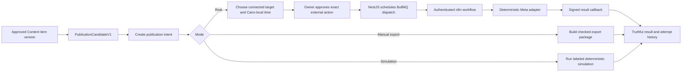
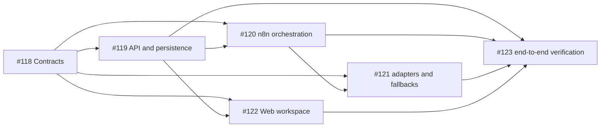

# Publishing Automation Architecture and Team Plan

**Status:** approved Sprint 5B implementation plan
**Automation epic:** [#117](https://github.com/ARabee3/marketmind-ai/issues/117)
**Team:** Ahmed (`ARabee3`), Abdulazim (`abdulazimRabie`), and Gerges
(`GergesYoussef-hub`)
**Lead:** Ahmed
**Pairing rule:** Abdulazim is primary owner of
[#120](https://github.com/ARabee3/marketmind-ai/issues/120) and
[#121](https://github.com/ARabee3/marketmind-ai/issues/121); Ahmed is the
second contributor and co-assignee on both
**Depends on:** the frozen `PublicationCandidateV1` fixture and rules from
Content issue #107
**Normative contract:**
`packages/contracts/PUBLISHING_CONTRACT.md`, frozen by issue #118; code snippets
in this planning document are illustrative when naming differs
**GitHub state:** epic #117 and child issues #118–#123 are created, linked as
sub-issues, and assigned to Sprint 5 with `Todo / Sprint Ready`

## 1. Outcome

Publishing Automation turns one exact approved `PublicationCandidateV1` into
one truthful result:

- a real scheduled Meta publication when the required account, permissions,
  media, and credentials work;
- a downloadable manual-export package; or
- a clearly labeled simulation for the graduation demo.

It is a deterministic service, not an AI agent. It cannot rewrite the caption,
change the asset, select a different channel, invent a schedule, or approve an
external action.

The Automation team can start as soon as Content issue #107 freezes the
handoff contract and fixtures. It does not wait for the full Content UI or
generation implementation.

## 2. Approved implementation baseline

These decisions are the approved Sprint 5B baseline.

| Decision               | Approved answer                                                       |
| ---------------------- | --------------------------------------------------------------------- |
| Source of truth        | NestJS and PostgreSQL                                                 |
| Workflow runner        | An authenticated, version-controlled n8n workflow                     |
| Due-time scheduling    | Redis/BullMQ delayed jobs created from PostgreSQL state               |
| First real platforms   | Facebook Page and Instagram Professional account                      |
| First real format      | One ready static image plus its approved caption                      |
| Other formats/channels | Manual export or clearly labeled simulation                           |
| Owner time zone        | Store UTC plus the IANA zone; show `Africa/Cairo` in the UI           |
| Real-publish approval  | Required for the exact candidate, target, mode, and time              |
| Retry delivery         | At least once, with idempotency and truthful unknown outcomes         |
| Fallback               | Manual export and simulation remain available even if Meta is blocked |

This scope does not add TikTok publishing, paid-ad execution, or generated video
production. A short-video script can be exported, but it is not treated as a
ready video asset.

## 3. Two approvals, for two different decisions

Content approval and publication approval are not the same action.

### Content approval

The owner approves one exact immutable Content item version. NestJS may then
create `PublicationCandidateV1`.

This answers:

> Is this exact caption, CTA, hashtag set, and asset allowed to leave Content?

### Publication approval

For a real external publication, the owner approves:

- the exact `candidate_id` and checksum;
- the exact connected target account;
- `mode = real`;
- the exact local date and time;
- the time zone;
- the resulting UTC instant; and
- the current intent version.

This answers:

> Should MarketMind perform this external action on this account at this time?

The owner may approve several items together only when the confirmation screen
lists every exact item, account, mode, and scheduled time. There is no standing
approval for all future weeks.

A scheduled job may execute later without asking again because the external
action was already approved. Any material change invalidates that approval and
returns the intent to `awaiting_approval`.

Manual export has no external side effect. The owner's explicit Export action
is logged, but it does not need a second real-publication approval. Simulation
is also an explicit user action and must stay visibly labeled.

## 4. End-to-end flow



For each rolling week:

1. Content creates three to five draft items.
2. The owner approves the exact Content items they want to use.
3. Each eligible approved item creates one candidate.
4. Automation shows the candidate as waiting for a publishing decision.
5. The owner chooses real publishing, export, or simulation.
6. For a real publication, the owner chooses a target and exact time, then
   confirms the external action.
7. Automation executes and records the result.
8. The process repeats for the next approved weekly pack through Strategy week 12.

Automation is event-driven per candidate. It does not run one unsafe
"publish every week" loop.

## 5. Service boundaries

| Component      | Responsibility                                                                                                                                          |
| -------------- | ------------------------------------------------------------------------------------------------------------------------------------------------------- |
| Next.js Web    | Calendar, target/mode/time selection, exact confirmation, cancellation, retry/recovery, export download, and truthful result display                    |
| NestJS API     | Auth and ownership, candidate intake, validation, targets, schedules, approval snapshots, persistence, idempotency, dispatch, callbacks, and public API |
| PostgreSQL     | Authoritative candidates, targets, intents, approvals, attempts, results, outbox/inbox identities, and export metadata                                  |
| Redis/BullMQ   | Delayed due-time jobs and bounded retryable dispatch work                                                                                               |
| n8n            | Versioned deterministic execution workflow and platform routing                                                                                         |
| Meta adapter   | Approved Graph API request and normalized provider response                                                                                             |
| Object storage | Immutable candidate media and generated export archives                                                                                                 |
| Content module | Candidate creation, source validity, checksum, and immutable approved fields                                                                            |

Important ownership rules:

- NestJS remains the only PostgreSQL writer.
- PostgreSQL, not n8n execution history, is product truth.
- BullMQ, not an n8n Wait node, owns long-lived due times.
- n8n cannot update product state directly; it returns a signed callback.
- No LLM appears anywhere in the publishing path.
- Provider secrets never enter a browser payload, Git, or ordinary logs.

## 6. Proposed modules and repository locations

The normative package now uses the following paths. Implementation modules may
add internal details, but the responsibilities must stay separate.

```text
packages/contracts/
  src/publishing/
    publishing-types.ts
    publishing-canonical.ts
    publication-intent.ts
    publication-result.ts
    publishing-envelope.ts
    publishing-policy.ts
    publishing-interfaces.ts

apps/api/
  src/publishing/
    publishing.module.ts
    candidates/
    targets/
    intents/
    dispatch/
    exports/
    callbacks/

apps/web/
  app/.../publishing/
  components/publishing/

infra/n8n/
  workflows/
    publishing-v1.json
  fixtures/
    publication-candidate.valid.json
    publication-candidate.tampered.json
    publication-candidate.unapproved.json
```

The exact Web route should follow the product's existing authenticated route
structure when implementation begins.

## 7. Contract and data model (illustrative)

`packages/contracts/PUBLISHING_CONTRACT.md` and the exported TypeScript types
are authoritative. The snippets below explain persistence intent and do not
override the frozen snake_case wire shapes.

### 7.1 Candidate inbox record

Automation stores the minimum projection required to process the frozen
Content candidate:

```ts
interface PublicationCandidateRecord {
  candidateId: UUID;
  eventId: UUID;
  businessId: UUID;
  contentItemVersionId: UUID;
  strategyWeekNumber: number;
  channel: ContentChannel;
  format: ContentFormat;
  locale: "ar" | "en";
  candidateChecksum: string;
  eventFingerprint: string;
  payload: PublicationCandidateV1;
  sourceState: "active" | "revoked" | "replaced";
  sourceStateVersion: number;
  sourceStatus: PublicationCandidateStatusV1;
  receivedAt: IsoDateTime;
}
```

Candidate delivery is at least once. The inbox has unique constraints for
`eventId` and `candidateId`. A repeated valid delivery returns the existing
record. A repeated identity with different bytes is rejected as tampering.
State changes arrive through the frozen Content state-change event, bind the
same candidate checksum, and advance only when `stateVersion` is newer. They
update `sourceState` and `sourceStatus` without mutating `payload`. The shared
`reducePublicationCandidateEventV1` function is the reference reducer:
identical same-version delivery is a no-op, lower versions are stale, and
different same-version bytes are conflicts.

### 7.2 Publishing target

```ts
interface PublishingTarget {
  targetId: UUID;
  businessId: UUID;
  provider: "meta";
  channel: "facebook" | "instagram";
  externalAccountId: string;
  displayName: string;
  connectionState: "connected" | "expired" | "revoked" | "error";
  credentialRef: string;
  capabilities: Array<"static_image">;
  lastVerifiedAt: IsoDateTime | null;
}
```

`credentialRef` is opaque. The database must not expose a raw provider token to
the Web application. Sprint 5B uses one-business MVP credentials managed in the
approved n8n/secret store. Multi-tenant credential architecture is deferred.

### 7.3 Publication intent

One intent is the owner's plan for one candidate.

```ts
type PublishingMode = "real" | "manual_export" | "simulation";

type PublicationIntentState =
  | "draft"
  | "awaiting_approval"
  | "scheduled"
  | "dispatching"
  | "succeeded"
  | "failed"
  | "action_required"
  | "cancelled";

interface PublicationIntent {
  intentId: UUID;
  version: number;
  businessId: UUID;
  candidateId: UUID;
  mode: PublishingMode;
  targetId: UUID | null;
  scheduledLocal: LocalDateTime | null;
  timeZone: "Africa/Cairo" | null;
  scheduledUtc: IsoDateTime | null;
  state: PublicationIntentState;
  approvedDecisionId: UUID | null;
  createdByUserId: UUID;
  createdAt: IsoDateTime;
  updatedAt: IsoDateTime;
}
```

MVP permits one non-cancelled intent per candidate. Retry creates a new attempt
under the same intent; it does not create another logical publication.

Changing candidate, mode, target, local time, time zone, or UTC instant:

1. increments the intent version;
2. clears any prior publication approval;
3. cancels the old delayed job; and
4. returns a real intent to `awaiting_approval`.

### 7.4 Exact publication approval

```ts
interface PublicationApprovalSnapshotV1 {
  contractVersion: "publication-approval-v1";
  decisionId: UUID;
  intentId: UUID;
  intentVersion: number;
  candidateId: UUID;
  candidateChecksum: string;
  mode: "real";
  targetId: UUID;
  scheduledLocal: LocalDateTime;
  timeZone: "Africa/Cairo";
  scheduledUtc: IsoDateTime;
  decidedByUserId: UUID;
  decidedAt: IsoDateTime;
}
```

Approval is rejected if the client submits a stale intent version or candidate
checksum.

### 7.5 Publication attempt and result

```ts
type PublicationAttemptState =
  | "queued"
  | "running"
  | "succeeded"
  | "failed"
  | "unknown"
  | "cancelled";

interface PublicationAttempt {
  attemptId: UUID;
  intentId: UUID;
  attemptNumber: number;
  idempotencyKey: string;
  workflowVersion: string;
  providerRequestFingerprint: string | null;
  state: PublicationAttemptState;
  startedAt: IsoDateTime | null;
  finishedAt: IsoDateTime | null;
}

interface PublicationResultV1 {
  contractVersion: "publication-result-v1";
  attemptId: UUID;
  intentId: UUID;
  mode: PublishingMode;
  outcome:
    | "published"
    | "exported"
    | "simulated"
    | "failed"
    | "cancelled"
    | "unknown";
  provider: "meta" | null;
  remotePublicationId: string | null;
  remoteUrl: string | null;
  exportArtifactId: UUID | null;
  simulationLabel: "SIMULATION" | null;
  errorCode: PublishingErrorCode | null;
  retryable: boolean;
  occurredAt: IsoDateTime;
}
```

An ambiguous network timeout after sending a provider request becomes
`unknown`; it must not be presented as failed or blindly retried. The system
first attempts provider reconciliation, then asks for owner/operator action if
the outcome still cannot be proven.

## 8. Lifecycle

```text
draft
  -> awaiting_approval      real mode after target and schedule are complete
  -> scheduled              exact real action approved
  -> dispatching
  -> succeeded
  -> failed                 proven failure
  -> action_required        ambiguous result or expired authorization

draft
  -> dispatching            explicit export/simulate action
  -> succeeded | failed

draft | awaiting_approval | scheduled
  -> cancelled

failed | action_required
  -> dispatching            eligible explicit retry/reconciliation only
```

Terminal result labels are mode-specific:

- `Published` means a provider confirmed a real external publication.
- `Exported` means an archive was generated; it does not mean the owner posted
  it.
- `Simulated` always shows a permanent simulation badge; it does not mean a
  remote account changed.
- `Unknown` means MarketMind cannot safely prove whether the provider accepted
  the request.

## 9. Scheduling and dispatch

### 9.1 Schedule creation

The API:

1. accepts a Cairo-local date/time;
2. resolves it using the `Africa/Cairo` IANA time zone;
3. stores both the local input and normalized UTC instant;
4. rejects a time in the past;
5. shows both values on the approval screen;
6. persists the exact approval snapshot; and
7. creates a uniquely keyed BullMQ delayed job after the transaction commits.

The queue job identity is derived from `intentId + intentVersion`. Duplicate
queue delivery resolves to the same attempt or a recorded no-op.

### 9.2 Dispatch-time checks

Immediately before any real provider call, NestJS rechecks:

- the intent is still `scheduled`;
- the approved intent version is current;
- the candidate is active;
- the candidate checksum still matches;
- the target remains connected and supports the format;
- every media checksum matches;
- no successful attempt already exists;
- the job is due; and
- the idempotency identity has not already been accepted.

The checksum check hashes the retrieved bytes through
`validateRetrievedPublicationAssetsV1`; matching IDs or checksum strings alone
do not authorize an adapter call.

If any check fails, no provider call occurs.

### 9.3 n8n invocation

NestJS creates an attempt, then sends n8n:

- attempt and correlation identities;
- the immutable publishing payload;
- a short-lived media retrieval URL;
- the provider operation name;
- a timestamp and nonce;
- a signature over the canonical request body; and
- the signed callback location.

The n8n webhook rejects missing/invalid authentication, expired timestamps, and
replayed nonces. n8n records the approved workflow version and never logs
tokens or complete sensitive request bodies.

### 9.4 Callback

n8n sends one normalized signed callback. NestJS:

1. authenticates signature, timestamp, and nonce;
2. checks `attemptId` and request fingerprint;
3. accepts the callback once;
4. stores the immutable result;
5. updates the intent in the same transaction; and
6. pushes the truthful state to the Web UI.

A repeated identical callback is idempotent. A repeated identity with
different result data is a security/state conflict.

## 10. Three adapters

### 10.1 Real Meta adapter

The initial adapter supports only capabilities proven during setup:

- an owner-authorized Facebook Page or Instagram Professional target;
- a ready static image whose checksum matches the candidate;
- the exact approved caption;
- a provider response normalized into `PublicationResultV1`.

Meta app permissions and account prerequisites must be verified against the
current official documentation during implementation. If app review,
authorization, media requirements, or provider access are not ready, the issue
does not fake a real success; the demo uses export or simulation.

### 10.2 Manual export adapter

The archive contains:

```text
manifest.json
caption-ar.txt or caption-en.txt
hashtags.txt
alt-text.txt
media/
posting-notes.txt
README.txt
```

`manifest.json` includes candidate identity, item/version identity, checksum,
channel, format, locale, recommended window, generated time, and every asset
checksum. The download is visibly labeled as an export, never a publication.

### 10.3 Simulation adapter

Simulation:

- performs all candidate, asset, target-shape, and schedule validation that can
  run without a real provider;
- never sends an external request;
- returns a deterministic fake remote identity scoped to the attempt;
- stores `simulationLabel = "SIMULATION"`; and
- displays that label in history, details, notifications, and demo data.

Simulation is useful evidence that orchestration works, not evidence that Meta
published anything.

## 11. Public API intent

Route intent and DTOs are frozen in `PUBLISHING_CONTRACT.md`.

```text
GET  /api/v1/publication-candidates
GET  /api/v1/publication-candidates/:candidateId

GET  /api/v1/publishing-targets
POST /api/v1/publishing-targets/meta/connect
POST /api/v1/publishing-targets/meta/callback
POST /api/v1/publishing-targets/:targetId/verify
DELETE /api/v1/publishing-targets/:targetId

POST /api/v1/publication-intents
GET  /api/v1/publication-intents
GET  /api/v1/publication-intents/:intentId
PUT  /api/v1/publication-intents/:intentId/schedule
POST /api/v1/publication-intents/:intentId/decisions
POST /api/v1/publication-intents/:intentId/cancel
POST /api/v1/publication-intents/:intentId/retry

GET  /api/v1/publication-intents/:intentId/attempts
GET  /api/v1/publication-intents/:intentId/export
```

Internal-only routes:

```text
POST /internal/v1/publishing/dispatch/:attemptId/callback
GET  /internal/v1/publishing/assets/:assetId
```

Internal routes require service authentication and are not reachable through
normal owner-session authorization alone.

## 12. Stable errors

| Code                                   | Meaning                                                              |
| -------------------------------------- | -------------------------------------------------------------------- |
| `PUBLISHING_CONTRACT_UNSUPPORTED`      | Contract or field set is outside the frozen publishing-v1 boundary   |
| `PUBLISHING_CANDIDATE_INVALID`         | Candidate does not match the frozen V1 shape                         |
| `PUBLISHING_CANDIDATE_TAMPERED`        | Candidate identity/checksum no longer matches                        |
| `PUBLISHING_CANDIDATE_REVOKED`         | Content marked the candidate inactive or replaced                    |
| `PUBLISHING_TARGET_NOT_CONNECTED`      | No eligible external target is connected                             |
| `PUBLISHING_TARGET_UNAUTHORIZED`       | Provider authorization is expired/revoked                            |
| `PUBLISHING_FORMAT_UNSUPPORTED`        | Target cannot publish this format in Sprint 5B                       |
| `PUBLISHING_ASSET_UNAVAILABLE`         | Required immutable media cannot be retrieved                         |
| `PUBLISHING_ASSET_TAMPERED`            | Retrieved asset checksum differs                                     |
| `PUBLISHING_SCHEDULE_IN_PAST`          | Requested instant is no longer valid                                 |
| `PUBLISHING_APPROVAL_REQUIRED`         | Exact external action has no current approval                        |
| `PUBLISHING_STATE_CONFLICT`            | Request used a stale intent/version/state                            |
| `PUBLISHING_IDEMPOTENCY_CONFLICT`      | One idempotency identity was reused with different canonical bytes   |
| `PUBLISHING_DUPLICATE_DISPATCH`        | A successful/in-flight identity already exists                       |
| `PUBLISHING_WEBHOOK_UNAUTHORIZED`      | n8n request or callback authentication failed                        |
| `PUBLISHING_WEBHOOK_TIMESTAMP_INVALID` | Signed message is outside the frozen five-minute window              |
| `PUBLISHING_WEBHOOK_NONCE_REPLAYED`    | One-time webhook nonce has already been consumed                     |
| `PUBLISHING_PROVIDER_RATE_LIMITED`     | Provider rejected due to a rate limit                                |
| `PUBLISHING_PROVIDER_FAILURE`          | Provider returned a proven failure                                   |
| `PUBLISHING_PROVIDER_OUTCOME_UNKNOWN`  | Request may have succeeded but cannot be proven                      |
| `PUBLISHING_CALLBACK_INVALID`          | Callback identity, signature, or body is invalid                     |
| `PUBLISHING_CALLBACK_CONFLICT`         | Callback identity was replayed with different canonical result bytes |

Errors are persisted with sanitized details. Secrets, access tokens, signed
media URLs, and raw provider payloads are never returned to the browser.

## 13. Recovery rules

| Failure                                      | Required behavior                                        |
| -------------------------------------------- | -------------------------------------------------------- |
| Candidate event repeats                      | Reuse the existing inbox record                          |
| Candidate bytes change under same identity   | Reject as tampered                                       |
| Content revokes/replaces candidate           | Cancel a not-yet-dispatched intent; never mutate payload |
| Target authorization expires before due time | Do not call provider; move to action required            |
| Schedule changes                             | Invalidate approval and replace the delayed job          |
| Queue job repeats                            | Reuse the same attempt/idempotency identity              |
| n8n webhook is replayed                      | Reject the replayed nonce                                |
| Provider rate-limits before acceptance       | Record retryable failure and apply bounded backoff       |
| Network fails before any request is sent     | Retry within the bounded policy                          |
| Network times out after request send         | Mark unknown and reconcile; do not blind retry           |
| Callback repeats identically                 | Return the existing result                               |
| Callback conflicts                           | Reject and alert as state/security conflict              |
| Export generation fails                      | Preserve candidate and allow explicit retry              |
| Meta is unavailable for the demo             | Use export or visibly labeled simulation                 |

## 14. Security and operational minimum

- Authenticate every n8n webhook and API callback.
- Use request signatures, short timestamp tolerance, and one-time nonce replay
  protection.
- Use TLS outside local development.
- Store provider credentials only in the approved encrypted credential/secret
  store and reference them opaquely.
- Grant the smallest provider permissions that the selected publishing
  operation requires.
- Redact credentials, signed URLs, auth headers, captions, and owner data from
  routine logs where not required.
- Version-control the exported n8n workflow JSON and fixture set.
- Pin the workflow version on every attempt.
- Keep production workflow editing restricted and review workflow diffs.
- Run the n8n security audit and ensure production webhooks are protected.
- Set execution retention deliberately; PostgreSQL remains the durable product
  history.
- Expose health/readiness for the API, queue, n8n endpoint, storage, and enabled
  provider adapter without leaking secrets.

## 15. Web experience

The Publishing workspace should make the decision trail obvious:

```text
Approved candidate
    -> mode
    -> exact target and time
    -> consequence summary
    -> owner approval
    -> scheduled/dispatching
    -> truthful result and recovery
```

Required views:

- rolling 12-week publication calendar or timeline;
- current and next Strategy week;
- approved candidates waiting for a decision;
- static preview with locale, caption, CTA, hashtags, alt text, and asset;
- mode selector with clear real/export/simulation consequences;
- connected-target selector and connection status;
- Cairo-local schedule picker with UTC confirmation;
- explicit final confirmation for a real external action;
- cancellation/reschedule before dispatch;
- attempt history and normalized provider result;
- recovery actions for expired auth, proven failure, and unknown outcome;
- export download with checksum/manifest detail.

Design rules:

- Arabic-first behavior, English parity, correct RTL/LTR layout, and protected
  brand text;
- desktop sidebar, mobile bottom navigation, and a centered max-width workspace;
- MarketMind navy/teal/action palette;
- no purple AI styling, glassmorphism, robots, or unexplained sparkles;
- no generic card grid hiding the sequence;
- real, exported, and simulated outcomes must be visually and textually
  distinct;
- keyboard-visible focus, labeled controls, accessible error summaries, and
  confirmation that names the external consequence.

## 16. Verification matrix

### Contract and state

- valid Content fixture is accepted once;
- duplicate event/candidate delivery is idempotent;
- unapproved, revoked, stale, or tampered fixtures are rejected;
- stale intent versions cannot be approved;
- a schedule change invalidates approval;
- a cancelled candidate cannot dispatch;
- one candidate cannot create two active MVP intents.

### Scheduling

- Cairo local time converts to the expected UTC instant;
- past schedules are rejected;
- reschedule cancels/replaces the old delayed job;
- duplicate queue delivery does not create a second external call;
- dispatch-time revalidation blocks stale target/candidate/asset state.

### Workflow and provider

- n8n rejects missing signature, expired timestamp, and replayed nonce;
- callback rejects invalid signature and conflicting replay;
- fake Meta adapter covers success, `401/403`, `429`, `5xx`, timeout before
  send, and ambiguous timeout after send;
- provider and callback payloads are sanitized;
- retry never duplicates a confirmed remote publication;
- versioned workflow JSON imports and runs from a clean local setup.

### Fallbacks

- export archive contains every required file and matching checksum;
- simulation never makes a network call and is labeled everywhere;
- Meta-disabled environment still completes export and simulation paths.

### Web

- Arabic, English, RTL, desktop, and mobile journeys work;
- target/time/consequence are visible before approval;
- schedule, cancel, reschedule, export, simulate, retry, and unknown-result
  recovery are keyboard usable;
- real, export, simulation, failure, and unknown states are never confused.

## 17. Primary ownership and pairing

Each teammate owns one large implementation issue and one medium
contract/verification issue. This gives each person approximately eight points:
`Large = 5`, `Medium = 3`. These points describe primary ownership.

| Primary owner                | Medium issue                                                                                     | Large issue                                                                             | Primary total |
| ---------------------------- | ------------------------------------------------------------------------------------------------ | --------------------------------------------------------------------------------------- | ------------: |
| Ahmed (`ARabee3`)            | [#118 — Contracts](https://github.com/ARabee3/marketmind-ai/issues/118) (3)                      | [#122 — Web workspace](https://github.com/ARabee3/marketmind-ai/issues/122) (5)         |             8 |
| Abdulazim (`abdulazimRabie`) | [#121 — Adapters/fallback verification](https://github.com/ARabee3/marketmind-ai/issues/121) (3) | [#120 — n8n orchestration](https://github.com/ARabee3/marketmind-ai/issues/120) (5)     |             8 |
| Gerges (`GergesYoussef-hub`) | [#123 — End-to-end integration](https://github.com/ARabee3/marketmind-ai/issues/123) (3)         | [#119 — API/persistence/queue](https://github.com/ARabee3/marketmind-ai/issues/119) (5) |             8 |

Ahmed leads the epic, resolves cross-issue decisions, and owns the joint
checkpoint with Content lead Merzek.

Ahmed is also the named **second contributor** on both Abdulazim issues:

- [#120 — n8n orchestration](https://github.com/ARabee3/marketmind-ai/issues/120);
- [#121 — Meta, export, and simulation adapters](https://github.com/ARabee3/marketmind-ai/issues/121).

Both issues are assigned to `abdulazimRabie` and `ARabee3` in GitHub.
Abdulazim remains the primary owner and explains the finished implementation.
Ahmed pairs on architecture, difficult integration/security work, provider
setup, testing, and review so Abdulazim is never left alone with the workflow
or live-provider risks. This support role does not silently transfer A3 or A4
delivery ownership to Ahmed.

## 18. Dependency order



Parallel start:

- Ahmed freezes contracts and Web states with fixtures.
- Abdulazim prepares the importable n8n skeleton and fake adapter against the
  frozen fixtures, then locks it to #118.
- Gerges prepares migrations, repository boundaries, and queue test harness
  without guessing final DTO fields.

After #118 acceptance, all three implementation lanes proceed in parallel.

## 19. GitHub issue map and implementation packets

### Current project metadata

All seven Automation issues are in the MarketMind AI Project with:

- `Status = Todo`;
- `Sprint Status = Sprint Ready`;
- the parent epic linked from every child;
- dependencies written in the issue body; and
- `Sprint = Sprint 5`.

Created labels:

- `publishing` — deterministic publishing/export work;
- `sprint-5` — Content and Automation phase work.

Applied labels by issue:

| Issue                                                                     | Assignees                |    Points | Labels                                                                         |
| ------------------------------------------------------------------------- | ------------------------ | --------: | ------------------------------------------------------------------------------ |
| [#117 — Epic](https://github.com/ARabee3/marketmind-ai/issues/117)        | Ahmed, Abdulazim, Gerges |         — | `enhancement`, `integration`, `publishing`, `sprint-5`                         |
| [#118 — Contracts](https://github.com/ARabee3/marketmind-ai/issues/118)   | Ahmed                    |         3 | `enhancement`, `schemas`, `security`, `publishing`, `sprint-5`                 |
| [#119 — API](https://github.com/ARabee3/marketmind-ai/issues/119)         | Gerges                   |         5 | `enhancement`, `backend`, `nestjs`, `security`, `publishing`, `sprint-5`       |
| [#120 — n8n](https://github.com/ARabee3/marketmind-ai/issues/120)         | Abdulazim, Ahmed         | 5 primary | `enhancement`, `integration`, `provider`, `security`, `publishing`, `sprint-5` |
| [#121 — Adapters](https://github.com/ARabee3/marketmind-ai/issues/121)    | Abdulazim, Ahmed         | 3 primary | `enhancement`, `provider`, `testing`, `integration`, `publishing`, `sprint-5`  |
| [#122 — Web](https://github.com/ARabee3/marketmind-ai/issues/122)         | Ahmed                    |         5 | `enhancement`, `frontend`, `publishing`, `sprint-5`                            |
| [#123 — Integration](https://github.com/ARabee3/marketmind-ai/issues/123) | Gerges                   |         3 | `integration`, `testing`, `publishing`, `sprint-5`                             |

### [#117 — Epic](https://github.com/ARabee3/marketmind-ai/issues/117)

**Title**

`[Sprint 5B] Publishing Automation — approved weekly content to safe scheduled, exported, or simulated result`

**Owners**

Ahmed, Abdulazim, and Gerges; Ahmed leads.

**Outcome**

Deliver the deterministic publishing half of the rolling 12-week workflow.
Each approved Content candidate can become a separately approved real Meta
schedule, a manual export, or a clearly labeled simulation with truthful,
idempotent result history.

**Acceptance**

- #118–#123 are complete.
- Real publishing always has exact owner approval.
- Manual export and simulation work without Meta credentials.
- No LLM can choose or execute publishing.
- Duplicate/replayed delivery cannot create a duplicate confirmed publication.
- Failures and unknown outcomes are visible and never converted to success.
- The team demonstrates approved weekly candidate → publishing decision →
  result, then repeats the same process for later weeks.

### [#118 — Contracts](https://github.com/ARabee3/marketmind-ai/issues/118)

**Primary owner:** Ahmed
**Required reviewers:** Abdulazim, Gerges, and Content contract owner Merzek
**Estimate:** Medium, 3 points
**Depends on:** Content #107 fixture/checksum checkpoint

**Title**

`[Publishing Contracts] Freeze publishing-v1 intent, approval, attempt, result, and Content handoff`

**Scope**

- Freeze shared DTOs, enums, error codes, lifecycle, checksum and idempotency
  rules.
- Consume the valid, unapproved, and tampered `PublicationCandidateV1`
  fixtures from Content #107.
- Define exact approval invalidation and candidate revocation behavior.
- Define signed n8n dispatch and callback envelopes.
- Publish fake-adapter fixtures for success, failure, and unknown outcomes.

**Acceptance**

- Contract package type-checks in API, Web, and workflow fixture validation.
- Every mutation uses an explicit version/idempotency rule.
- Content and Automation jointly approve the frozen fixtures.
- No contract gives n8n or an LLM authority to edit/approve content.
- Breaking V1 changes require a new contract version.

### [#119 — API and scheduling](https://github.com/ARabee3/marketmind-ai/issues/119)

**Primary owner:** Gerges
**Required contributors/reviewers:** Ahmed for contracts; Abdulazim for
dispatch envelope
**Estimate:** Large, 5 points
**Depends on:** #118

**Title**

`[Publishing API] Persist candidates, targets, schedules, approvals, attempts, results, and callbacks`

**Scope**

- Implement PostgreSQL models/migrations and NestJS publishing modules.
- Add candidate inbox deduplication and checksum validation.
- Add target, intent, exact-decision, cancel/reschedule, attempt, result, and
  export metadata endpoints.
- Implement BullMQ due-time jobs and dispatch-time revalidation.
- Implement authenticated callback ingestion and idempotent state transitions.
- Enforce business ownership and sanitize error/log output.

**Acceptance**

- State transitions and unique constraints prevent duplicate active intents and
  duplicate confirmed publication.
- Schedule changes invalidate approval and delayed-job identity.
- Stale/revoked/tampered candidates never dispatch.
- Callback replay is idempotent; conflict is rejected.
- Unit, migration, repository, queue, and integration tests pass.

### [#120 — n8n orchestration](https://github.com/ARabee3/marketmind-ai/issues/120)

**Primary owner:** Abdulazim
**Second contributor/co-assignee:** Ahmed
**Required reviewer:** Gerges for API/queue integration
**Estimate:** Large, 5 primary-owner points
**Depends on:** #118 and the #119 dispatch/callback skeleton

**Title**

`[Publishing Automation] Build authenticated n8n orchestration and deterministic platform routing`

**Scope**

- Create the version-controlled `publishing-v1` n8n workflow.
- Validate signed webhook timestamp/nonce/body and callback signing.
- Route real, export, and simulation operations deterministically.
- Normalize adapter outcomes and error codes.
- Add bounded retry/reconciliation branches without blind retry after an
  ambiguous provider request.
- Document import, configuration, workflow versioning, and protected
  production operation.

**Acceptance**

- Clean local n8n can import and run the committed workflow.
- Missing/invalid/replayed webhook authentication is rejected.
- The workflow contains no AI/LLM node and cannot change approved fields.
- Execution returns one normalized signed callback.
- Secrets are absent from Git, browser responses, fixture files, and routine
  logs.
- Fake-provider tests cover success, failure, rate limit, and unknown outcome.
- Abdulazim and Ahmed both review the workflow export, authentication path,
  retry behavior, and setup runbook before completion.

### [#121 — Adapters and fallback verification](https://github.com/ARabee3/marketmind-ai/issues/121)

**Primary owner:** Abdulazim
**Second contributor/co-assignee:** Ahmed
**Required reviewers:** Gerges for normalized results; Content lead Merzek for
candidate/asset expectations
**Estimate:** Medium, 3 primary-owner points
**Depends on:** #118 and the #120 adapter boundary

**Title**

`[Publishing Adapters] Verify Meta static publishing, manual export, and labeled simulation`

**Scope**

- Implement and test the first supported Meta static-image operation.
- Verify current account, permission, media, and app-review prerequisites.
- Implement deterministic manual-export archive generation.
- Implement simulation with a permanent `SIMULATION` label and no provider
  request.
- Publish a truthful demo runbook when real Meta credentials are unavailable.

**Acceptance**

- A real smoke test runs only when valid owner-authorized credentials and
  permissions exist.
- The feature reports blocked Meta setup honestly.
- Export manifest and media checksums match the candidate.
- Simulation makes zero external publishing calls and is labeled in every
  result surface.
- Meta availability cannot block the export/simulation Definition of Done.
- Abdulazim and Ahmed jointly run or witness the live Meta smoke test when
  credentials are available; neither person handles the provider setup alone.

### [#122 — Publishing workspace](https://github.com/ARabee3/marketmind-ai/issues/122)

**Primary owner:** Ahmed
**Required contributors/reviewers:** Gerges for API states; Abdulazim for n8n
and provider recovery states
**Estimate:** Large, 5 points
**Depends on:** #118, then integrates with #119

**Title**

`[Publishing Web] Build the bilingual schedule, approval, status, and recovery workspace`

**Scope**

- Build the rolling 12-week publication timeline and candidate queue.
- Add exact preview, mode, target, Cairo-local time, and consequence summary.
- Add real-publication confirmation, cancel/reschedule, export, simulation,
  retry, and unknown-result recovery.
- Show target connection and attempt/result history.
- Verify Arabic/English, RTL/LTR, responsive, keyboard, loading, empty, stale,
  failure, and simulation states.

**Acceptance**

- The owner cannot approve a real action without seeing the exact candidate,
  target, mode, local time, time zone, and UTC instant.
- A material change visibly invalidates old approval.
- Published, exported, simulated, failed, cancelled, and unknown are distinct.
- Mobile and desktop journeys pass interactive browser verification.
- Final accessibility/UX review passes the project design guidance.

### [#123 — End-to-end integration](https://github.com/ARabee3/marketmind-ai/issues/123)

**Primary owner:** Gerges
**Required contributors/reviewers:** Ahmed and Abdulazim
**Estimate:** Medium, 3 points
**Depends on:** #119, #120, #121, and #122

**Title**

`[Publishing Integration] Verify approved candidate to publication result end to end`

**Scope**

- Wire the frozen Content fixtures through API, queue, n8n, callbacks, and Web.
- Test real-with-fake-provider, export, and simulation paths.
- Test duplicate event/job/callback, revocation, reschedule, expired target,
  asset mismatch, provider error, and ambiguous timeout.
- Add one repeatable demo path that does not require Meta credentials.
- Document evidence and remaining live-provider prerequisites.

**Acceptance**

- Valid fixture completes all three modes to the correct truthful result.
- Invalid/tampered/unapproved fixture cannot reach provider dispatch.
- Duplicate and replay tests prove no duplicate confirmed publication.
- The demo works from a clean setup using export and simulation.
- `npm run check` and all affected API, workflow, and browser tests pass.

## 20. First joint checkpoint

Before #119–#122 diverge, Content lead Merzek and Automation lead Ahmed confirm:

1. exact `PublicationCandidateV1` fixture bytes and checksum inputs;
2. active/revoked candidate lookup behavior;
3. asset retrieval, expiry, and checksum behavior;
4. event/inbox idempotency;
5. real-publish approval fields and invalidation;
6. target and initial static-image capability;
7. dispatch/callback signature and replay policy;
8. outcome distinction: published, exported, simulated, failed, cancelled,
   unknown;
9. the demo fallback when Meta permissions are unavailable; and
10. who approves a breaking contract change.

After this checkpoint and #118 acceptance, both teams can work independently
against the frozen V1 boundary.

## 21. Definition of Done

Sprint 5B Automation is complete only when:

- the valid frozen Content candidate is consumed idempotently;
- unapproved, revoked, stale, or tampered candidates are rejected;
- every real action has exact owner approval for candidate, account, mode, and
  time;
- a changed material field invalidates approval;
- due-time dispatch revalidates candidate, target, asset, and idempotency;
- n8n requests and callbacks are authenticated and replay-protected;
- no AI model decides or performs publishing;
- real Meta success is claimed only after provider confirmation;
- manual export creates a complete checksum-addressed package;
- simulation makes no external call and stays labeled everywhere;
- duplicate events, jobs, provider retries, and callbacks cannot create a
  duplicate confirmed publication;
- ambiguous provider outcomes stay `unknown` until reconciled;
- failures, cancellation, target expiry, and recovery are visible;
- rolling Week 1 through Week 12 candidates use the same repeatable flow;
- Arabic, English, RTL, mobile, desktop, and keyboard journeys pass;
- a no-credentials demo works through export and simulation;
- `npm run check` and affected API, workflow, and browser tests pass; and
- Ahmed, Abdulazim, and Gerges can each explain and demonstrate their owned
  contract and implementation slice.

## 22. Current technical references

Implementation must re-check provider requirements on the day the real adapter
is configured:

- [Meta Instagram content publishing](https://developers.facebook.com/docs/instagram-platform/content-publishing/)
- [Meta Pages API posts](https://developers.facebook.com/docs/pages-api/posts/)
- [Meta permissions reference](https://developers.facebook.com/docs/permissions/)
- [n8n Webhook node](https://docs.n8n.io/integrations/builtin/core-nodes/n8n-nodes-base.webhook/)
- [n8n execution and retry behavior](https://docs.n8n.io/workflows/executions/all-executions/)
- [n8n security audit](https://docs.n8n.io/hosting/securing/security-audit/)
- [n8n workflow sharing and least privilege](https://docs.n8n.io/workflows/sharing/)
