# Payments, Subscriptions, and SME Pricing Plan

- **Status:** Proposed decision for team review
- **Prepared:** 2026-08-04
- **Target slice:** Sprint 6 - commercial readiness
- **Current implementation status:** Billing foundation, a clearly labelled
  fake-provider sandbox, and a provider-gated Paymob hosted-checkout adapter
  are implemented. No payment provider is approved for live use yet, so
  production checkout remains fail-closed until the merchant/procurement gate
  is complete. Recurring cancellation/refund operations still require the
  merchant-approved Paymob subscription contract.

This document proposes how MarketMind should price the first paid SME product
and integrate Egyptian payments. It is intentionally narrower than the old SRS
assumption of Starter, Pro, and Agency tiers.

The current product supports one owner and one business. Agency workspaces,
multiple businesses, team seats, and advanced RBAC remain deferred, so they
must not be sold through a plan before the product actually supports them.

For implementation, this document supersedes SRS requirements FR4-FR6 where
they conflict with the approved MVP:

- Stripe is not an Egypt launch option.
- Three paid tiers are not required at launch.
- Usage limits must map to real, implemented MarketMind capabilities.

Repository context reviewed for this decision:

- [MarketMind SRS](../../MarketMind_SRS_Features.pdf), especially FR4-FR6;
- [MarketMind market research](<../../MARKET RESEARCH (MarketMind).pdf>),
  especially the affordable, localized closed-loop value proposition;
- [Digital advertising module analysis](<../../Digital Advertising Module Analysis.pdf>),
  which reinforces that advertising spend is a separate, high-risk financial
  concern and must not be bundled into the SaaS fee.

## 1. Recommended decision

Launch with **one paid plan**, not three:

- `Trial | تجربة`: a bounded 14-day, no-card trial.
- `Growth | نمو`: EGP 299 monthly or EGP 2,990 yearly.

Use EGP 249 only as a closed founding-pilot price for the first three paid
cycles of a capped cohort. It is not the proposed permanent public price.

Use **Paymob as the primary provider candidate**, conditional on a written live
merchant offer that enables EGP subscriptions and the required local payment
methods. Keep **Geidea as the fallback candidate**. Integrate only one provider
for the first release.

The launch payment experience should support two distinct modes:

1. Card-based automatic renewal when the provider and card are eligible and the
   owner has given explicit recurring-payment consent.
2. Manual renewal by a one-time EGP checkout for cards, mobile wallets, or a
   cash/kiosk reference when those methods are enabled for the merchant.

Do not publish the price or begin provider-specific production code until the
commercial, legal, and unit-economics gates in this document pass.

## 2. Why one paid plan is the right launch shape

Three tiers would create artificial choices before MarketMind has three real
customer segments. The approved MVP has one owner, one business, one 12-week
strategy cycle, and one weekly content workflow. A single paid plan matches
that product boundary and keeps the first billing implementation explainable.

One paid plan also avoids these early problems:

- inventing an Agency plan before multi-business workspaces and team roles exist;
- fragmenting a small pilot across limits that have not been validated;
- multiplying upgrade, downgrade, proration, and entitlement cases;
- making Egyptian owners compare AI credits instead of business outcomes;
- hiding uncertain AI costs behind vague "unlimited" claims.

Add a second paid tier only after evidence shows a durable segment with a
different job, willingness to pay, and implemented feature set. Good triggers
would be one of the following:

- at least 20% of paying owners repeatedly hit the same useful limit;
- at least 10 qualified agencies request multi-business collaboration;
- paid analytics, extra channels, or higher content volume have measured costs
  and retention value;
- the product supports multiple businesses and seats safely.

## 3. Competitive pricing snapshot

This snapshot was captured on 2026-08-04. USD comparisons use approximately
EGP 51.13 per USD, the Central Bank of Egypt average market sell rate published
for 2026-07-20. These are directional comparisons, not promises about future
exchange rates or competitor prices.

| Product | Comparable entry offer | Approximate EGP/month | Important difference |
| --- | ---: | ---: | --- |
| Buffer Essentials | USD 6 per channel monthly; two channels cost USD 12 | EGP 614 | Primarily scheduling, analytics, and an AI assistant; no Egypt-specific business discovery or grounded strategy. |
| Later Starter | USD 18.75/month, billed yearly | EGP 959 | One social set and only five AI credits per month. |
| Predis Core | USD 19/month, billed yearly | EGP 971 | One brand and AI creation, but its Core plan lists no auto-posting. |
| SocialBee Bootstrap | USD 29/month | EGP 1,483 | Five accounts, AI strategy/content, and mature multi-network scheduling. |
| Orange Egypt Social Pro 1000 | EGP 1,000 for one month | EGP 1,000 | Twelve Facebook posts plus stated paid reach; it is not a closed-loop AI marketing workspace. |
| Blast Media Launch | EGP 2,500/month | EGP 2,500 | Human agency package with Reels and reporting; materially different service economics. |

Sources:

- [Buffer pricing and features](https://support.buffer.com/article/595-features-available-on-each-buffer-plan)
- [Later pricing](https://later.com/pricing/)
- [Predis pricing](https://predis.ai/pricing/)
- [SocialBee pricing](https://socialbee.com/pricing/)
- [Orange Egypt Social Media Pro](https://www.orange.eg/en/business/business-solutions/social-media-pro)
- [Blast Media Egypt pricing guide](https://www.blast-media.net/en/blog/social-media-management-prices-egypt/)
- [Central Bank of Egypt exchange rates](https://www.cbe.org.eg/en/economic-research/statistics/exchange-rates?query=USD)

### Pricing interpretation

Competitor prices are a positioning check, not a cost basis. The repo-derived
request budget in Section 6 shows that EGP 999 is not justified by MarketMind's
current direct provider cost. EGP 299 is the revised **cost-led launch
hypothesis**: it is materially below international two-channel tools and local
content packages while retaining room for tax, payment fees, failed trials,
support, and fixed operating costs.

MarketMind must not claim that EGP 299 replaces a full agency. The launch plan
does not include filming, finished video production, community management,
paid-ad execution, or a human account manager.

## 4. Proposed commercial catalog

### 4.1 Trial | تجربة

| Field | Decision |
| --- | --- |
| Price | Free for 14 days |
| Payment method | No card required; never converts automatically |
| Owner/business | One verified owner and one business |
| Discovery | One Business Profile flow |
| Strategy | One owner-reviewable 12-week Strategy draft |
| Content | One Week 1 pack containing exactly three content items |
| Generated static images | Up to one successful generation |
| Revisions | One generated revision per trial content item |
| Publishing | Export or clearly labeled simulation; live publishing only if the target is genuinely ready |
| End of trial | Existing work remains viewable; new AI work and new publication scheduling stop |

Trial abuse controls should include verified email, verified Egyptian mobile
number when available, one trial per owner/business, rate limits, and provider
cost caps. Do not add watermarks that make the trial output look fake.

### 4.2 Growth | نمو

| Field | Decision |
| --- | --- |
| Public monthly price hypothesis | EGP 299 |
| Public yearly price hypothesis | EGP 2,990 paid upfront, equivalent to two months free |
| Owner/business | One owner and one active business |
| Languages | Arabic, English, or mixed as supported by the product |
| Discovery and strategy | One confirmed Business Profile and one 12-week Strategy cycle at a time |
| Strategy revisions | Up to one generated Strategy revision per 12-week cycle |
| Weekly content | One weekly pack of 3-5 items, bounded by 20 new content items in a rolling 30-day period |
| Generated static images | Up to 12 successful image generations per billing period |
| Revisions | Up to two generated revisions per content item |
| Connected targets | Up to one supported Facebook Page and one supported Instagram Business target when live integration is available |
| Publishing | Owner-approved export, simulation, or real static publishing according to the existing publishing safety contract |
| Analytics | Only real connected analytics, owner-entered metrics, or visibly labeled scenario data |
| Support | In-app and email support; no dedicated account manager |

The limit is expressed in finished business artifacts, not tokens or generic AI
credits. A failed provider call that produces no usable artifact does not spend
the owner's quota. Duplicate/idempotent requests also do not spend quota.

### 4.3 Explicit exclusions

The subscription price does not include:

- Meta, TikTok, Google, or any other advertising spend;
- paid-ad execution or automatic budget changes;
- full video generation or filming;
- influencer fees or influencer matching;
- TikTok publishing;
- more than one business;
- agency workspaces, team seats, comments, or client approvals;
- guaranteed reach, sales, ROI, or follower growth;
- human community management or message replies.

Advertising budgets must remain separate owner-to-platform transactions. The
billing integration in this plan pays for MarketMind software and AI services
only.

## 5. Price validation before public launch

The EGP 299 price is a testable hypothesis, not a fact. Validate it with real
Egyptian SME owners before freezing the catalog.

### Research sample

- Interview 12-15 owners across at least four target sectors.
- Include micro businesses and established small businesses, not only startups.
- Require each participant to see the same clickable product flow and the same
  exact Growth entitlements.
- Test EGP 249, EGP 299, and EGP 349 using a randomized Gabor-Granger sequence
  rather than asking an open-ended "what would you pay?" question.
- Ask which payment method they would actually use: recurring card, one-time
  card, mobile wallet, kiosk/reference code, or bank transfer.

### Paid design-partner test

- Recruit 5-10 businesses for three paid monthly cycles.
- A temporary EGP 249 founding-pilot price may be used for the first three paid
  cycles of this closed cohort.
- Do not call a free beta proof of willingness to pay.
- Measure activation, weekly approval activity, renewal, support burden, actual
  AI cost, and why anyone cancels.

### Price freeze gate

Freeze EGP 299 only if all of these are true:

- the same target customer understands the offer without a sales explanation;
- directional interview results support EGP 299;
- at least five design partners complete a real local payment;
- at least three renew into a second paid month;
- the variable-cost ceiling below holds at the 95th percentile;
- provider cost per activated trial remains at or below EGP 20, or trial-to-paid
  conversion produces an acceptable first-paid-month contribution after failed
  trials are allocated;
- no critical product capability in the price card is simulated without a
  visible label.

Otherwise change the entitlements or price before adding more tiers.

## 6. Repo-derived request and unit-economics guardrail

The earlier EGP 999 hypothesis used a generous EGP 250 cost allowance rather
than the requests MarketMind actually makes. This revision counts the bounded
flows in the repository and prices the currently configured text model.

### 6.1 Configuration and calculation basis

The development configuration reviewed on 2026-08-04 uses
`gemini-3.1-flash-lite` for text. Image generation and embeddings remain
mock/fake by default, so MarketMind does **not** yet have production image or
embedding billing telemetry.

For a conservative launch estimate:

- Gemini text uses the paid standard rate of USD 0.25 per 1M input tokens and
  USD 1.50 per 1M output tokens.
- Production static-image cost is modeled with the repository's configured
  `gpt-image-1` default at explicit `medium` quality and `1024x1024`: USD 0.042
  per image output before the small text-input charge.
- Research assumes eight successful SerpApi searches allocated at the Starter
  plan rate, up to five Google Maps places, one Facebook Page, and five
  Facebook posts.
- USD costs use EGP 52 per USD as a planning rate. This rounds above the Central
  Bank of Egypt average market sell rate of EGP 51.1294 published for
  2026-07-20.
- Gateway math remains indicative at 2.75% plus EGP 3 until MarketMind receives
  a merchant-specific written quote.
- VAT is shown as a 14% VAT-inclusive reserve only if that treatment applies;
  an Egyptian accountant must confirm the real treatment.

Current primary sources:

- [Gemini Developer API pricing](https://ai.google.dev/gemini-api/docs/pricing)
- [OpenAI API pricing](https://developers.openai.com/api/docs/pricing#image-generation)
- [OpenAI image token and per-image calculator](https://developers.openai.com/api/docs/guides/image-generation#cost-and-latency)
- [SerpApi pricing](https://serpapi.com/pricing)
- [Apify Google Maps Scraper pricing](https://apify.com/compass/crawler-google-places)
- [Apify Facebook Pages pricing](https://apify.com/apify/facebook-pages-scraper)
- [Apify Facebook Posts pricing](https://apify.com/apify/facebook-posts-scraper)
- [Central Bank of Egypt exchange rates](https://www.cbe.org.eg/en/economic-research/statistics/exchange-rates?query=USD)

### 6.2 Logical request budget from the repository

| Flow | Successful logical request budget | Current retry boundary that affects cost |
| --- | ---: | --- |
| Discovery query plan | One per onboarding | Up to three LLM attempts before deterministic fallback |
| Evidence triage | Four to eight calls per onboarding, one for each non-empty planned query | One LLM call per query; a background-job replay can repeat research |
| Discovery interview | Cost case: start + seven owner responses + summary = nine calls; contract maximum: start + 15 responses + summary = 17 calls | Each Discovery call permits up to two provider attempts |
| Strategy | One generation and one entitled owner-requested revision per 12-week cycle | Up to three provider attempts per generation/revision; failed Strategy jobs also have a bounded owner retry path |
| Weekly Content packs | Four five-item packs consume the 20-item monthly allowance | The AI service permits three attempts **and** the BullMQ job currently permits three attempts, creating a possible nine-call amplification |
| Content item revisions | Usage case: six; catalog maximum: two for each of 20 items = 40 | The same current three-by-three retry amplification can produce up to nine LLM calls for one logical revision |
| Static images | Up to 12 successful generations per paid period | The asset job currently permits three attempts; a late failure must not generate and charge for the same image again |

A failed call should not consume the owner's artifact quota, but it must consume
an internal provider-attempt and cost budget. Customer quota and provider cost
are different controls.

### 6.3 Token measurements from current fictional fixtures

These are `count_tokens` measurements against the configured Gemini model,
using the repository's fictional test fixtures. They are not substitutes for
production usage telemetry, but they are a materially better basis than a flat
EGP 250 guess.

| Representative call | Input tokens | Representative output tokens |
| --- | ---: | ---: |
| Strategy generation | 8,270 | 4,812 |
| Strategy revision | 13,846 | 4,812 |
| Five-item Content pack | 3,688 | 3,539 |
| One Content item revision | 1,631 | 709 |
| Evidence triage with ten candidates | 1,971 | 914 |
| Query plan with five queries | 313 | 214 |

A deliberately heavy Discovery scenario with 30 accepted evidence records and
all 15 owner turns measured 477,149 cumulative input tokens across its 17
logical calls. Allowing about 16,800 output tokens, that full interview is
approximately EGP 7.50 at the current Gemini rate before repair attempts.

At full paid Content allowance, four five-item packs plus all 40 entitled item
revisions cost approximately EGP 4.36 in Gemini tokens with no repair/replay.
The current nine-call Content amplification could turn that into roughly EGP
39, which is why retry control is a launch gate even though the model itself is
inexpensive.

### 6.4 Direct cost budget

| First-paid-month direct cost at full use | Planning EGP |
| --- | ---: |
| Gemini text for onboarding, research triage, Strategy, all four packs, all 40 revisions, and a token/repair reserve | 18 |
| SerpApi and Apify onboarding research allocation | 14 |
| Twelve `gpt-image-1` medium square outputs | 26 |
| Metered storage, email, and delivery reserve | 5 |
| **Repo-derived first-paid-month estimate** | **63** |
| **Launch ceiling at the 95th percentile** | **70** |

A full renewal month without a new Discovery/research run is estimated near EGP
36-40 at the same entitlements. Salaries, general hosting baseline, support,
sales, refunds, chargebacks, and failed-trial acquisition cost are not direct
per-active-payer COGS and are not included in this table.

At a customer-facing EGP 299 price, an indicative 2.75% plus EGP 3 payment fee
is about EGP 11.22. A 14% VAT-inclusive reserve is approximately EGP 36.72.

| Illustrative monthly amount | EGP |
| --- | ---: |
| Customer pays | 299.00 |
| VAT reserve if applicable | (36.72) |
| Indicative gateway fee before any tax on gateway fees | (11.22) |
| Available before variable product cost | 251.06 |
| 95th-percentile direct product cost ceiling | (70.00) |
| **Contribution before fixed overhead, support, and acquisition** | **181.06** |

That contribution is about 60.6% of the customer-facing price. It is
contribution, not net profit.

| Monthly price case | Available after illustrative VAT and gateway | Contribution after EGP 70 direct-cost ceiling | Interpretation |
| --- | ---: | ---: | --- |
| EGP 199 | EGP 166.09 | EGP 96.09 | Too little room for failed trials, support, and early low-volume fixed costs |
| EGP 249 | EGP 208.57 | EGP 138.57 | Viable as a capped founding-pilot price |
| **EGP 299** | **EGP 251.06** | **EGP 181.06** | Recommended public test price |

The EGP 2,990 yearly price must be tested using twelve months of product cost,
one annual gateway transaction, applicable VAT, refunds, and annual churn. Do
not treat the upfront cash as immediate accounting profit.

### 6.5 Trial economics

The no-card trial is not free to MarketMind. Its one Discovery, capped research,
Strategy, three-item pack, and one image should have a hard provider-cost target
of EGP 20. At 25% trial-to-paid conversion, every payer also carries the cost of
roughly three non-converting trials: up to EGP 60 before marketing spend. This
is why EGP 249 is a pilot price rather than the public recommendation.

Limit trial research to four planned searches and one successful static image.
If the EGP 20 target is still missed, reduce the expensive trial entitlement or
require an explicit owner activation step before research/image calls. Do not
silently degrade paid output or make the trial auto-renew.

### 6.6 Required cost controls before payment launch

1. Cap billable attempts at three **end to end** for one logical artifact. Do
   not multiply three queue attempts by three provider attempts.
2. Persist a provider-run result before acknowledging the job so a queue replay
   returns the stored result instead of paying for it again.
3. Add an explicit production image model, `quality=medium`, and supported
   `1024x1024` provider size. The current adapter leaves quality on `auto`, and
   current 1080-square content requests are not accepted by its
   `gpt-image-1` size validator.
4. Record provider usage returned by Gemini/OpenAI rather than relying on prompt
   estimates. Record search credits, actor charge, storage bytes, email sends,
   and EGP conversion rate too.
5. Enforce a per-account and per-billing-period provider-cost circuit breaker.
   When it opens, preserve existing work and show a truthful recoverable state;
   do not present a failed or mock artifact as real.
6. Alert when one logical artifact uses more than one paid attempt, when a payer
   crosses EGP 50 direct monthly cost, or when the cohort's 95th percentile
   approaches EGP 70.

Before public launch, persist cost telemetry for every provider-backed run:

- provider, model, request ID, and immutable logical-artifact/idempotency key;
- provider-reported input/output units and calculated native-currency cost;
- EGP conversion rate and calculated EGP cost;
- successful artifact count and customer quota effect;
- retry, repair, queue replay, and failed-attempt cost;
- search, actor, storage, and delivery cost;
- owning billing account, business, trial or billing period, and cost snapshot
  version.

The Growth plan must keep 95th-percentile direct product cost at or below EGP
70 per active paid month and trial provider cost at or below EGP 20. If either
ceiling fails, first remove retry amplification, fix the image/provider mix, or
adjust the expensive entitlement. Reprice only with measured evidence. Do not
hide the problem behind an undefined fair-use clause.

## 7. Egypt-friendly gateway decision

### 7.1 Shortlist

| Provider | Evidence relevant to MarketMind | Commercial signal | Decision |
| --- | --- | --- | --- |
| Paymob | Official docs list cards, Egyptian mobile wallets, cash/kiosk payments, saved cards, a Subscriptions Module, hosted checkout, callbacks, and HMAC verification. | A public Paymob page currently displays 2.75% + EGP 3 and subscriptions, but the live Egypt quote and enabled methods must be confirmed in writing. | Primary candidate. Build only after the procurement gate. |
| Geidea | Egypt gateway supports major local/international cards including Meeza, digital wallets, hosted checkout, tokenization, and a Subscription API with automatic recurring payments or recurring links. | Gateway pricing is customized; no useful public Egypt transaction quote. | Fallback candidate if its live recurring approval, quote, or support is stronger. |
| Fawry Accept | Public docs cover cards, mobile wallets, reference codes, card tokenization, recurring payments, and weekly settlement. | Startup page lists EGP 999 setup, EGP 499 monthly minimum, 2.75% card/reference, 1.5% wallet, and EGP 3 processing. | Do not integrate at launch unless offline/reference-code demand justifies the fixed cost or Fawry provides a better written offer. |
| Kashier | Public pages list tokenization and subscriptions, with no monthly or annual fee. | Its current pricing page and FAQ disagree on 2.75% versus 2.85% plus EGP 3; its FAQ says it currently supports online cards but not wallets. | Card-only backup; require a corrected written quote and method list. |

Primary sources:

- [Paymob payment methods and features](https://developers.paymob.com/paymob-docs/payments-and-features)
- [Paymob API and callback flow](https://developers.paymob.com/paymob-docs/integration-paths/apis)
- [Paymob public pricing page](https://www.paymob.sa/ar/pricing.html)
- [Geidea Egypt payment gateway](https://www.geidea.net/egy/en/solutions/payments/payment-gateway)
- [Geidea Subscription API](https://docs.geidea.net/docs/subscriptions)
- [Fawry Accept pricing](https://www.atfawry.com/pricing)
- [Fawry card tokenization](https://developer.fawrystaging.com/docs/card-tokens/card-tokenization-overview)
- [Kashier pricing](https://www.kashier.io/en/pricing)
- [Kashier FAQ](https://www.kashier.io/en/faqs)

### 7.2 Procurement gate before coding

Send the same written questionnaire to Paymob and Geidea. Send it to Fawry and
Kashier only if their commercial response is competitive.

Require written answers for:

1. Can a new Egyptian SaaS merchant use automatic EGP recurring payments in
   production, not only in a sandbox?
2. Which cards are eligible for recurring charges: Visa, Mastercard, Meeza,
   debit, prepaid, and locally issued cards?
3. Which payment methods support only one-time/manual renewal: Vodafone Cash,
   Orange Cash, other wallets, kiosk, reference code, or bank transfer?
4. Is tokenization/recurring billing enabled by default or separately
   underwritten?
5. What are setup, monthly minimum, transaction, processing, refund,
   chargeback, payout, reserve, and tax fees?
6. What is the settlement schedule and how are settlement reports reconciled?
7. What legal/KYC documents are required and what is the realistic activation
   time?
8. How do retries, expired cards, 3DS, cancellation, plan changes, refunds, and
   chargebacks work?
9. Which webhook events exist, how are they signed, how long are they retried,
   and can events be replayed?
10. Are Arabic and English hosted checkouts, receipts, and customer
    notifications supported?
11. Are a sandbox, test cards, failure simulations, and production test
    transactions available before launch?
12. Is recurring billing permitted for an AI marketing SaaS business model
    under the merchant contract?

### 7.3 Provider scorecard

Score only written, merchant-specific answers.

| Criterion | Weight |
| --- | ---: |
| Live EGP automatic recurring approval | 25 |
| Cards, wallets, and manual/offline renewal coverage | 20 |
| Total commercial cost at 10, 50, and 200 paying owners | 15 |
| API, hosted checkout, webhook, and sandbox quality | 15 |
| Settlement and reconciliation quality | 10 |
| Onboarding time and required company documents | 5 |
| Arabic/English owner experience | 5 |
| Support response and escalation path | 5 |

Minimum gates:

- score at least 75/100;
- pass live recurring, signed webhooks, refunds, reconciliation, and contract
  fit with no unresolved critical answer;
- have a working sandbox before merging the provider adapter;
- have live merchant approval before showing an automatic-renewal option to a
  real customer.

## 8. Customer payment experience

### 8.1 Payment choices

The checkout should present business-friendly language, not gateway language:

- **Pay automatically each month:** eligible saved card with explicit consent.
- **Pay this month only:** one-time card or an enabled Egyptian mobile wallet.
- **Pay with cash/reference:** enabled kiosk/reference flow with a visible
  expiry time; activation occurs only after confirmed payment.
- **Pay yearly:** one EGP 2,990 payment through any method enabled for that
  amount; annual auto-renew is opt-in and card-only where supported.

Do not show a method merely because it appears in provider marketing material.
Show only methods enabled and tested for the live MarketMind merchant account.
Do not activate subscriptions from InstaPay, wallet, or bank-transfer
screenshots. Add such a rail only when a licensed provider supplies an
authenticated merchant API/callback and deterministic reconciliation.

### 8.2 Checkout flow

```mermaid
flowchart LR
    O["Owner chooses Trial or Growth"] --> API["NestJS creates server-priced checkout"]
    API --> HC["Provider-hosted checkout"]
    HC --> PM["Card, wallet, or reference method"]
    PM --> P["Provider processes payment"]
    P --> WH["Signed webhook to BillingModule"]
    WH --> V["Verify, deduplicate, and reconcile"]
    V --> DB["Persist transaction and subscription state"]
    DB --> E["Grant or retain server-side entitlements"]
    E --> UI["Billing UI shows confirmed result"]
    P -. "browser redirect is display-only" .-> UI
```



Rules:

- The browser sends only a server-known price code, never an amount or currency.
- NestJS calculates the exact price in EGP from the versioned catalog.
- Use hosted checkout first to reduce PCI scope and implementation risk.
- A success redirect never activates access.
- Only a verified provider webhook followed by local validation can confirm a
  payment.
- A pending wallet/kiosk/reference payment remains pending until confirmation
  or expiry.
- Duplicate clicks and duplicate callbacks must return the original local
  attempt without double charging or double entitlement.

## 9. Subscription and access lifecycle

### 9.1 Canonical local states

Provider-specific statuses must map into these MarketMind states:

| State | Owner experience | AI generation | Existing data | Scheduled publishing |
| --- | --- | --- | --- | --- |
| `trialing` | Trial with visible end date | Trial quota only | Read/export | Only within trial and only if safely supported |
| `checkout_pending` | Waiting for payment or reference expiry | No paid quota | Read trial work | No new paid scheduling |
| `active` | Paid through a known date | Paid quota | Read/export | Allowed under publishing safety rules |
| `past_due` | Payment failed; 7-day grace with reminders | Continue during grace | Read/export | Existing valid schedules may continue during grace |
| `paused` | Grace expired or operator safety pause | Block new AI work | Read/export | Pause future dispatches safely |
| `cancel_at_period_end` | Renewal disabled; paid access continues | Allowed until paid-through date | Read/export | Allowed only through paid-through date |
| `expired` | No current paid access | Block new AI work | Read/export; retention policy still applies | Block new dispatches |
| `refunded` | Payment reversed according to policy | Recalculate entitlement | Read/export | Pause unpaid future work |

### 9.2 Lifecycle rules

- The 14-day trial never requires payment and never auto-converts.
- Cancellation is self-service and stops future renewal; access continues to
  the paid-through date unless a refund explicitly shortens it.
- A failed automatic renewal enters a seven-day grace period.
- Send reminders at failure, day 3, day 6, and grace expiry; final cadence is
  subject to provider behavior and notification consent.
- During grace, allow the owner to change the card or make a one-time local
  payment.
- After grace, block new provider-costing AI actions and new publishing
  dispatches. Do not delete business data as a billing action.
- Publication candidates scheduled after the paid-through/grace boundary move
  to an action-required state; never silently publish after access expires.
- A chargeback or refund creates an immutable billing event and triggers a
  deterministic entitlement recalculation.
- An operator may pause billing access for fraud/safety review, but this state
  must be visible and supportable.

## 10. Technical architecture

Payments are deterministic financial infrastructure. They are not an AI agent
and should not be delegated to n8n. NestJS and PostgreSQL remain the source of
truth; the gateway is the payment processor and external event source.

### 10.1 Components

| Component | Responsibility |
| --- | --- |
| `BillingModule` in NestJS | Catalog, checkout orchestration, subscription state, transactions, cancellation, refunds, and billing APIs |
| `EntitlementsService` | Convert a local subscription state and catalog version into allow/deny decisions and quotas |
| `PaymentProviderPort` | Provider-neutral interface for checkout, subscription, cancellation, transaction lookup, and webhook verification |
| `PaymobAdapter` or `GeideaAdapter` | Exactly one first production adapter selected after procurement |
| Billing webhook controller | Raw-body signature verification, event ingestion, fast acknowledgement, and no owner JWT requirement |
| Billing reconciliation worker | Retrieve ambiguous/pending transactions and compare settlements without creating duplicate effects |
| PostgreSQL | Authoritative catalog versions, subscriptions, transactions, provider events, usage, and cost ledger |
| BullMQ | Bounded asynchronous webhook processing, retries, reconciliation, and notifications |
| Mail/notification services | Trial end, payment success/failure, grace, cancellation, refund, and receipt notices |
| Next.js billing UI | Pricing, hosted-checkout handoff, status, payment history, renewal, cancellation, and method update |

### 10.2 Provider-neutral port

The exact TypeScript shape is an implementation detail, but the adapter must
support these capabilities without leaking provider payloads into business
logic:

```ts
interface PaymentProviderPort {
  createCheckout(input: CreateCheckoutInput): Promise<CheckoutResult>;
  createRecurringAgreement(
    input: CreateRecurringAgreementInput,
  ): Promise<RecurringAgreementResult>;
  cancelRecurringAgreement(
    input: CancelRecurringAgreementInput,
  ): Promise<CancelResult>;
  getTransaction(input: GetTransactionInput): Promise<ProviderTransaction>;
  refund(input: RefundInput): Promise<RefundResult>;
  verifyAndParseWebhook(input: RawWebhookInput): VerifiedProviderEvent;
}
```

Do not force wallet or kiosk methods through the recurring-agreement interface.
They are one-time payment methods unless the signed merchant contract and live
provider behavior prove otherwise.

### 10.3 Minimum data model

| Model | Key purpose |
| --- | --- |
| `BillingAccount` | One owner-controlled billing boundary; one active business allowance at launch |
| `BillingPrice` | Immutable/versioned `trial`, monthly, and yearly catalog prices in EGP |
| `Subscription` | Local state, price version, paid-through/grace dates, cancel-at-period-end, provider references |
| `CheckoutAttempt` | Idempotent attempt, server amount, method mode, expiry, and provider checkout reference |
| `PaymentTransaction` | Charge/refund/chargeback facts, provider transaction ID, amount, status, and timestamps |
| `PaymentProviderEvent` | Raw event checksum, safe normalized payload, signature result, processing status, and deduplication key |
| `UsageLedger` | Successful artifact/revision counts keyed by billing account, business, metric, and period |
| `ProviderCostLedger` | Actual or calculated external AI/search/image/storage cost associated with a run and billing period |
| `BillingOutbox` | Transactional notifications and downstream entitlement/publication effects |

Store provider IDs as opaque strings. Store only masked payment display data
when needed. Never store PAN, CVV, raw card data, or a reusable token that the
browser can access.

### 10.4 API surface

Suggested versioned endpoints:

| Method | Endpoint | Purpose |
| --- | --- | --- |
| `GET` | `/api/v1/billing/prices` | Public active catalog with final display price and implemented entitlements |
| `GET` | `/api/v1/billing/subscription` | Owner's canonical local state and dates |
| `GET` | `/api/v1/billing/usage` | Human-readable quota use and next reset |
| `GET` | `/api/v1/billing/transactions` | Masked payment/refund history |
| `POST` | `/api/v1/billing/checkouts` | Idempotently create a server-priced hosted checkout |
| `POST` | `/api/v1/billing/subscription/cancel` | Set cancel-at-period-end |
| `POST` | `/api/v1/billing/subscription/resume` | Remove a pending cancellation when provider/local state allows |
| `POST` | `/api/v1/billing/manual-renewal` | Create one-time card/wallet/reference renewal checkout |
| `POST` | `/api/v1/billing/webhooks/{provider}` | Signed provider callback; no session auth; strict provider verification |

Refunds should be an authenticated operator action for the first release, not a
public owner endpoint, until the refund policy and partial-refund behavior are
approved.

### 10.5 Entitlement checks

Enforce entitlements on the server at every expensive or external boundary:

- before creating a Discovery/Strategy/Content job;
- again when the worker starts, because access may have changed in the queue;
- before image generation and each generated revision;
- before creating a new publication candidate or scheduling a future dispatch;
- immediately before real provider publication, alongside existing publishing
  safety checks;
- when creating an additional business or connecting more supported targets.

Do not rely on hidden buttons in the frontend. Read-only access and export
remain available according to the retention policy even when paid generation
is blocked.

## 11. Webhook, reconciliation, and security rules

### Webhooks

- Capture the raw request body required for signature/HMAC verification.
- Reject missing or invalid signatures before changing state.
- Acknowledge a valid event quickly after durable ingestion; process effects
  asynchronously.
- Deduplicate using a provider event ID when trustworthy, otherwise a stable
  provider/type/object/checksum key.
- Persist normalized facts and a redacted raw payload; never log secrets or
  reusable card tokens.
- Make handlers commutative and monotonic: an older event must not regress a
  newer terminal state.
- Test replay, out-of-order delivery, duplicates, malformed signatures, and
  provider timeouts.

### Reconciliation

- Reconcile any ambiguous checkout before granting or revoking access.
- Poll pending wallet/kiosk/reference attempts until terminal status or expiry
  with bounded backoff.
- Run a daily transaction reconciliation and a settlement reconciliation for
  every provider payout file/API period.
- Surface mismatches to an operator queue; never invent a successful payment.
- Store the last successful reconciliation cursor and make each run idempotent.

### Security

- Use hosted checkout for the first release.
- Keep secret keys and webhook secrets in the approved secret/config boundary,
  never Git, browser bundles, ordinary logs, or n8n workflows.
- Use separate sandbox and live credentials and explicit environment checks.
- Require HTTPS and narrow CORS/redirect allowlists.
- Never accept price, currency, entitlement, success, or provider customer ID
  from an untrusted browser as authoritative.
- Never treat a transfer screenshot, SMS, or owner-entered reference as payment
  proof.
- Rate-limit checkout creation and manual-renewal attempts.
- Record actor, reason, and before/after state for cancellation, refunds,
  operator pauses, and manual corrections.
- Preserve the existing owner-approval rules: paying for MarketMind never
  authorizes content or publication.

## 12. Tax, invoice, and policy gate

This section is a checklist, not legal or tax advice. Obtain a written answer
from an Egyptian accountant/lawyer before live sales.

Current Egyptian Tax Authority material states a general EGP 500,000 mandatory
VAT registration threshold, while classifications and exceptions can change.
ETA material for digital/remote services describes a 14% general VAT rate in
relevant cases. Confirm the treatment of an Egyptian AI marketing SaaS, the
registration date, and whether any element is classified differently.

Before live checkout, approve:

- the legal seller entity and bank settlement account;
- commercial registration, tax card, and gateway KYC documents;
- whether the public price is VAT-inclusive and the exact invoice line items;
- B2B electronic invoice versus B2C electronic receipt obligations;
- Arabic and English Terms of Service, Privacy Notice, recurring-payment
  consent, cancellation policy, refund policy, and acceptable-use policy;
- invoice/receipt numbering, customer tax fields, record retention, and ETA
  integration obligations;
- chargeback evidence and customer-support procedure;
- the accounting treatment of annual prepayments, refunds, gateway fees, and
  deferred revenue.

Customer-facing prices should show the final payable EGP amount without a
surprise checkout uplift whenever legally possible.

Official references:

- [Egyptian Tax Authority VAT FAQ](https://portal.eta.gov.eg/ar/alasylt-alshayt)
- [ETA electronic invoice/receipt guidance](https://eta.gov.eg/ar/content/e-receipt-services)
- [ETA digital and remote services VAT guidance](https://portal.eta.gov.eg/en/digital-services)

## 13. Implementation sequence

### Sprint 6A - Commercial and live-readiness spike

1. Run the price interviews and recruit design partners.
2. Add provider cost telemetry before introducing billing gates.
3. Send the procurement questionnaire to Paymob and Geidea.
4. Obtain written commercial quotes, required documents, and live recurring
   eligibility.
5. Obtain sandbox credentials from both finalists if possible.
6. Complete the tax, invoice, Terms, cancellation, and refund decisions.
7. Score providers and record the signed choice in an ADR.

**Exit gate:** price hypothesis, cost ceiling, legal seller, and provider choice
are documented. If live recurring is unavailable, approve manual renewal as the
honest first release instead of blocking the entire slice.

### Sprint 6B - Billing foundation

1. Freeze provider-neutral contracts and canonical states.
2. Add immutable catalog versions and billing tables in Prisma.
3. Add `BillingModule`, entitlements, usage ledger, and provider-cost ledger.
4. Add one fake provider covering success, decline, pending, expiry, duplicate,
   invalid signature, refund, chargeback, and ambiguous timeout.
5. Add unit and integration tests before the live adapter.

### Sprint 6C - One-time local payment vertical slice

1. Implement the chosen provider's hosted checkout.
2. Implement signed webhook ingestion and idempotent processing.
3. Activate one monthly manual-renewal payment only after webhook confirmation.
4. Implement pending/expired wallet or reference flows where enabled.
5. Add transaction and settlement reconciliation.

This slice proves safe payment state without recurring complexity.

### Sprint 6D - Subscription lifecycle

1. Add recurring card consent and eligible-card agreement creation.
2. Implement automatic renewal mapping, cancellation, resume, and payment-method
   update.
3. Implement failed-renewal grace, one-time recovery payment, and notifications.
4. Implement refund/chargeback entitlement recalculation.
5. Verify plan-price changes do not mutate existing catalog versions.

### Sprint 6E - Billing UI and owner communication

1. Build Arabic/English pricing and checkout handoff.
2. Build subscription, usage, payment history, renewal, and cancellation views.
3. Show final price, renewal date, consent, trial end, grace end, and method
   limitations clearly.
4. Add accessible loading, pending, failure, expired-reference, and recovery
   states.
5. Add transactional emails and in-app notices.

Frontend work under `apps/web` must follow the project-local frontend workflow,
browser verification, and final accessibility/UX audit required by `AGENTS.md`.

### Sprint 6F - Pilot and launch gate

1. Run sandbox end-to-end and failure suites.
2. Run one controlled live low-value transaction for each enabled method.
3. Verify settlement and refund end to end.
4. Pilot with 5-10 paying design partners for at least two renewal events.
5. Compare provider statements, local transactions, entitlements, and bank
   settlement.
6. Freeze or revise EGP 299 based on real conversion, renewal, trial-cost, and
   contribution data.

## 14. Acceptance criteria

The payment slice is complete only when:

- one approved provider is live for the exact MarketMind entity and business
  model;
- the public price and entitlements match implemented features;
- the trial requires no card and never auto-converts;
- prices and currency are server-controlled and versioned;
- hosted checkout keeps raw card data out of MarketMind;
- a redirect cannot activate a subscription;
- every activation is backed by a verified, deduplicated provider event and a
  local transaction;
- duplicate checkout requests and callbacks cannot double charge or double
  grant access;
- pending, decline, expiry, failed renewal, grace, cancellation, refund,
  chargeback, and ambiguous outcomes are tested;
- manual renewal works for at least one Egypt-friendly non-recurring method if
  the merchant account enables it;
- recurring card consent and cancellation are explicit and retrievable;
- owners can see their paid-through date, renewal mode, usage, and payment
  history in Arabic and English;
- no payment grants content approval or publication approval;
- reconciliation proves that provider transactions, MarketMind state, and
  settlement agree;
- unit-cost telemetry demonstrates the EGP 70 paid-month ceiling and EGP 20
  trial ceiling at the 95th percentile;
- the team has approved tax invoices/receipts, Terms, Privacy, cancellation,
  and refund handling;
- `npm run check` passes and the live-readiness runbook is signed by a human.

## 15. Metrics for the first 90 paid days

Track metrics by payment mode without exposing sensitive payment data:

- trial activation and trial-to-paid conversion;
- checkout start-to-confirmed-payment conversion;
- success rate by card, wallet, and reference flow;
- automatic renewal success rate;
- manual renewal completion rate;
- involuntary and voluntary churn;
- monthly and annual mix;
- average revenue per paying owner;
- gateway fees and net settled revenue;
- AI/search/image/storage cost per active payer;
- contribution margin;
- quota-hit rate by artifact type;
- refund and chargeback rate;
- payment-related support contacts per 100 payers;
- provider/local/settlement reconciliation mismatches.

Review weekly during the pilot and monthly afterward. Review the EGP catalog
quarterly, or earlier if provider/model costs or EGP input costs change by more
than 15%. Do not silently reprice an active period; version prices and give
advance notice for future renewals.

## 16. Decisions that remain open

The plan recommends a direction, but these facts require external confirmation:

- final live provider and merchant-specific contract;
- exact cards and local methods enabled for MarketMind;
- whether automatic recurring is approved at launch;
- final gateway fees, settlement timing, reserves, and support SLA;
- seller entity, VAT treatment, and electronic invoice/receipt obligations;
- final EGP 299/2,990 price after interviews and paid-pilot data;
- refund windows and whether partial refunds are offered;
- data-retention duration after expiration.

These are launch gates, not reasons to build vague abstractions. The team can
implement the provider-neutral fake and billing domain while commercial work is
active, but it must not claim live payment readiness until every applicable
gate is closed.
