# Facebook Performance and Owner-Approved Optimization Architecture

- **Status:** implementation-ready planning source; no implementation claimed
- **Prepared:** 2026-08-17
- **Epic:** [#217](https://github.com/ARabee3/marketmind-ai/issues/217)
- **Owner:** Ahmed (`ARabee3`)
- **Provider scope:** Facebook Page only
  **Implementation issues:**
  [#218](https://github.com/ARabee3/marketmind-ai/issues/218)–[#224](https://github.com/ARabee3/marketmind-ai/issues/224)

## 1. Outcome

This slice closes the MarketMind loop after real Facebook publication without
allowing an AI agent to operate the provider or rewrite the owner's plan.

The system will:

1. recognize a real Facebook post successfully published by MarketMind;
2. collect a normalized immutable metric snapshot at 24 hours, 72 hours, and
   7 days after publication;
3. show the owner real evidence, sync health, and baseline readiness;
4. compare sufficiently similar posts through deterministic code;
5. ask the Optimization Agent for one bounded, evidence-backed copywriting
   suggestion only when enough comparable evidence exists;
6. require the owner's explicit approval; and
7. allow the approved guidance to influence hook or CTA wording once during
   the normal Content V2 generation flow.

The approved Strategy and weekly plan remain authoritative and unchanged.

## 2. Short-time delivery boundary

This architecture deliberately has two release gates.

### Gate A — automatic monitoring

Issues #218–#221 deliver real provider evidence and a bilingual Content
Performance workspace. This is a complete, defensible graduation-project
feature by itself.

### Gate B — owner-approved Optimization

Issues #222–#223 add the AI proposal and its one-time Content V2 handoff. Gate B
is allowed to remain in a truthful `collecting_baseline` state when the Page
does not yet have enough eligible seven-day snapshots.

The team must not weaken evidence rules, import unrelated Page history, or show
synthetic production metrics to make Gate B appear complete.

## 3. Locked product decisions

| Decision              | V1 rule                                                              |
| --------------------- | -------------------------------------------------------------------- |
| Provider              | Facebook Page only                                                   |
| Metric entry          | Automatic provider collection; no manual analytics form              |
| Eligible publications | Real MarketMind `PUBLISHED` Facebook results only                    |
| Excluded results      | Export, simulation, unknown, failed, Instagram, or missing remote ID |
| Source of truth       | NestJS and PostgreSQL                                                |
| Execution             | Recoverable BullMQ jobs derived from PostgreSQL state                |
| Snapshot ages         | 24 hours, 72 hours, and 7 days from real publication time            |
| Comparison            | Same age, business, Strategy version, Content cycle, and format      |
| Minimum baseline      | Three comparable completed 7-day snapshots                           |
| AI responsibility     | Explain one bounded suggestion from prepared evidence                |
| Allowed changes       | Hook style or CTA wording style only                                 |
| Owner control         | Explicit approve or dismiss decision                                 |
| Application           | At most once during normal generation of an eligible future draft    |
| Plan mutation         | Forbidden                                                            |
| Public availability   | Not claimed; controlled team-Page demo only                          |

Existing Instagram publishing remains untouched. This slice neither removes it
nor adds Instagram monitoring.

## 4. Current repository boundaries to preserve

The implementation must extend the existing system rather than introduce a
second publication or Content lifecycle.

- `PublishingResult.remotePublicationId` already records the provider object
  returned by a real publication.
- `PublishingResult` is immutable and distinguishes real publication from
  export and simulation.
- `PublishingCandidate` connects the result path back to the exact frozen
  Content item.
- Meta credentials are API-owned, encrypted/opaque, and never projected to the
  browser or AI service.
- PostgreSQL is authoritative for long-lived work. BullMQ is execution
  infrastructure and must be recoverable.
- Content V2 requires an owner-created current actionable week plan before
  generation.
- Content approval and real-publication approval are separate decisions.
- Existing generated packs, item versions, candidates, approvals, schedules,
  and results are immutable.

Relevant current files include:

- `apps/api/src/modules/publishing/meta/meta-graph.client.ts`
- `apps/api/src/modules/publishing/scheduling/reconciliation.service.ts`
- `apps/api/src/modules/content/v2/content-v2.service.ts`
- `apps/api/src/modules/content/content-scheduler.service.ts`
- `apps/api/prisma/schema.prisma`
- `packages/contracts/src/publishing/`
- `packages/contracts/src/content/`

## 5. End-to-end flow

```mermaid
flowchart LR
    PC["Frozen approved PublicationCandidateV1"] --> PI["Owner-approved real Facebook intent"]
    PI --> PR["Immutable PUBLISHED result plus remote ID"]
    PR --> SW["24h, 72h, and 7d sync windows"]
    SW --> MQ["Recoverable BullMQ execution"]
    MQ --> MS["Immutable MetricSnapshotV1"]
    MS --> DA["Deterministic readiness and comparison"]
    DA -->|"insufficient"| CB["Collecting baseline"]
    DA -->|"eligible"| OA["Optimization Agent explanation"]
    OA --> OP["Pending OptimizationProposalV1"]
    OP --> OD{"Owner decision"}
    OD -->|"dismiss"| DS["No change"]
    OD -->|"approve"| OI["One approved copy instruction"]
    WP["Existing owner-created weekly plan"] --> CG["Normal Content V2 generation"]
    OI --> CG
    CG --> NP["New draft pack; plan fields unchanged"]
```



## 6. Meta capability gate

Issue #218 is a hard prerequisite because provider permissions, versions, and
metric availability are time-sensitive.

### 6.1 Permission increment

The current OAuth flow already requests `pages_read_engagement`. Monitoring is
expected to require `read_insights` as well. The capability spike must confirm
the current requirement using official Meta documentation and the team Page.

The Page must be reconnected through the API-owned OAuth flow. Existing tokens
do not gain a newly requested permission automatically. Nobody may paste a Page
token into `.env`, an issue, a script argument, a fixture, or the browser.

Publishing and monitoring capabilities must remain separate:

```text
publish_ready = pages_manage_posts and valid Page capability
performance_ready = pages_read_engagement and read_insights and valid Page capability
```

A target may be publish-ready while performance is blocked. Missing Insights
permission must not regress valid publishing.

### 6.2 Controlled-demo access

The intended demo uses a team-owned Page and an app-role user. Issue #218 must
prove that path using the current Meta access rules. Supporting arbitrary SME
accounts, Advanced Access, App Review, and Business Verification is outside
this vertical slice and must not be represented as complete.

### 6.3 Graph version

The repository currently defaults to Graph API `v21.0`. Issue #218 must test:

1. the current configured version;
2. the current supported version selected from official documentation;
3. an Insights request for one stored real Facebook remote ID; and
4. existing Facebook text/static-image publication against the selected
   version.

The selected version is frozen only after both publication and Insights smoke
tests pass. Do not introduce separate publish and Insights versions unless the
spike proves they are necessary.

### 6.4 Candidate metric allowlist

The following metrics are candidates, not implementation claims, until #218
records a live-confirmed fixture:

- `post_media_view`
- `post_total_media_view_unique`
- `post_engagements`
- `post_clicks`
- optional `post_reactions_by_type_total`

Legacy reach/impression metrics are excluded. The exact allowlist and response
shape must be dated and frozen by #218.

Official references:

- <https://developers.facebook.com/docs/graph-api/overview/access-levels/>
- <https://developers.facebook.com/docs/graph-api/reference/insights/>
- <https://developers.facebook.com/docs/platforminsights/page/deprecated-metrics>

## 7. Metric semantics

### 7.1 Snapshot windows

Each eligible publication receives three lifetime-to-date observations:

| Window | Due time                 | Purpose                          |
| ------ | ------------------------ | -------------------------------- |
| `24h`  | `publishedAt + 24 hours` | Early evidence                   |
| `72h`  | `publishedAt + 72 hours` | Short-term stabilization         |
| `7d`   | `publishedAt + 7 days`   | Comparable Optimization baseline |

The system compares `24h` with `24h` and `7d` with `7d`. It never presents a
one-day-old post as directly outperforming a seven-day-old post.

### 7.2 Zero is not missing

Every normalized metric uses an explicit availability shape equivalent to:

```ts
type MetricValueV1 =
  | { status: "available"; value: number }
  | {
      status: "unavailable";
      reason: "not_returned" | "unsupported" | "permission" | "not_applicable";
    };
```

`0` is valid data. A missing, unsupported, hidden, or inapplicable value is not
coerced to zero.

### 7.3 Derived values

V1 should prefer provider raw counts. A derived click/view rate is allowed only
when both values are available and the denominator is greater than zero:

```text
click_view_rate = post_clicks / post_media_view
```

No other rate is exposed until its denominator and semantics are confirmed in
the frozen metric decision.

## 8. Contract surface

Create a versioned `packages/contracts/src/performance/` boundary with Python
parity for the FastAPI consumer.

Minimum public contracts:

- `MetricValueV1`
- `FacebookMetricSnapshotV1`
- `PerformanceSyncStatusV1`
- `FacebookPerformancePostV1`
- `FacebookPerformanceOverviewV1`
- `OptimizationReadinessV1`
- `OptimizationProposalV1`
- `OptimizationDecisionV1`
- `ApprovedOptimizationInstructionV1`

Contracts must have:

- explicit `contract_version`;
- snake_case wire fields;
- closed enums;
- canonical examples and invalid fixtures;
- TypeScript and Python parity tests;
- finite non-negative number validation;
- exact identity/provenance fields; and
- no credential-bearing fields.

## 9. Persistence model

Names below are normative at the domain level. Prisma naming may follow current
repository conventions while preserving the invariants.

### 9.1 PerformanceSyncWindow

Mutable execution state for one expected observation:

```text
id
businessId
publishingResultId
window                 24h | 72h | 7d
dueAt
status                 PENDING | RUNNING | RETRYABLE | BLOCKED | COMPLETED | UNAVAILABLE
attemptCount
nextAttemptAt
leaseOwner
leasedUntil
lastAttemptAt
completedAt
lastErrorCode          sanitized stable code only
createdAt
updatedAt
```

Required database guarantees:

- unique `(publishingResultId, window)`;
- index on `(status, dueAt, nextAttemptAt)`;
- business/result ownership relation;
- bounded lease recovery.

### 9.2 MetricSnapshot

Immutable evidence captured from one completed window:

```text
id
contractVersion
businessId
publishingResultId
publishingAttemptId
publishingIntentId
publishingCandidateId
provider               facebook
providerObjectId       server-owned; never accepted from the browser
window
publishedAt
dueAt
observedAt
fetchedAt
graphVersion
metricSchemaVersion
metrics                normalized values plus availability
providerProvenance     safe metric names/period/end time only
snapshotChecksum
createdAt
```

Required guarantees:

- unique `(publishingResultId, window)`;
- insert-only repository methods;
- identical replay is a no-op;
- conflicting replay is rejected;
- no raw Graph body, token, header, or unsanitized error is stored.

### 9.3 OptimizationProposal

Immutable pending recommendation:

```text
id
contractVersion
businessId
strategyId
strategyVersion
contentCycleId
formatCohort
basisSnapshotIds
evidenceChecksum
deterministicComparison
changeKind             hook_style | cta_wording_style
summary
rationale
uncertainty
instruction
modelVersion
promptVersion
generationFingerprint
status                 PENDING_OWNER_DECISION | APPROVED | DISMISSED | SUPERSEDED
createdAt
```

The AI does not create approval state. NestJS persists only validated output
under the same evidence identity used to build the request.

### 9.4 OptimizationDecision

One immutable terminal owner decision per proposal:

```text
id
proposalId
businessId
decision               APPROVED | DISMISSED
proposalChecksum
idempotencyKey
requestFingerprint
decidedByUserId
decidedAt
ownerNote              optional and bounded
```

An identical replay returns the same decision. A conflicting decision or
fingerprint under the same identity returns a conflict.

### 9.5 ApprovedOptimizationInstruction

One-time bridge into Content generation:

```text
id
proposalId
decisionId
businessId
strategyId
strategyVersion
contentCycleId
compatibleFormat
changeKind
instruction
status                 APPROVED | CONSUMED | EXPIRED | SUPERSEDED
consumedWeekNumber
consumedContentPackId
consumedAt
createdAt
```

Only an approved decision can create this row. A database constraint and
transactional claim must prevent double consumption.

## 10. Automatic synchronization

### 10.1 Window creation

After a real Facebook result is authoritatively persisted, NestJS
idempotently creates the three sync windows. This operation must be connected
to the same durable result path or a recoverable outbox/reconciler. A failed
`queue.add` must not lose monitoring work.

Eligibility is derived server-side from the immutable chain:

```text
PublishingResult
  -> PublishingAttempt
  -> PublishingIntent
  -> PublishingCandidate
```

The required conditions are:

- `outcome = PUBLISHED`;
- real Meta/Facebook execution;
- candidate channel is Facebook;
- non-null remote publication ID;
- valid business ownership.

### 10.2 Reconciler and queue

Use a dedicated queue such as `facebook-performance-sync`.

1. A periodic reconciler finds due `PENDING` or due `RETRYABLE` rows.
2. It atomically claims a bounded lease.
3. It enqueues a deterministic job ID containing the window identity.
4. The worker resolves the credential and provider post identity server-side.
5. The worker requests the frozen metric allowlist.
6. Snapshot insertion and window completion happen in one authoritative
   transaction.
7. A lost job or expired lease is rediscovered from PostgreSQL.

Manual refresh uses the same state machine. It schedules an eligible due/stale
window and never performs an inline Graph call from the controller.

### 10.3 Error classification

| Class                               | Behavior                                                  |
| ----------------------------------- | --------------------------------------------------------- |
| Timeout, eligible 5xx, 429          | Bounded retry with backoff and jitter                     |
| Expired/revoked credential          | `BLOCKED`; owner reconnect action                         |
| Missing Insights permission         | `BLOCKED`; monitoring capability false                    |
| Deleted/unsupported provider object | `UNAVAILABLE`; no infinite retry                          |
| Missing individual metric           | Snapshot value is unavailable; other values remain usable |
| Contract/schema conflict            | Terminal internal failure; do not store invented values   |

All provider errors are normalized to stable application codes. Logs include
safe correlation and internal row IDs, never credentials or raw provider
messages.

## 11. API surface

All endpoints require the existing owner authentication and derive business
scope server-side.

### Monitoring reads and refresh

```text
GET  /api/v1/performance/facebook/overview
GET  /api/v1/performance/facebook/posts?cursor=&format=
GET  /api/v1/performance/facebook/posts/:publishingResultId/snapshots
POST /api/v1/performance/facebook/posts/:publishingResultId/refresh
```

### Optimization

```text
GET  /api/v1/performance/optimization/readiness
POST /api/v1/performance/optimization/proposals
GET  /api/v1/performance/optimization/proposals
GET  /api/v1/performance/optimization/proposals/:proposalId
POST /api/v1/performance/optimization/proposals/:proposalId/decisions
```

Mutating endpoints use idempotency keys and request fingerprints. IDs are
validated through owner/business relations rather than trusted as sufficient
authorization.

Suggested stable error codes include:

- `PERFORMANCE_FACEBOOK_CONNECTION_REQUIRED`
- `PERFORMANCE_FACEBOOK_PERMISSION_REQUIRED`
- `PERFORMANCE_SNAPSHOT_NOT_DUE`
- `PERFORMANCE_SYNC_RATE_LIMITED`
- `PERFORMANCE_METRIC_UNAVAILABLE`
- `PERFORMANCE_BASELINE_INSUFFICIENT`
- `OPTIMIZATION_PROPOSAL_CONFLICT`
- `OPTIMIZATION_DECISION_CONFLICT`
- `OPTIMIZATION_INSTRUCTION_INELIGIBLE`

## 12. Deterministic Optimization eligibility

The LLM must not decide whether the evidence is comparable.

NestJS admits a cohort only when all snapshots are:

- owned by the same business;
- from the exact same approved Strategy version;
- from the same Content cycle;
- Facebook only;
- from the same Content format;
- completed at the 7-day window;
- real MarketMind publications; and
- complete for the metric subset required by the chosen comparison.

At least three posts are required. The deterministic analyzer calculates the
cohort medians and safe differences. Weak, missing, or conflicting evidence
returns `collecting_baseline` or `insufficient_evidence` and does not invoke the
model.

V1 does not claim causal attribution or statistical significance. It may say
that one observed copy pattern is associated with stronger measured results in
this small cohort, with explicit uncertainty.

## 13. Optimization Agent boundary

### 13.1 Input

FastAPI receives a strict prepared request containing:

- exact business/Strategy/cycle/format identity;
- safe frozen plan context needed to avoid contradicting the business;
- calculated cohort comparison;
- exact snapshot evidence references;
- captions/CTA metadata quoted as untrusted data;
- allowed change kinds; and
- prohibited changes.

It receives no Meta token, credential reference, raw Graph response, arbitrary
database access, or browser-controlled provider ID.

### 13.2 Output

The agent returns either:

- one strict `OptimizationProposalV1`; or
- a typed no-recommendation result.

The proposal must cite its exact evidence, state uncertainty, and contain only
`hook_style` or `cta_wording_style`. NestJS rejects unsupported changes,
identity drift, missing evidence, or checksum mismatch. Schema repair is
bounded.

### 13.3 Invocation

The owner explicitly selects **Generate recommendation** after readiness is
true. The model is not called continuously by a scheduler. Identical retries
reuse the same generation fingerprint.

## 14. Preserving the existing weekly plan

Optimization is an optional generation overlay, not a planner.

### 14.1 What cannot change

| Existing authority                        | Optimization behavior          |
| ----------------------------------------- | ------------------------------ |
| Approved Strategy                         | Never mutated or replaced      |
| Weekly purpose/topic                      | Never changed                  |
| Intended audience                         | Never changed                  |
| Channel and locale                        | Never changed                  |
| Content format                            | Never changed                  |
| Post count and position                   | Never changed                  |
| CTA objective/library selection           | Never changed                  |
| Media and visual direction                | Never changed                  |
| Planned publication window                | Never changed                  |
| Existing draft/approved/scheduled content | Never regenerated or rewritten |

V1 guidance may influence only how a new caption opens or how its already
planned CTA is worded.

### 14.2 Precedence

Content generation uses this order:

1. approved Strategy and frozen weekly plan;
2. confirmed Business Profile, owner instructions, and business facts;
3. approved one-time optimization guidance.

The plan always wins. An instruction that cannot be applied without violating
the higher-precedence inputs is skipped and reported, not forced.

### 14.3 Transactional Content V2 handoff

The Optimization module must not call `createOrReplaceWeekPlan`, progress the
cycle, or invoke `ContentScheduler`.

Inside the existing explicit `ContentV2Service.generateWeek` path:

1. validate the owner-created current actionable week and draft plan normally;
2. find at most one approved, unconsumed, compatible instruction for the same
   business, Strategy version, and cycle;
3. claim the normal pack and freeze the instruction/provenance into its input
   in one authoritative transaction;
4. mark the instruction consumed only when that exact pack claim succeeds;
5. queue normal Content generation; and
6. preserve the full original plan snapshot for post-generation comparison.

If the week already has a pack, is not planned, is not current/actionable, or
is incompatible, the instruction cannot mutate it. It waits for a later normal
eligible week or reaches an explicit expiry/supersession state.

Approval never triggers generation, approval, scheduling, or publishing.

## 15. Web experience

### 15.1 Route and label

- localized protected route: `/[locale]/performance`
- English: **Content performance**
- Arabic: **أداء المحتوى**

The route is added to desktop and mobile navigation. Journey/dashboard actions
may point to it only after an eligible real publication exists and must not
replace an unfinished Discovery, Strategy, Content, or Publishing action.

### 15.2 Page structure

```text
[Content performance] [Facebook capability] [Last sync]

Published ── 24h ✓ ── 72h ✓ ── 7d pending

Baseline readiness: 2 of 3 comparable text posts measured

Post / format      24h       72h       7d       Sync state
...

Recommendation review
Evidence + uncertainty + what stays unchanged
[Dismiss] [Approve for one future draft]
```

The evidence rail is the signature structure. V1 uses semantic tables/rows and
does not add a chart dependency or a generic metric-card grid.

### 15.3 Required states

- no Facebook connection;
- connected but Insights permission missing;
- no eligible MarketMind-published posts;
- collecting first window;
- partial 24h/72h/7d evidence;
- retryable sync failure;
- reconnect required;
- individual metric unavailable;
- baseline insufficient;
- baseline ready;
- proposal generation in progress/failed;
- proposal pending decision;
- approved waiting for an eligible week;
- dismissed, consumed, expired, or superseded.

All states require English/Arabic parity, locale formatting, logical RTL-safe
layout, keyboard access, visible focus, semantic status text, and mobile
verification at 375px.

## 16. Security and privacy

- Tokens and app secrets remain in the existing encrypted/opaque credential
  boundary.
- The browser and FastAPI never receive a Page token.
- The client cannot select an arbitrary provider object ID.
- API reads and mutations validate owner, business, Strategy, cycle, proposal,
  and result relationships.
- Provider messages and responses are normalized before persistence/logging.
- Metric snapshots store normalized evidence and safe provider provenance, not
  arbitrary raw payloads.
- Prompt input treats captions and owner text as data; embedded instructions do
  not gain system authority.
- Fixtures use invented IDs/data and are limited to tests. Production UI never
  loads them as live evidence.

## 17. Verification matrix

### Contracts

- TypeScript/Python valid and invalid example parity;
- zero versus unavailable;
- closed provider/window/change-kind enums;
- canonical evidence checksum parity.

### Meta adapter

- metric query allowlist;
- permission grant/denial;
- expired credential;
- deleted/unsupported post;
- 429, timeout, and eligible 5xx;
- missing and numeric-zero metrics;
- token/error redaction;
- credential-redacted live request.

### API and database

- eligibility for real Facebook `PUBLISHED` only;
- window/snapshot uniqueness and conflicting replay;
- concurrent scanner/worker behavior;
- lease expiry and Redis-loss recovery;
- cross-business rejection;
- refresh idempotency/rate limit;
- forward-only migration on an isolated test database.

### Optimization

- minimum three same-cycle/same-format seven-day snapshots;
- deterministic medians and same-age comparison;
- no provider call on insufficient evidence;
- prompt-injection-shaped captions remain data;
- strict proposal validation and bounded repair;
- unsupported change kind rejection;
- decision and consumption concurrency.

### Content V2

- no instruction before approval;
- dismissed/expired/wrong-owner/wrong-cycle/wrong-version ignored;
- one-time claim and consumption;
- no scheduler or planning mutation;
- already-generated week unchanged;
- Strategy and weekly plan byte-for-byte unchanged;
- pack frozen input contains exact proposal/decision provenance;
- generated plan fields remain identical.

### Web

- mapping/state unit tests;
- English/Arabic dictionary parity;
- keyboard and accessible-name verification;
- mobile/desktop Playwright;
- RTL and no horizontal overflow;
- no fixture/live mislabeling;
- project-local frontend workflow and final interface audit.

### Repository and live closeout

- use a database ending in `_test`, `_ci`, or `_e2e` and a dedicated Redis
  namespace for E2E; never reset `marketmind_dev`;
- run `IMAGE_PROVIDER_MODE=mock npm run check` for repository verification;
- keep mock image/provider results separate from live Facebook metric evidence;
- prove at least one snapshot through the real product worker path;
- if the baseline is ready, prove proposal, approval, and single consumption;
- otherwise preserve the truthful `collecting baseline` state.

## 18. Delivery sequence

```text
#218 Meta capability and metric spike
  -> #219 contracts and persistence
    -> #220 synchronization and APIs
      -> #221 bilingual monitoring workspace       [Gate A]
      -> #222 deterministic evidence + AI proposal
        -> #223 owner decision + Content handoff    [Gate B]
          -> #224 integrated/live closeout
```

One focused PR per implementation issue is recommended. The documentation PR
that introduced this plan does not claim any of those implementation checks.

## 19. Definition of done

Gate A is done only when a real team-Page publication is collected through the
product worker path and shown truthfully in the bilingual UI.

Gate B is done only when enough real evidence exists, or when implementation is
clearly separated from the time-based live-evidence blocker. A test-fixture
proposal can prove code behavior but cannot prove live Facebook readiness.

The epic closes only when issue #224 records automated, live, and remaining
human evidence separately and no required live claim is fabricated.
