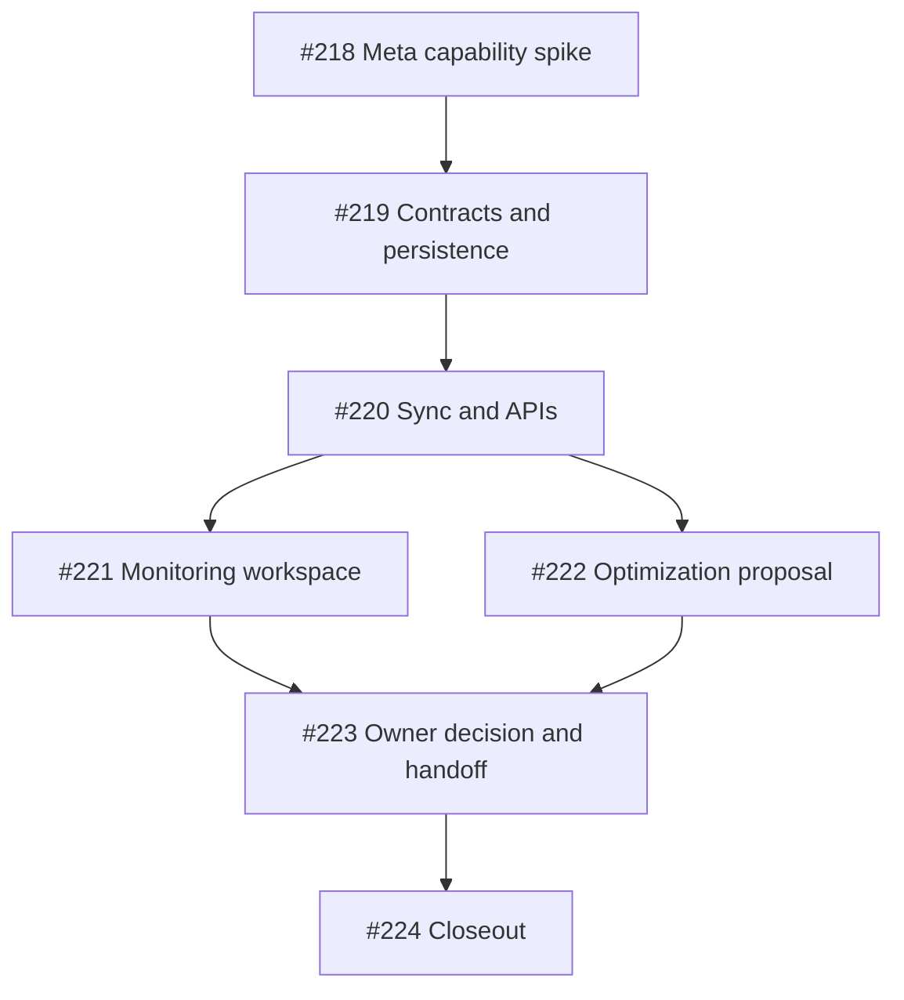

# Facebook Performance Implementation Issue Packet

- **Status:** issues created and implementation-ready
- **Prepared:** 2026-08-17
- **Epic:** [#217](https://github.com/ARabee3/marketmind-ai/issues/217)
- **Assignee for every issue:** Ahmed (`ARabee3`)
  **Architecture:**
  [`FACEBOOK_PERFORMANCE_AND_OPTIMIZATION_ARCHITECTURE.md`](./FACEBOOK_PERFORMANCE_AND_OPTIMIZATION_ARCHITECTURE.md)

## 1. Delivery strategy

The work is split so the team can stop after real automatic monitoring and
still have a complete graduation-project feature.

- **Gate A — Monitoring:** #218–#221
- **Gate B — Optimization:** #222–#223
- **Closeout:** #224

Gate B does not block Gate A. Gate B may remain truthfully in
`collecting_baseline` if fewer than three comparable real seven-day snapshots
exist.

## 2. Issue index

| Issue                                                       | Outcome                                                                   | Depends on | Suggested PR                    |
| ----------------------------------------------------------- | ------------------------------------------------------------------------- | ---------- | ------------------------------- |
| [#217](https://github.com/ARabee3/marketmind-ai/issues/217) | Tracking epic and locked product boundaries                               | —          | Documentation/coordination only |
| [#218](https://github.com/ARabee3/marketmind-ai/issues/218) | Prove Meta permissions, Graph version, metrics, and eligible demo history | #217       | PR 0 — capability spike         |
| [#219](https://github.com/ARabee3/marketmind-ai/issues/219) | Freeze cross-language metric contracts and immutable persistence          | #218       | PR 1 — contracts/schema         |
| [#220](https://github.com/ARabee3/marketmind-ai/issues/220) | Recoverable Insights sync, capability projection, and owner APIs          | #218, #219 | PR 2 — monitoring backend       |
| [#221](https://github.com/ARabee3/marketmind-ai/issues/221) | Bilingual, responsive Content Performance workspace                       | #220       | PR 3 — monitoring Web           |
| [#222](https://github.com/ARabee3/marketmind-ai/issues/222) | Deterministic eligibility plus bounded AI proposal                        | #219, #220 | PR 4 — Optimization proposal    |
| [#223](https://github.com/ARabee3/marketmind-ai/issues/223) | Owner decision and one-time non-mutating Content V2 handoff               | #221, #222 | PR 5 — decision/handoff         |
| [#224](https://github.com/ARabee3/marketmind-ai/issues/224) | Automated, live, bilingual, and plan-preservation evidence                | #218–#223  | PR 6 — closeout evidence        |

## 3. Critical path



## 4. Implementation handoff by issue

The GitHub issue bodies are normative. This section is a short navigation map,
not a replacement for their acceptance criteria.

### #218 — Meta capability spike

Start here. Confirm `read_insights`, `pages_read_engagement`, the working Graph
version, the non-deprecated metric allowlist, and the number of eligible stored
real Facebook publications. Keep every credential opaque and server-side.

Do not start the persistence model until the response shape and metric names
are frozen.

### #219 — Contracts and persistence

Add the TypeScript/Python `performance-v1` boundary, sync-window state, and
immutable snapshot model. The migration is forward-only and is verified on an
isolated database. Numeric zero and unavailable are different contract states.

This issue contains no Graph calls or UI.

### #220 — Synchronization and APIs

Create the NestJS Performance module, three due windows per eligible
publication, the PostgreSQL-authoritative reconciler, a dedicated BullMQ queue,
the Insights adapter, sanitized error policy, and owner-scoped APIs.

The Page may remain publish-ready while monitoring is permission-blocked.

### #221 — Monitoring workspace

Add `/[locale]/performance`, desktop/mobile navigation, journey integration,
the publication-to-7-day evidence rail, baseline readiness, and every missing,
retry, reconnect, and unavailable state in English and Arabic.

No charts or proposal actions are required yet. This PR completes Gate A.

### #222 — Optimization proposal

Require three comparable seven-day snapshots from the same business, Strategy
version, Content cycle, and format. NestJS performs all cohort selection and
math. FastAPI returns at most one strict hook-style or CTA-wording proposal and
may return no recommendation.

No proposal is approved or applied in this issue.

### #223 — Owner decision and Content V2 handoff

Add proposal review, approve/dismiss, immutable decision/instruction rows, and
one-time transactional consumption during the existing explicit Content V2
pack claim.

This issue must prove that Strategy and weekly plan rows are unchanged and that
approval does not create, progress, generate, approve, schedule, or publish a
week by itself.

### #224 — Integrated closeout

Run the complete automated matrix using isolated PostgreSQL and Redis, then
record a credential-redacted real team-Page snapshot through the product path.
If three real seven-day snapshots are unavailable, document the time-based
blocker and keep the live product at `collecting baseline`.

## 5. Recommended PR rules

For each implementation PR:

1. use one issue as the main scope and link its exact number;
2. state which acceptance criteria are implemented, test-verified, live
   verified, blocked, or awaiting human review;
3. do not close an issue because mocks pass when it requires real provider
   evidence;
4. keep forward-only Prisma migrations isolated and test them on a disposable
   database;
5. preserve unrelated work and never use `marketmind_dev` for destructive E2E;
6. include focused tests with the behavior change;
7. keep tokens, credentials, provider payloads, and private Page content out of
   PR descriptions, logs, fixtures, and screenshots; and
8. obtain human review before merge.

## 6. Gate A handoff checklist

- [ ] #218 records a working permission/version/metric decision.
- [ ] OAuth reconnect remains API-owned and publish capability is independent.
- [ ] #219 freezes zero-versus-unavailable semantics across TS/Python.
- [ ] #220 recovers due work from PostgreSQL after queue loss.
- [ ] Only real MarketMind Facebook `PUBLISHED` results are eligible.
- [ ] Owner APIs reject cross-business IDs and arbitrary provider IDs.
- [ ] #221 implements every English/Arabic/mobile/RTL state.
- [ ] At least one real snapshot is shown through the product path before Gate
      A is called live-verified.

## 7. Gate B handoff checklist

- [ ] The deterministic analyzer enforces the minimum comparable cohort.
- [ ] Insufficient evidence avoids a provider call.
- [ ] The AI is restricted to hook style and CTA wording style.
- [ ] Every proposal includes exact evidence and uncertainty.
- [ ] The owner sees what stays unchanged before approval.
- [ ] Approval is bound to the exact proposal/evidence checksum.
- [ ] The instruction is consumed at most once by normal Content V2 generation.
- [ ] Strategy and weekly plan rows are unchanged.
- [ ] Already-generated or unplanned weeks are never altered.
- [ ] Live Optimization is not claimed without sufficient real seven-day data.

## 8. Required verification commands

Exact focused commands may evolve with implementation, but every PR must run
the smallest relevant workspace checks and the final closeout must run:

```bash
IMAGE_PROVIDER_MODE=mock npm run check
```

Also run:

- contract TypeScript and Python parity checks;
- Prisma validation and migration tests;
- focused NestJS unit/integration/E2E tests;
- focused FastAPI tests;
- `npm run check -w @marketmind/web`;
- the Web production build;
- English/Arabic Playwright at mobile and desktop widths; and
- the credential-redacted live Meta probe/product-worker verification required
  by #218 and #224.

Use a PostgreSQL database whose name ends in `_test`, `_ci`, or `_e2e`, plus a
dedicated Redis namespace or instance. Never reset `marketmind_dev` for E2E.

## 9. Scope control

Reject implementation expansion into:

- Instagram analytics;
- arbitrary Page-history imports;
- manual analytics entry;
- reach/impression metrics deprecated by Meta;
- ads or competitor monitoring;
- automatic topic, schedule, or Strategy changes;
- applying one approval across multiple weeks;
- regenerating an existing pack; or
- claiming public Meta onboarding readiness.

The first priority under time pressure is #218 → #219 → #220 → #221. Do not
start the AI handoff before the monitoring evidence path is trustworthy.
