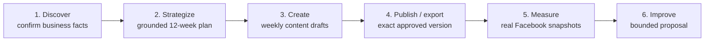
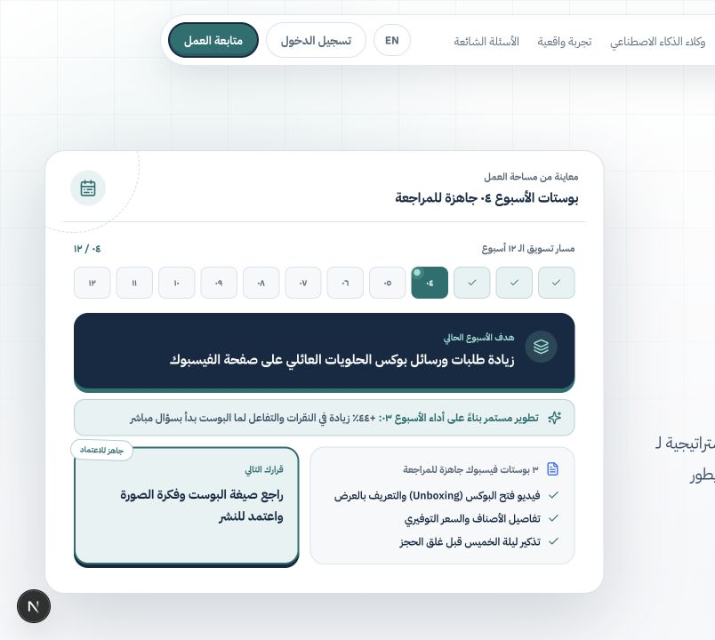
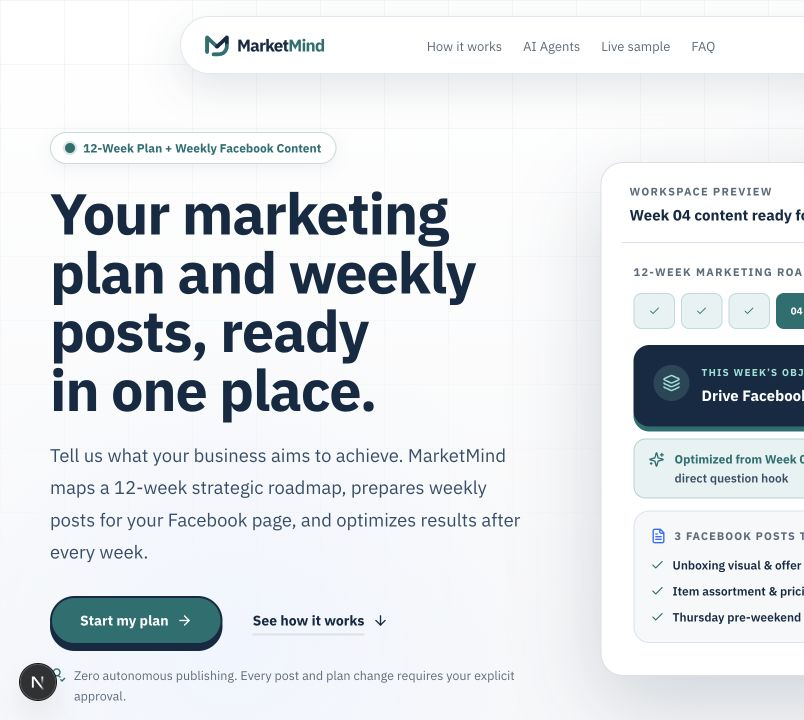
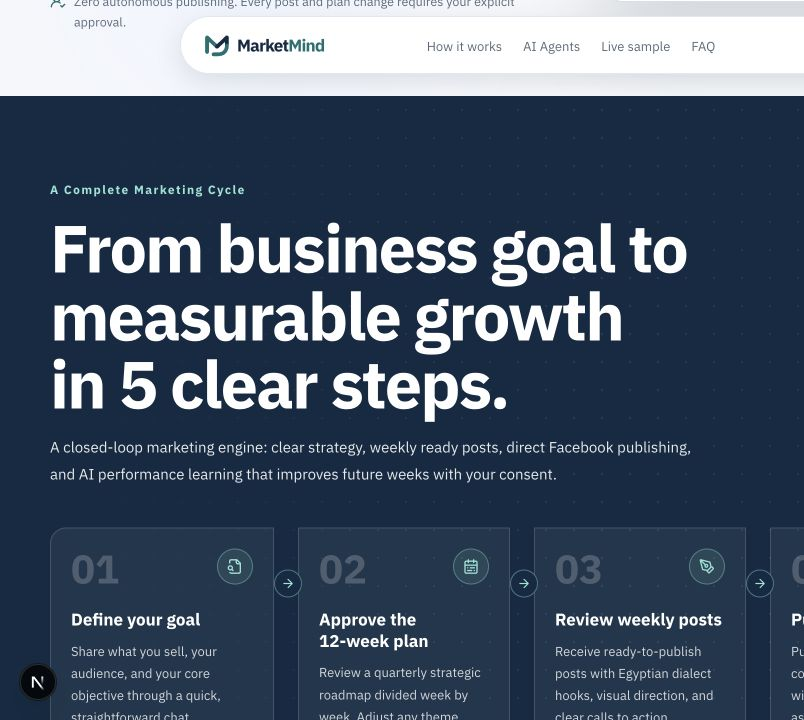
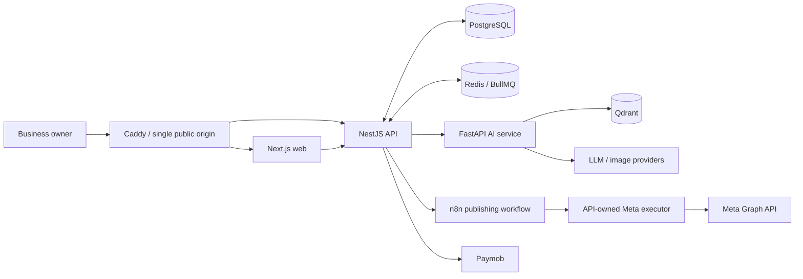

<p align="center">
  
</p>

<h1 align="center">MarketMind AI</h1>

<p align="center">
  <strong>Arabic-first marketing intelligence for Egyptian SMEs.</strong><br />
  From evidence-backed business discovery to owner-approved strategy, content,
  publishing, and performance improvement.
</p>

<p align="center">
  <a href="#product-preview">Product preview</a>
  ·
  <a href="Docs/README.md">Documentation</a>
  ·
  <a href="Docs/technical-and-ai-docs/01_TECHNICAL_ARCHITECTURE_AND_SYSTEM_DESIGN.md">Architecture</a>
  ·
  <a href="LICENSE">MIT License</a>
</p>

<p align="center">
  <a href="https://github.com/ARabee3/marketmind-ai/actions/workflows/api-ci.yml"></a>
  <a href="https://github.com/ARabee3/marketmind-ai/actions/workflows/ai-ci.yml"></a>
  <a href="https://github.com/ARabee3/marketmind-ai/actions/workflows/web-ci.yml"></a>
  <a href="LICENSE"></a>
</p>

## About

MarketMind helps small and medium business owners move through a complete
marketing loop without giving up control to AI. The platform gathers and
confirms business facts, builds a cited 12-week strategy, prepares reviewable
weekly content, publishes or exports an exact approved version, and uses real
Facebook performance evidence to propose bounded improvements.

The experience is bilingual and RTL-aware, designed around Egyptian SME needs,
and intentionally honest about evidence and integration state:

- research suggestions remain unconfirmed until the owner reviews them;
- AI output must pass structured and business-policy validation;
- Strategy, Content, publishing, and Optimization have explicit owner gates;
- mock, simulation, export, failed, and live-provider results remain distinct;
- PostgreSQL—not an LLM, queue, or vector database—owns durable product state.

## Product journey



Owner approval is required before Strategy activation, Content progression,
real publication, and any Optimization influence on a future draft.

## What is implemented

| Area                  | Current repository state                                                                                                                                |
| --------------------- | ------------------------------------------------------------------------------------------------------------------------------------------------------- |
| Identity and access   | Email verification, password reset, Google OAuth, rotating sessions, three-role RBAC, business ownership checks, and admin controls                     |
| Discovery             | Arabic/English research-backed interview, progress events, evidence mapping, resumable sessions, and owner-confirmed Business Profiles                  |
| Strategy and RAG      | Reviewed marketing corpus, Qdrant retrieval, deterministic channel/budget/KPI decisions, citations, 12-week plans, versioning, revision, and approval   |
| Content V2            | Owner-created weekly plans, 3–5 post packs, bilingual generation, media workflows, deterministic policy checks, revisions, and item-level decisions     |
| Publishing            | Immutable candidates, separate publication approval, export, labeled simulation, Cairo scheduling, n8n handoff, and Facebook text/static-image adapters |
| Performance           | Automatic snapshots for eligible MarketMind-published Facebook posts, sync health, comparable windows, and truthful insufficient-data states            |
| Optimization          | Evidence-bound hook/CTA proposals, owner approve/dismiss decisions, and one-time influence on an eligible future draft                                  |
| Billing               | Prepaid points wallet, server-owned bundle pricing, idempotent ledger/outbox handling, hosted checkout boundaries, and Paymob webhook verification      |
| Agentic orchestration | Feature-flagged LangGraph graph, durable checkpoints, bounded tools/retries, local tracing, and shadow evidence; not the default authoritative journey  |

Provider-backed generation, payment, Facebook publishing, and Facebook Insights
require valid server-side configuration and external account readiness. The
implementation does not treat local mocks or CI fixtures as live verification.

## Product preview

Screenshots below are captured from the current local application rather than
the older hosted deployment.

<table>
  <tr>
    <td width="50%"></td>
    <td width="50%"></td>
  </tr>
  <tr>
    <td align="center"><strong>Arabic-first, RTL-aware experience</strong></td>
    <td align="center"><strong>Bilingual evidence-led journey</strong></td>
  </tr>
</table>

<p align="center">
  
</p>

## Architecture



- The NestJS API owns authentication, lifecycle transitions, approvals,
  billing, queues, publishing, and durable state.
- The FastAPI service owns structured AI workflows, prompts, RAG, validation,
  deterministic decision helpers, and gated orchestration.
- The shared contracts package keeps TypeScript and Python boundaries aligned.
- The reviewed marketing corpus is governed in PostgreSQL and indexed into
  Qdrant; confirmed private Business Profiles are never stored in the shared
  vector collection.

Read the full [system architecture](Docs/technical-and-ai-docs/01_TECHNICAL_ARCHITECTURE_AND_SYSTEM_DESIGN.md),
[API/database/deployment guide](Docs/technical-and-ai-docs/02_API_DATABASE_AND_DEPLOYMENT_GUIDE.md),
and [AI/RAG technical reference](Docs/technical-and-ai-docs/03_AI_RAG_AGENTIC_TECHNICAL_DOCUMENT.md).

## Technology

| Layer      | Main technologies                                                          |
| ---------- | -------------------------------------------------------------------------- |
| Web        | Next.js 16, React, TypeScript, Tailwind CSS, next-intl, Playwright, Vitest |
| API        | NestJS 11, Prisma, PostgreSQL 16, Redis 7, BullMQ, Socket.IO, Jest         |
| AI         | FastAPI, Python 3.12, Pydantic, LangGraph, pytest                          |
| Retrieval  | Qdrant with governed Markdown knowledge and configurable embeddings        |
| Automation | n8n, Meta Graph API adapters, Paymob adapter, SMTP outbox                  |
| Deployment | Docker Compose, Caddy, GHCR images, GitHub Actions                         |

## Repository structure

```text
marketmind-ai/
├── apps/
│   ├── api/                 # NestJS API, Prisma, jobs, provider adapters
│   └── web/                 # Next.js bilingual owner application
├── services/ai/             # FastAPI AI, RAG, providers, evaluation
├── packages/contracts/      # TypeScript/Python contracts and fixtures
├── Docs/
│   ├── technical-and-ai-docs/
│   ├── marketing-knowledge/ # Runtime reviewed RAG corpus; keep path-stable
│   ├── planning/            # Durable feature architecture and runbooks
│   └── security-privacy/    # Dated audit and testing evidence
├── infra/                   # Docker, Caddy, and n8n assets
├── scripts/                 # Setup, checks, rehearsal, and readiness tools
└── .github/                 # CI workflows and repository presentation assets
```

## Local setup

### Prerequisites

- Node.js 20+ with npm
- Docker with Docker Compose
- [`uv`](https://docs.astral.sh/uv/) with Python 3.12+

### Start the full stack

```bash
git clone https://github.com/ARabee3/marketmind-ai.git
cd marketmind-ai

npm install

cp apps/api/.env.example apps/api/.env
cp apps/web/.env.example apps/web/.env
cp services/ai/.env.example services/ai/.env
cp infra/docker/.env.example infra/docker/.env

npm run dev:full
```

`dev:full` starts PostgreSQL, Redis, Qdrant, and n8n; applies Prisma
migrations; synchronizes the reviewed Strategy knowledge corpus; then launches
the API, AI service, and web app. Local defaults use deterministic mock AI and
image providers, so provider API keys are not required for the default path.

| Service        | Local URL                             |
| -------------- | ------------------------------------- |
| Web            | <http://localhost:3000>               |
| NestJS API     | <http://localhost:3001/api/v1>        |
| API health     | <http://localhost:3001/api/v1/health> |
| FastAPI health | <http://localhost:8000/health>        |
| Qdrant         | <http://localhost:6333>               |

For ordinary restarts after the database and knowledge index are prepared, use
`npm run dev`. Stop backing services with:

```bash
docker compose -f infra/docker/docker-compose.local.yml \
  -f infra/docker/docker-compose.qdrant.yml down
```

Never commit real credentials. External-provider setup belongs in the
gitignored service `.env` files and must follow the corresponding readiness
runbook.

## Quality gates

Run the repository-wide gate from the monorepo root:

```bash
npm run check
```

It validates shared contracts and fixtures, builds and tests the NestJS API,
runs API e2e coverage, executes the non-network FastAPI suite, checks Qdrant
field parity, validates the Next.js app, and verifies the governed marketing
knowledge corpus.

Useful focused commands:

```bash
npm run check -w @marketmind/web
npm run build -w @marketmind/api
npm run test -w @marketmind/api
npm run check:ai
npm run check:marketing-knowledge
npm run demo:rehearse
```

Live provider/network tests are opt-in and require the relevant credentials,
accounts, permissions, and safe test data.

## Documentation

Use the [documentation index](Docs/README.md) as the entry point. The most
important references are:

- [Product flow](Docs/planning/02_MARKETMIND_AI_FLOW.md)
- [AI roles and responsibility boundaries](Docs/planning/03_AGENTS_OVERVIEW.md)
- [Database ERD](Docs/technical-and-ai-docs/MARKETMIND_DATABASE_ERD.dbml)
- [Strategy completion runbook](Docs/planning/sprint-4/STRATEGY_COMPLETION_RUNBOOK.md)
- [Publishing architecture](Docs/planning/sprint-5/PUBLISHING_AUTOMATION_ARCHITECTURE.md)
- [Facebook performance and Optimization architecture](Docs/planning/sprint-8/FACEBOOK_PERFORMANCE_AND_OPTIMIZATION_ARCHITECTURE.md)
- [Security and privacy evidence package](Docs/security-privacy/SECURITY_AND_PRIVACY_GDPR_PACKAGE.md)
- [Postman collection](Docs/api/postman/marketmind-ai.postman_collection.json)

## Team

MarketMind AI was built as an ITI graduation project by:

- [@ARabee3](https://github.com/ARabee3)
- [@abdulazimRabie](https://github.com/abdulazimRabie)
- [@GergesYoussef-hub](https://github.com/GergesYoussef-hub)
- [@MOKHXXXXXX](https://github.com/MOKHXXXXXX)
- [@MostafaAhmed22](https://github.com/MostafaAhmed22)
- [@mostafamerzk](https://github.com/mostafamerzk)

See the complete [contributor history](https://github.com/ARabee3/marketmind-ai/graphs/contributors).

## License

MarketMind AI is available under the [MIT License](LICENSE).
